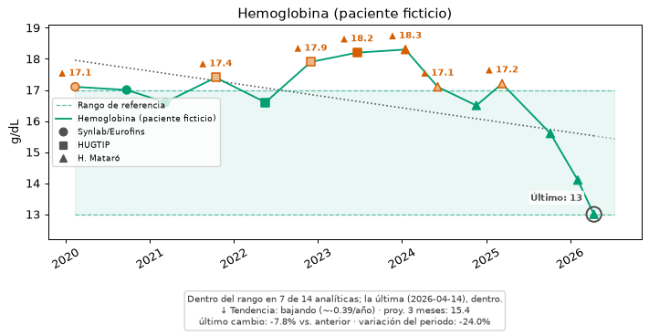
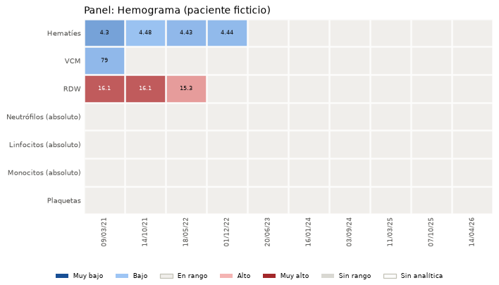
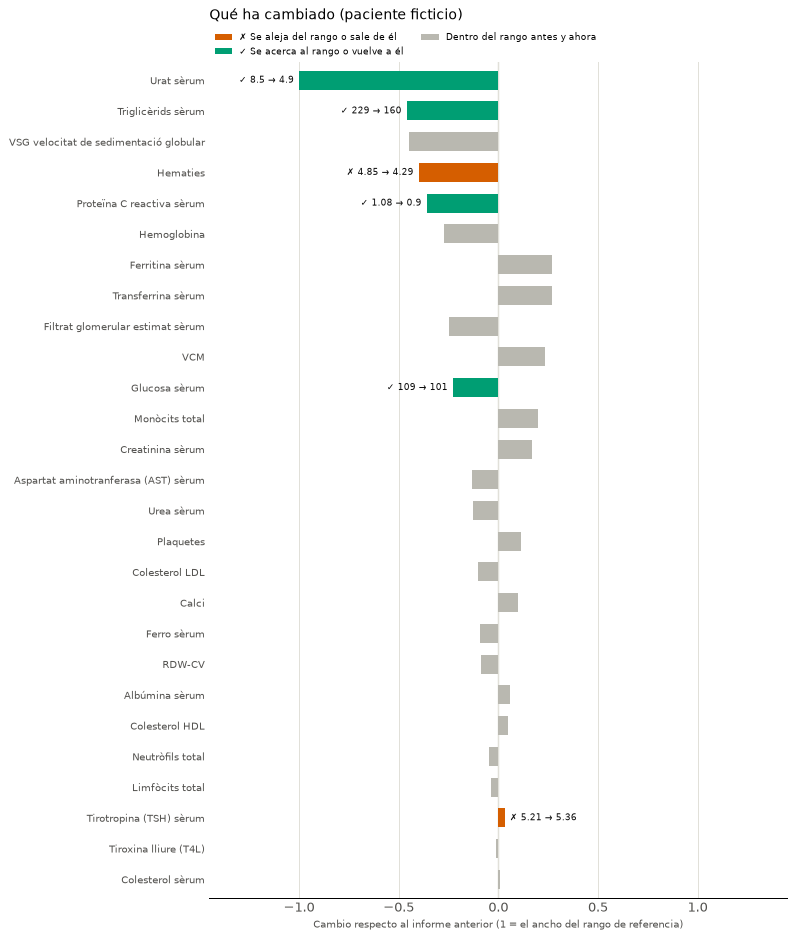

# Analitix — Documentación técnica

---

Documentación para cualquier programador que quiera usar, modificar o ampliar
la aplicación. Para instalación/uso como usuario final, ver
[`MANUAL_USUARIO.md`](MANUAL_USUARIO.md).


## 1. Visión general

Analitix es una aplicación de escritorio (Python + Tkinter) que:

1. Extrae los datos de los informes de laboratorio en PDF de una carpeta.
2. Los guarda en una base de datos SQLite cifrada (SQLCipher).
3. Permite analizar la evolución de cada prueba en el tiempo, comparar
   pruebas entre sí y exportar los resultados a Excel/CSV.

No hay servidor: todo el procesamiento es local y el único fichero de estado
persistente es `data/analitix.db`. La **única conexión a internet** es la
comprobación de versiones nuevas (`updates.py`): una petición GET anónima a
la API pública de GitHub que solo lee el número de la última versión; no
envía ningún dato del usuario ni de la base de datos. Solo se hace cuando el
usuario la pide (Ayuda → Buscar actualizaciones...) o al iniciar si lo ha
activado en Configuración → General (desactivado por defecto).

**Formatos de PDF soportados**: el parser se ha desarrollado y probado
contra informes de cinco centros: **Consorci Sanitari del Maresme /
Hospital de Mataró** (4 variantes de plantilla), el **Hospital
Universitari Germans Trias i Pujol (HUGTIP)** (2 variantes de plantilla),
**Synlab / SNB (Eurofins) Diagnósticos Globales**, **Quirón** y
**Laboratorio Echevarne** — ver las plantillas concretas en §5,
`pdf_parser.py`. PDF de otros laboratorios/hospitales probablemente no se
reconozcan bien — la app no falla ni pierde datos en ese caso (quedan
`status="review"`, o se pueden introducir a mano, ver `gui.py` §5), pero
no extrae sus resultados automáticamente. **Se aceptan colaboraciones**
para añadir soporte a otros formatos (guía paso a paso sin necesitar IA:
[`GUIA_NUEVO_PERFIL_PARSER.md`](GUIA_NUEVO_PERFIL_PARSER.md) +
[`plantilla_perfil.toml`](plantilla_perfil.toml)); el diseño está pensado
para admitir varias plantillas a la vez sin romper las existentes (cada
línea se evalúa contra todos los patrones conocidos, no se selecciona una
plantilla de antemano).

## 2. Requisitos y dependencias

| Paquete | Uso en el proyecto |
|---|---|
| [`pdfplumber`](https://github.com/jsvine/pdfplumber) | Extracción de texto de los PDF, carácter a carácter (`pdf_parser.py`). |
| [`sqlcipher3`](https://github.com/coleifer/sqlcipher3) | Driver DB-API 2.0 para SQLite cifrado con SQLCipher (`db.py`). |
| `pandas` | Construcción de tablas para exportar (`export.py`). |
| `openpyxl` | Motor usado por pandas para escribir `.xlsx` (`export.py`). |
| `matplotlib` | Gráficos de evolución/comparativa, embebidos en Tkinter (`charts.py`, `gui.py`); también genera el informe de seguimiento en PDF (`PdfPages`, `export.py`), sin librería de PDF adicional. |
| `mplcursors` | Tooltips al pasar el cursor sobre los puntos de las gráficas (`gui.py`). |
| `ttkbootstrap` | Tema visual moderno sobre `tkinter.ttk` (`gui.py`). |
| `Pillow` | Icono de la aplicación y pantalla de bienvenida (`branding.py`) — hasta ahora llegaba solo de forma transitiva vía `matplotlib`, se declara explícita porque ya se usa directamente. |
| `tkinter` (stdlib) | Interfaz gráfica. |
| `sqlite3`/`hashlib`/`csv`/`unicodedata` (stdlib) | Utilidades varias. |

Python 3.11+ (probado en 3.14, Windows, `sqlcipher3` con wheel precompilado
`cp314-win_amd64`). Ver `requirements.txt` para versiones mínimas.

## 3. Estructura de carpetas

```
Analitix/
  informes_analiticas/      PDF de entrada (el usuario los deja aquí)
  data/                     analitix.db + analitix.log (creados en el primer arranque)
  tests/                     suite automatizada aislada de la aplicación
  docs/                      esta documentación
    referencias_medicas/      fuentes científicas de los cálculos clínicos (implementados y pendientes)
  scripts/                   instaladores/lanzadores (Windows y Linux) y build_windows.bat
  packaging/                 receta de PyInstaller + instalador Inno Setup (ver §8)
  src/analitix/
    config.py                rutas del proyecto
    branding.py              icono de la app + splash screen
    res/                     analitix_icon.png, analitix_logo.png
    logging_setup.py          configuración del log a fichero
    textutils.py              normalización de texto (nombres, pruebas)
    pdf_parser.py             motor de parseo de los PDF (gramática de línea compartida)
    parser_profiles.py         carga y detección de perfiles por centro/laboratorio
    catalog.py                identificador canónico por prueba
    db.py                     conexión cifrada + esquema SQL
    repository.py              todas las consultas SQL (capa de acceso a datos)
    ingest.py                  orquesta el escaneo incremental de la carpeta
    export.py                  exportación a Excel/CSV/PDF (informe de seguimiento)
    charts.py                  construcción de figuras matplotlib
    lipid_risk.py               perfil lipídico y riesgo cardiovascular
    hepatic_risk.py             función e índices hepáticos
    renal_risk.py               función renal (KDIGO, urea/creatinina, aviso AKI)
    hemogram_risk.py            hemograma y series roja/blanca (NLR, PLR, LMR, Mentzer)
    iron_risk.py                metabolismo del hierro (ferritina, TSAT)
    inflammation_risk.py        PCR + VSG (sin índice combinado, por diseño)
    uric_acid_risk.py           ácido úrico / hiperuricemia
    calcium_risk.py              calcio corregido por albúmina
    glycemic_risk.py             glucosa media estimada (eAG) desde HbA1c
    thyroid_risk.py               TSH + T4L (solo gráfico combinado)
    rcv.py                        RCV: ¿cambio probablemente real o variación esperable?
    gui.py                     interfaz Tkinter/ttkbootstrap
    main.py                    punto de entrada (contraseña + arranque)
    data/test_aliases.csv      alias editable de nombres de prueba
    data/biological_variation.csv  variación biológica (CVI/CVA) citada, para el RCV
    data/descripciones/        una ficha .txt por canonical_id (ver `catalog.get_description`)
    data/parser_profiles/      un .toml por centro/laboratorio (ver `parser_profiles.py`)
```

**Mismo código, dos modos.** El ejecutable instalado se genera a partir de
los mismos ficheros de `src/analitix/`; no hay código separado. Solo
`config.FROZEN` (`sys.frozen`, que pone PyInstaller) cambia: dónde están los
datos (abajo), la capa de alias del usuario (`config.CATALOG_PATH`) y que en
Configuración aparezca "Cambiar ubicación de los datos...". Todo lo demás
funciona igual en los dos modos.

Esa es la estructura ejecutando desde el repositorio. En el **ejecutable
instalado** (`config.FROZEN`, PyInstaller) la carpeta del programa no es
escribible: el instalador pregunta dónde guardar los datos, crea ahí
`Analitix\informes_analiticas\` y `Analitix\data\` (base de datos, log y
alias añadidos por el usuario) y guarda esa carpeta `Analitix` en el
registro del usuario (`HKCU\Software\Analitix`, valor `HomeDir`), que
`config._installed_home_dir` lee al arrancar; si no consta, se usa
`Documentos\Analitix` (la carpeta Documentos real, aunque esté redirigida).
Perfiles, fichas, alias de la app e iconos van dentro del programa, solo
lectura. Si el usuario elige una carpeta sincronizada con la nube es
decisión suya: sigue siendo su espacio personal.

Los alias van en dos capas: `config.BUNDLED_CATALOG_PATH` (los que trae la
app) y `config.CATALOG_PATH` (los del usuario, que ganan si coinciden).
Desde el repositorio ambas rutas son el mismo `data/test_aliases.csv`; en el
ejecutable, `catalog.add_aliases` escribe solo en la del usuario, así una
versión nueva de la app puede corregir sus propios alias sin pisar los
suyos. La versión de la app es `analitix.__version__` (título de la ventana
y "Acerca de"); la etiqueta de cada Release de GitHub es `v` + esa versión.

La variación biológica del RCV sigue el mismo esquema de dos capas:
`config.BUNDLED_BV_PATH` (la de la app, versionada y citada) y
`config.BV_PATH` (`data/biological_variation.csv` en la carpeta de datos,
opcional, mismo formato), cuyas filas sustituyen a las de la app. A
diferencia de los alias, son siempre dos ficheros distintos, también desde
el repositorio (`data/` está fuera del control de versiones).

## 4. Modelo de datos

Esquema completo en `db.SCHEMA` (SQLite). Tablas:

- **`patients`** — un paciente. Clave de emparejamiento: `name_key`
  (nombre normalizado, ver §6) + `birth_date`. `dni`/`nhc` son informativos:
  el NHC cambia de numeración entre plantillas del laboratorio a lo largo de
  los años, así que **no** se usa como clave. `nhc_alt` (ver
  `db._ensure_column`) guarda, separados por coma, los NHC
  "desplazados" al aparecer uno nuevo distinto — para no perderlos, ni al
  reimportar (`get_or_create_patient`) ni al fusionar dos pacientes
  (`merge_patients`) que resultan ser la misma persona con NHC de
  plantillas distintas. `sex` (`"Hombre"`/`"Mujer"`, o `NULL` si ninguna
  plantilla lo trae — Maresme anterior a 2024) se normaliza en
  `pdf_parser._parse_sex` desde el campo "Sexe/Sexo" de cada centro; al
  reimportar o fusionar solo se rellena si faltaba (`COALESCE`). `cip` es el
  CIP autonómico (tarjeta sanitaria CatSalut; Maresme y HUGTIP — nunca el
  CIP-SNS estatal, ni el domicilio, que no se guarda). Al ser personal y
  estable entre plantillas, `get_or_create_patient` lo usa para emparejar
  (tras nombre+fecha de nacimiento y DNI, antes que el NHC), lo que une
  informes de la misma persona cuyo nombre se escribe distinto entre
  plantillas (p. ej. con o sin segundo nombre). Si nada del PDF identifica
  al paciente, una reimportación respeta el paciente al que ya estaba
  asignado ese informe (`clear_previous_import` lo devuelve →
  `previous_patient_id`): sin esto, reimportar un fichero en "revisar"
  (siempre se reintenta) deshacía una fusión manual y recreaba el
  duplicado. El nombre del paciente solo se refresca con el del PDF cuando
  el emparejamiento es por nombre.
  Tabaquismo (solo entrada manual, ningún PDF lo trae; para análisis y
  correlaciones futuros): `smoker_current` / `smoker_former` (`1` sí, `0`
  no, `NULL` no consta), y para exfumador `smoker_former_from` /
  `smoker_former_to` (años) o `smoker_former_period` (texto libre si no se
  saben los años).
  Toda la ficha se puede editar a mano con `repository.update_patient`
  (lista blanca `EDITABLE_PATIENT_FIELDS`; valida fecha `AAAA-MM-DD`, sexo,
  años 1900-actual con desde ≤ hasta, y convierte el choque con
  `UNIQUE(name_key, birth_date)` en un `ValueError` que sugiere fusionar).
  Una reimportación solo sustituye nombre/DNI/NHC/sexo/CIP si el PDF trae
  valor; fecha de nacimiento y tabaquismo no los toca nunca.
- **`reports`** — un informe (un PDF, o uno "de entrada manual" con
  `source_file = "(entrada manual)"`). `UNIQUE(patient_id, report_number)`.
  `notes` (ver `db._ensure_column`) es texto libre
  opcional, hoy solo rellenable desde ✏ Entrada manual (gui.py) — para
  anotar a qué corresponde una analítica metida a mano o por qué no vino
  como PDF; la importación de PDF nunca la toca (ver `upsert_report`).
  `source_file` es solo el **nombre** del PDF, nunca su ruta; `file_md5` es
  la firma MD5 de su contenido (identifica el mismo PDF aunque se renombre
  o cambie de carpeta). `report_number` es el identificador del informe en
  el laboratorio (Nº Petició en Maresme/HUGTIP, Nº Lab. en Synlab/SNB,
  Nº Laboratorio en Quirón, Nº Anàlisi en Echevarne) y `assistance_number`
  el Nº Assistència del Consorci Sanitari del Maresme. `lab` es el nombre
  corto del laboratorio de origen (`short_name` del perfil de parser, p. ej.
  "H. Mataró", "HUGTIP"; "Entrada manual" en las manuales); NULL en
  informes importados antes de 2026-09-25 hasta reimportarlos.
  `repository.get_series` lo devuelve en cada punto (`lab`).
- **Fecha de la analítica** (`repository._FECHA_SQL`): la de recepción de
  la muestra (`results.sample_date`) si el PDF la trae; si no, la de
  petición (en todas las plantillas vistas es el mismo día de la
  extracción) y, solo en último recurso, la de validación (puede ser días
  posterior). La fecha de emisión/descarga del informe ("Fecha Informe" en
  Synlab/SNB, que es cuando se descargó el PDF de la web y puede ser meses
  posterior) nunca se guarda. Hasta 2026-09-25 el orden era muestra →
  validación → petición, y dos plantillas del Maresme (2024-2025 "Data
  recepció mostra:" y 2023 de Calella "Data/Hora :") no tenían su fecha
  mapeada, así que caían a la de validación o quedaban sin fecha.
- **`results`** — una fila de determinación analítica dentro de un informe:
  nombre crudo, `canonical_id` (ver §7), valor (texto y numérico), unidad,
  rango de referencia (`ref_low`/`ref_high`/`ref_text`), la flecha tal cual
  aparecía en el PDF (`flag_pdf`) y la recalculada por la propia app
  (`flag_calc`, en `{alto, bajo, normal, NULL}`).
- **`processed_files`** — control de ingesta incremental: nombre de fichero,
  firma MD5 del contenido (`file_hash`; SHA-256 hasta 2026-09-25 — al
  actualizar, cada PDF ya importado se reprocesa una vez porque su firma
  guardada ya no coincide, lo que de paso rellena los campos nuevos), estado (`ok`/`review`/`error`) y marca de tiempo. Es la base
  de la detección de "ficheros nuevos" en cada ejecución. `status="review"`
  es la red de seguridad frente a PDF de un formato/laboratorio distinto que
  el parser no reconozca bien (ver §5, `ingest.py`).
- **`settings`** — pares clave/valor de configuración de la app: `reports_dir`
  (carpeta de informes) y `min_points_evolucion` (nº mínimo de analíticas
  para que una evolución sea representativa: agrupa la lista de
  Evolución/Comparativa y es el umbral del control de pocos datos de todos
  los gráficos de evolución, ver §5, `charts.data_sufficiency`).

Todas las fechas se normalizan a `AAAA-MM-DD[ HH:MM:SS]` (string,
ordenable lexicográficamente) por `pdf_parser._parse_date`, que admite
`DD/MM/AAAA` y `DD/MM/AA` (año a 2 dígitos → se asume `20AA`; usado por la
plantilla 2023-2024, que también escribe día/mes a veces con 1 solo dígito)
además de `AAAA-MM-DD`, con hora opcional `HH:MM[:SS]` tras cualquier
separador no numérico (espacio, coma o paréntesis); y, como tercer formato
(HUGTIP), `"DD de <mes en catalán>[.] AAAA"` con la hora a veces pegada al
año sin ningún separador (`"13 de nov. 202411:23:16"`) — el nombre del mes
se compara por sus 3 primeras letras sin acentos (`_CATALAN_MONTH_PREFIXES`),
así que valen tanto la forma abreviada (`"nov."`) como la completa
(`"novembre"`). "de" se eufoniza en "d'" delante de un mes que empieza por
vocal (`"17 d'abr. 2025"`, con apóstrofo tipográfico ’ o recto ' según la
plantilla); `_CATALAN_DATE_RE` usa `d.?` en vez del literal `"de"` para
admitir ambos glifos sin enumerarlos.

## 5. Módulo por módulo

### `pdf_parser.py` — motor de parseo (gramática de línea compartida)

Las tablas de datos que varían por centro/laboratorio
(etiquetas de cabecera, términos frontera, secciones conocidas, valores de
texto conocidos) **no** viven en este módulo: están en ficheros `.toml`
externos, uno por perfil (`data/parser_profiles/*.toml`), cargados por
`parser_profiles.py` (ver su propia subsección más abajo). `pdf_parser.py`
conserva únicamente el **motor de parseo en sí** — la gramática de línea
compartida por los perfiles que la usan (marcador de nota `"(n)"`, rango
entre paréntesis o al final de línea, flechas ↑/↓, LOINC entre paréntesis,
etc.) — parametrizado por el perfil que le pasa `parse_report`.

El laboratorio **Consorci Sanitari del Maresme** (entidad que gestiona el
**Hospital de Mataró**, único centro con motor de parseo completo hasta
ahora) ha usado al menos **cuatro variantes de plantilla** entre 2023 y 2026,
con menos marcado explícito cuanto más se retrocede en el tiempo — todas
cubiertas por el mismo perfil `consorci_sanitari_maresme.toml`, ya que el
motor evalúa cada línea contra todos los patrones a la vez sin elegir
variante de antemano (ver más abajo):

1. **2026, actual**: código LOINC entre paréntesis, flechas ↑/↓ de fuera de
   rango, marcador `"(n)"` delante de cada fila, rango sin paréntesis al
   final de línea, etiquetas bilingües `"Catalán / Traducción:"`.
2. **2024-2025**: como la anterior pero sin LOINC ni flechas.
3. **2023-2024 (la más retrocedida con soporte)**: **sin marcador `"(n)"`**,
   sin LOINC, **rango entre paréntesis** al final de línea (`"( 74 - 106 )"`
   en vez de `"74 - 106"`), y **sin ninguna etiqueta `"Pacient:"`** — el
   nombre del paciente aparece suelto en la línea siguiente a un título
   `"Informe"`. Además usa abreviaturas de cabecera distintas sin acentuar
   igual (`"Num. Història"` en vez de `"Núm. Història clínica"`, etc.) y no
   tiene "Data petició:"/"Data de la mostra:": en su lugar trae
   `"Programada: DD/MM/AAAA"` (→ `request_date`) y `"Recepció: DD/MM/AA
   (HH:MM)"` (→ `sample_date`, año a 2 dígitos). Sin este mapeo, los
   resultados de esta plantilla se guardaban sin ninguna fecha (`fecha=None`
   en `get_series`), lo que hacía fallar el gráfico de Evolución con
   `TypeError: object of type 'NoneType' has no len()` en
   `charts._parse_fecha`.
4. **Informes "Point of Care Testing" (POCT) del hospital**, del mismo
   laboratorio pero con maquetación de informe distinta (una sola
   determinación urgente, p. ej. troponina): la cabecera usa
   `"Nom i cognoms / Nombre y apellido(s):"` en vez de `"Pacient:"` (ambas
   reconocidas por el mismo patrón `full_name` del perfil) y trae líneas de
   ruido en mayúsculas que confunden la máquina de estados de cabecera (ver
   más abajo). La cabecera se reconoce igual que las demás; la fila de
   resultado, de momento, **no** se reconoce (queda `status="review"` por "no
   se extrajo ningún resultado") — su formato (nombre; subtipo, valor, unidad
   y rango todo en una línea sin paréntesis ni marcador `"(n)"`) no encaja con
   ningún patrón soportado y solo se ha visto en un documento, insuficiente
   para generalizar un patrón sin riesgo de falsos positivos.

**HUGTIP** (segundo centro con motor de parseo) tiene **dos variantes**
cubiertas por el mismo perfil `hugtip.toml` (mismo nº de acreditación ENAC
en las 4 muestras conocidas, `1460/LE2690`): la compacta original (etiquetas cortas en catalán,
sin fecha de nacimiento) y una bilingüe catalán/castellano tipo Maresme
("Laboratori Clínic Metropolitana Nord", con fecha de nacimiento y DNI).
Esta variante plantea tres casos reales de gramática, resueltos en
`_parse_lines`/`parse_result_line` (salvo el tercero, resuelto también en
el perfil):

- **Líneas de unidad secundaria con texto delante** (p. ej. `"Mètode
  enzimàtic(AE) 6.4 mmol/L 2.8 - 7.1"` justo después del resultado real):
  con `bare_range_is_result`, esa línea también parece un resultado válido.
  El caso sin texto delante (solo "valor unidad rango") se descarta por
  nombre vacío (`_add_result`); el caso con texto delante se descarta con
  `bare_range_skip_if_contains` (campo de `ParserProfile`): una lista de
  subcadenas que, si aparecen en la línea, la descartan sin más — HUGTIP la
  usa con `["(AE)"]` (marca de acreditación ENAC, estable en las distintas
  formas de redacción del método).
- **Notas a pie que casualmente terminan en un rango numérico** (p. ej.
  `"Valors de normalitat en pacients amb insuficiència renal: 0.37 - 3.1"`,
  una referencia alternativa para cierta población, no un resultado): sin
  ningún valor delante del rango. Un guardia en `_parse_lines`
  descarta la línea si `parse_result_line(...)["value_raw"]` sale `None` en
  la rama `bare_range_is_result` — solo en esa rama (las otras dos,
  marcador `"(n)"` y rango entre paréntesis, admiten resultados de texto
  sin valor numérico, p. ej. "Negatiu", y no deben perderlos; comprobar
  `value_raw` en vez de `value_num` no descarta esos casos por error, ya
  que un resultado de texto reconocido sí rellena `value_raw`, solo no
  `value_num`).
- **Nombre de prueba con un dígito suelto en medio** (p. ej. `"Srm-Alfa 1
  Globulines; fr. massa. 2.7"`, viene de "Alfa-1-globulina"): el heurístico
  de `_split_name_rest` que separa nombre/valor escanea de derecha a
  izquierda buscando un número seguido de una unidad (ver el comentario
  junto a `_split_name_rest`, pensado para el caso de un límite de rango
  descolgado). El parámetro `prefer_last_numeric_token` (en
  `_split_name_rest`/`parse_result_line`/`_add_result`), activado **solo**
  desde la rama `bare_range_is_result`, usa en su lugar directamente el
  último número de la línea: ahí, por construcción, ya se ha extraído un
  rango real antes de llegar a este punto, así que el caso del límite
  descolgado no puede darse. Las otras dos ramas (Maresme) siguen usando el
  heurístico de número-seguido-de-unidad.

**Synlab / SNB (Eurofins) Diagnósticos Globales** (`synlab.toml`; los PDF
descargados hoy de su web salen firmados "SNB Diagnósticos Globales",
integrado en Eurofins, con la misma plantilla — ambas firmas activan este
perfil) usa un rango de referencia entre corchetes en vez de
paréntesis o sin delimitar (`"Hematíes 3,89 x106/mm³ [ 3,9 - 5,2 ]"`) —
`BRACKET_RANGE_RE`, tratada como resultado sin necesitar ningún
interruptor de perfil, igual que el rango entre paréntesis de Maresme (un
delimitador tan inequívoco no necesita activarse caso a caso). Dos ruidos
de extracción propios de este PDF se resuelven con `strip_mid_tokens`
(campo de `ParserProfile`: quita un token suelto, con los espacios que lo
rodean, en cualquier punto de la línea, no solo al final):

- Un glifo `"ü"` delante del valor en toda determinación acreditada ENAC
  (`"Tiempo de protrombina ü 9,8 * seg [ 10 - 13 ]"`), sin relación con
  ninguna palabra real.
- Un `"*"` de fuera de rango entre el valor y la unidad, no al final de
  línea como en HUGTIP (`"Hematíes 3,89 * x106/mm³ [...]"`) —
  `compute_flag` recalcula alto/bajo del propio rango numérico de todos
  modos, así que no hace falta capturar la dirección del `"*"`.

Cabecera Synlab/SNB: `report_number` sale de `"Nº Lab.:"` y no de `"Nº
Laboratorio:"` (este último lleva la fecha pegada, `"X0000000 -
01/01/2024"`). `"D.N.I.:"` va en la línea de `"Doctor:"` pero es el DNI del
**paciente** (comprobado contra el DNI de la misma persona en otro
laboratorio). En alguna maquetación la dirección del paciente cae en la
columna `"NºHistoria:"`; `_parse_lines` descarta como NHC cualquier valor
con espacios, en todos los perfiles.

Limitación conocida, no resuelta: algunos valores llevan `"<"`/`">"`
pegado directamente al número sin espacio (`"<100 UI/mL"`,
`"ü >60 mL/min/1,73m2"`) — reconocido como límite de un rango, pero no
como valor medido, así que esa fila se descarta en vez de guardar un dato
incorrecto (el rango de referencia de esa misma fila no se pierde, solo el
valor medido concreto). Tampoco hay ninguna etiqueta de cabecera fiable
para el DNI del paciente: la única etiqueta `"D.N.I.:"` del documento es
la del médico solicitante, así que este perfil no rellena `dni` — evita
guardar el DNI de la persona equivocada en vez de arriesgarse.

**Quirón** (cuarto centro con motor de parseo, `quiron.toml`) es el primero
en mezclar **dos gramáticas de fila distintas dentro del mismo documento**:

- **Resultados "en casa"** (hemograma, hormonas, índices calculados...):
  una sola línea `"Nombre valor unidad (mín - máx)"`, cubierta sin ningún
  interruptor nuevo por `PAREN_RANGE_RE` (igual que Maresme). El rango
  también aparece en forma `"(Inf. N)"` (solo límite superior, "inferior a
  N") para algunos índices — una alternativa más en la misma familia de
  regex de rango (`_RANGE_ALTS`, compartida por `RANGE_RE`/`PAREN_RANGE_RE`/
  `BRACKET_RANGE_RE`), interpretada en `_parse_range_bounds` igual que
  `"< N"`. El fuera-de-rango se marca con un `"*"` final de línea, cubierto
  con `strip_trailing_flags` (igual que HUGTIP).
- **Resultados "interfaced"** (bioquímica básica, enzimas, metabolismo
  lipídico): el valor/unidad/rango va en una línea que empieza por `"‡"`
  y el **nombre de la prueba va en la línea siguiente** — orden invertido
  respecto a cualquier otro perfil. Nuevo campo de perfil
  `interfaced_result_prefix`: cuando una línea empieza por ese prefijo,
  `_parse_lines` la parsea con `_parse_interfaced_value_line` (variante de
  `_extract_range`/`_extract_value_unit` que no exige que el rango esté al
  final de la línea, ya que alguna fila añade una coletilla en prosa
  después: `"‡ 60 mg/dl (Inf. 200) <150 para pacientes con riesgo CV"`) y
  guarda el resultado en `pending_interfaced`; la línea siguiente se toma
  como `raw_name` y completa el resultado. Limitación conocida, no
  resuelta: cuando la unidad es demasiado larga para la línea de valor, la
  plantilla la reparte en una tercera línea suelta después del nombre
  (p. ej. `"m²"` tras `"Filtrado glomerular (CKD-EPI creatinina)"`) — no se
  recompone, así que el resultado guardado es correcto en valor y rango
  pero puede llevar la unidad incompleta.

Las secciones no se distinguen por mayúsculas (títulos en frase normal,
`detect_headings=false`) sino porque preceden a una línea fija de cabecera
de columna (`"Prueba Resultado Unidades Valores de Normalidad"`). Nuevo
campo de perfil `section_after_anchor`: cuando aparece esa línea literal,
la línea **inmediatamente anterior** (recordada en `previous_line`, una
variable de estado nueva en `_parse_lines`) se toma como título de sección.

El propio texto extraído sustituye el dígrafo "ti" por un byte NUL en
palabras como "Creatinina"/"Hematíes" (`"Crea\x00nina"`) — artefacto de una
fuente subseteada embebida en el PDF. Se corrige a nivel de motor en
`extract_lines` (`text.replace("\x00", "ti")`, junto al `dedupe_chars` ya
existente), no en el perfil, por ser un artefacto de extracción y no
vocabulario de un centro.

La fecha de toma de muestra solo aparece una vez, al final del documento
(pie de la última página), después de todos los resultados a los que
debería aplicar. `_parse_lines` preescanea `sample_date_label` sobre todo
el documento antes del bucle principal para sembrar `current_sample_date`
con la primera aparición encontrada — una mejora genérica del motor (no
específica de Quirón) que también cubre, sin cambiar nada, cualquier
perfil cuya fecha de muestra ya aparezca al principio (mismo valor, sin
efecto).

Sin ninguna cadena de marca del laboratorio en el texto extraído, la firma
se basa en una etiqueta de cabecera propia (`signature.header_label_any =
["dni"]`, la etiqueta `"Nº identificación:"`) en vez de un nombre.
Limitación conocida, no implementada en este perfil (haría falta un
segundo PDF real para no adivinar el patrón sobre un único caso, ver
`CONTRIBUTING.md`): los resultados cualitativos de la sección de orina
(`"Proteínas orina NEGATIVO NEGATIVO"`, valor y referencia repitiendo el
mismo texto sin ningún delimitador) y las secciones narrativas no se
capturan — no hay marcador ni rango numérico reconocible en esas filas, así
que se ignoran en vez de arriesgar una fila mal interpretada.

**Laboratorio Echevarne** (`echevarne.toml`) es, de los cuatro centros con
motor de parseo, el que más se aparta de la gramática compartida:

- **Palabras contiguas sin espacio** en gran parte de la cabecera
  (`"Datanaixement:22/02/1975"` en vez de `"Data naixement: 22/02/1975"`):
  artefacto real de esta fuente concreta con la tolerancia de espaciado por
  defecto de `pdfplumber`, no un error genérico de extracción. Nuevo campo
  de perfil `extract_x_tolerance`: `parse_report` detecta primero el perfil
  con la extracción por defecto (las cadenas de firma, sin espacios
  internos que perder, no lo necesitan) y solo reextrae el PDF entero con
  la tolerancia menor del perfil una vez sabe que hace falta — `extract_lines`
  acepta ahora un parámetro `x_tolerance` para esto.
- **Resultado con puntos de relleno** en vez de marcador `"(n)"` o rango
  pegado al final de línea:
  `"SEROALBÚMINA..................... 39,0 g/L (36,0-54,0)"`. Nuevo campo
  de perfil `dot_leader_result` y regex `DOT_LEADER_RE`
  (`^(?P<name>.+?)\.{2,}\s(?P<rest>.*)$`), comprobada **antes** que
  `PAREN_RANGE_RE`/`_is_heading` (una fila sin unidad, solo valor y rango,
  puede quedar enteramente en mayúsculas y sin minúsculas que la libren de
  parecer un título de sección).
- **Nombre de prueba heredado del título de sección**: cuando una sección
  solo tiene una determinación, el nombre de la fila es literalmente la
  palabra `"RESULTAT"` en vez del nombre real. Nuevo campo de perfil
  `single_result_name_placeholder`: cuando el nombre extraído coincide
  (sin distinguir mayúsculas) con este texto, se sustituye por el título de
  sección actual. Como consecuencia, cada título detectado por
  `_is_heading` es directamente una sección para este perfil (sin la
  jerarquía sección/grupo de Maresme): con `known_sections` vacío,
  cualquier título pasa a ser `current_section` sin más (antes esta
  combinación —`detect_headings=true` con `known_sections` vacío— no
  estaba definida porque ningún perfil la usaba).
- **Resultado repartido en 3 líneas** cuando el valor queda fuera de rango:
  nombre+puntos+valor (sin unidad ni rango) en una línea, un marcador
  `"(cid:145)"`/`"(cid:147)"` en su propia línea (el glifo de flecha de la
  fuente subseteada no se pudo mapear a un carácter real, sale como su
  código interno en vez de texto), y unidad+rango en una tercera línea.
  `_merge_dot_leader_splits` recompone estas 3 líneas en una sola **antes**
  del análisis línea a línea (no interpreta la dirección del marcador,
  mismo motivo que el resto de flags de fuera de rango del resto de
  perfiles: `compute_flag` recalcula del propio rango numérico).
- **Cabecera de columna con ruido inyectado**: la fila
  `"PROVA <nºanàlisi> RESULTAT UNITATS VAL.DE.REFERENCIA"` se repite en
  mayúsculas al principio de cada página con el número de análisis del
  informe intercalado — sin excluirla se leería como un título de sección
  nuevo. Nuevo campo de perfil `ignore_line_patterns` (lista de regex
  comprobadas contra la línea ya extraída antes que cualquier otra regla;
  si alguna coincide, se descarta sin más).
- **Metadatos sin etiqueta en la misma línea**: el número de análisis y las
  tres fechas (toma de muestra, recepción, edición) van en una fila de
  valores aparte, con la etiqueta de columna en la línea anterior. Nuevo
  campo de perfil `metadata_row_re` (regex con grupos nombrados
  `report_number`/`sample_date`/`request_date`/`validation_date`):
  reconoce la fila de valores directamente por su forma, sin depender de
  la etiqueta.
- **Nombre del paciente sin etiqueta**: va tras un tratamiento
  (`"Sr."`/`"Sra."`) sin ninguna etiqueta `"Nombre:"`. Nuevo campo de
  perfil `full_name_re` (regex con un grupo nombrado `name`). Solo se
  captura el primer nombre de pila (un único token tras la coma): en la
  misma línea, separado únicamente por el espacio del hueco entre columnas
  de la maquetación, va el nombre del centro remitente, indistinguible de
  un nombre de pila compuesto por el texto — limitación conocida, un
  nombre de pila compuesto (p. ej. "Maria José") se guarda truncado a su
  primera palabra en vez de arriesgarse a colar el nombre del remitente en
  el campo del paciente.
- **Sin ninguna cadena con espacios reales** del nombre del laboratorio
  (`"LABORATORIOECHEVARNES.A"`, `"LaboratoriEchevarne"`,
  `"laboratorioechevarne.com"`, todas pegadas): la firma usa las tres
  formas de mayúscula/minúscula de la subcadena `"echevarne"` en vez de un
  nombre completo con espacios.
- **Separador de millares**: algún valor usa `"."` como separador de
  millares junto con `","` como separador decimal (convención catalana/
  española, p. ej. `"2.534"` = 2534, con un rango a juego
  `"(1.000-2.400)"`) — `_to_float` distingue ahora este caso (grupos de
  exactamente 3 dígitos tras un punto) del uso de `"."` como separador
  decimal normal en otros perfiles (p. ej. `"-3.0"` en HUGTIP), probando
  primero la interpretación de millares y solo si no encaja, la decimal.
- Sin NHC: el documento no trae ningún número de historia clínica propio,
  solo un identificador tipo DNI (`"I.P.F.:"`).

El motor evalúa cada línea contra todos los patrones del perfil detectado a
la vez (no selecciona una de las 4 variantes de antemano), lo que permite que
un único perfil (`consorci_sanitari_maresme.toml`) cubra las cuatro. Un
centro distinto con una gramática de resultado parecida (marcador `"(n)"` o
rango entre paréntesis, o alguno de los interruptores de
`hugtip.toml` — ver `parser_profiles.py` más abajo) se soporta con su propio
`.toml`. **Si aparece un PDF de un centro/laboratorio realmente
irreconocible**, `parser_profiles.detect_profile` no encuentra ningún perfil
cuya señal coincida y `parse_report` devuelve cabecera y resultados vacíos
sin intentar aplicar la gramática de otro centro sobre un formato ajeno —
ver la red de seguridad `status="review"` en `ingest.py` (§5).

- `extract_lines(pdf_path) -> list[str]`: abre el PDF con `pdfplumber` y
  extrae el texto página a página con
  `page.dedupe_chars(extra_attrs=()).extract_text()`. **Importante**: la
  plantilla nueva dibuja los valores fuera de rango dos veces superpuestas
  (una vez con fuente normal y otra en negrita) para simular negrita; sin
  `dedupe_chars(extra_attrs=())` pdfplumber intercala los caracteres de
  ambas copias (p. ej. "14.97" sale como "1144..9977"). `extra_attrs=()`
  fuerza a ignorar que las dos copias usan fuentes distintas y las fusiona
  por posición.
- `parse_report(pdf_path) -> {"header": {...}, "results": [...], "source_file": str, "format_id": str, "format_name": str, "manual_review_only": bool}`:
  extrae las líneas, llama a `parser_profiles.detect_profile(lines)` y, si el
  perfil detectado no es `manual_review_only`, delega en `_parse_lines(lines,
  profile)` (si lo es, devuelve cabecera/resultados vacíos sin más). `_parse_lines`
  recorre las líneas una vez, con una pequeña máquina de estados:
  - `_extract_labeled_fields(line, profile.header_labels, profile.boundary_re)`
    para rellenar `header` (nombre, fecha nacimiento, DNI, NHC, nº de informe,
    fecha de petición y de validación) se aplica a **todas** las líneas del
    documento, no solo mientras `in_header` es `True`: algunos informes (p.
    ej. los de tipo POCT del hospital, ver plantilla 4 más abajo) traen
    líneas de ruido (marcas de agua, texto de redacción en mayúsculas tipo
    `"XXXXX"`) que `_is_heading` confunde con un título y apagan `in_header`
    **antes** de llegar a la línea con `"Pacient:"`/`"NIF/DNI:"`/etc.; como
    `header.setdefault(...)` no sobrescribe un valor ya capturado, buscar en
    todo el documento no tiene coste de correctitud y evita perder datos por
    ruido previo. `in_header` se sigue usando para el caso de la plantilla
    2023-2024 (activar `expect_name_next` solo la primera vez que aparece un
    título `"Informe"`) y para decidir cuándo empezar a tratar líneas en
    mayúsculas como encabezado de sección/subgrupo en vez de ruido de
    cabecera.
  - `current_section` / `current_group`: la plantilla nueva marca la sección
    con la línea literal `Secció / Sección X`; la vieja solo pone un
    encabezado en mayúsculas sin ese prefijo. `_is_heading` detecta
    cualquier línea íntegramente en mayúsculas y sin ":" como encabezado; si
    su texto (sin acentos, sin el código LOINC entre paréntesis) está en
    `profile.known_sections` se trata como sección nueva, si no como subgrupo
    (`test_group`) dentro de la sección actual.
  - `current_sample_date`: se actualiza cada vez que aparece una etiqueta de
    tipo "Data de la mostra"/"Data extracció", y se asigna a cada resultado
    parseado a partir de ese punto.
  - Cada línea que empieza por `(n)` (nota al pie) se intenta parsear como
    resultado con `parse_result_line`, salvo que su contenido empiece por
    una de las etiquetas de `NON_RESULT_PREFIX_RE` (son metadatos del
    laboratorio/facultativo responsable, no una determinación). Si la línea
    no lleva `"(n)"` pero termina en un rango entre paréntesis
    (`PAREN_RANGE_RE`, plantilla 2023-2024), también se trata como fila de
    resultado.
  - `full_name` sin etiqueta `"Pacient:"` (plantilla 2023-2024): si una línea
    coincide con `INFORME_TITLE_RE` (por defecto exactamente `"Informe"`, pero
    también admite una o dos palabras delante — `"Reedició Informe"` en una
    reedición del mismo informe, visto en un PDF real de 2023), se marca
    `expect_name_next` y la línea siguiente se toma como nombre completo tal
    cual si tiene forma de nombre (`"Apellidos, Nombre"`, solo
    letras/comas/guiones) — sin pasar por el resto de comprobaciones (para no
    confundirla con un encabezado en mayúsculas, ya que suele estar toda en
    mayúsculas).
- `parse_result_line(content) -> dict`: dado el contenido de una fila de
  resultado (ya sin el `(n)` inicial si lo había), en orden:
  1. `_extract_range`: separa el rango de referencia del final de la línea,
     probando primero el formato entre paréntesis (`PAREN_RANGE_RE`,
     `"( NUM - NUM )"`) y si no encaja el formato sin paréntesis (`RANGE_RE`,
     `"NUM - NUM"`, `"> NUM"` o `"< NUM"`). Cada extremo admite un signo `-`
     inicial (rango con límite negativo, p. ej. exceso de base en una
     gasometría: `"-2.0 - 2.0"`) además del `-` que separa ambos extremos.
     Un paréntesis cortado tras el guion (`"Folat 7.5 ng/ml ( 2.9 -"`,
     `OPEN_PAREN_RANGE_RE`) es un rango con solo mínimo (`">= 2.9"`).
  2. `_split_name_rest`: si hay un código LOINC entre paréntesis
     (`LOINC_NAME_RE`), lo usa para separar nombre/resto; si no (plantilla
     antigua), busca desde el final el último token puramente numérico y usa
     esa posición como frontera nombre/valor — pero **prefiere** un número
     seguido de una unidad (token no numérico) frente al último número de la
     línea a secas: alguna plantilla sin LOINC pierde el símbolo `<`/`>` de
     un límite de rango suelto al final (`"Colesterol HDL 47 mg/dL 40"`, el
     `40` es el mínimo de referencia, no el valor); sin esta preferencia, ese
     límite suelto se confundía con el valor, y el nombre real quedaba con
     el valor/unidad pegados — generaría un `canonical_id` nuevo y distinto
     por cada valor visto en vez de agruparse con el resto de esa misma
     prueba. Un valor con comparador pegado (`"<5"`, `">90"`, `"↓<1"`,
     `CENSORED_VALUE_RE`: fuera del límite de detección) cuenta también como
     valor, no como parte del nombre. Si no encuentra ningún token numérico
     (resultado textual sin LOINC, p. ej. "No és procedent"), intenta hacer
     coincidir el final de la cadena con `profile.known_text_values`.
  3. `_extract_value_unit`: separa la flecha ↑/↓ inicial (si la hay), y del
     resto, el primer token si es numérico es el valor y el resto la unidad;
     si no es numérico, todo el resto es un valor de texto (p. ej.
     "Negatiu"). Un valor `"<5"` se guarda como texto (`value_raw="<5"`,
     `value_num=None`, unidad aparte): así no se dibuja en las gráficas como
     si fuera exactamente 5. Una marca `"* "` al inicio del nombre (plantilla
     antigua de Maresme, determinaciones calculadas) se quita.
  4. Corrección de un artefacto conocido: alguna revisión del PDF pierde el
     símbolo "<"/">" de un rango (queda un número suelto pegado a la
     unidad); si no se detectó rango, ese número final se reinterpreta como
     límite. Su dirección la decide `_bound_is_minimum`: Colesterol HDL
     (`_HDL_RE`, excluye "no HDL"/"non-HDL") siempre es mínimo; en el resto
     manda la flecha del PDF (↓ = mínimo, ↑ = máximo) y, sin flecha (valor
     normal), es mínimo si el valor lo supera. Antes siempre se tomaba como
     máximo, y el folato o el filtrado glomerular bajos (`"Filtrat
     glomerular estimat 78 mL/min 90"`, mínimo 90) salían "normales".
- `compute_flag(value_num, ref_low, ref_high) -> "alto"|"bajo"|"normal"|None`:
  la app **recalcula** el fuera-de-rango a partir del propio rango numérico
  de cada informe en vez de fiarse solo de la flecha del PDF (que no
  existe en la plantilla antigua y a veces se pierde en la extracción).
- `_extract_labeled_fields(line, labels, boundary_re)`: helper genérico para
  parsear líneas densas de tipo `"Etiqueta1: valor1 Etiqueta2: valor2"`.
  Encuentra las posiciones de las etiquetas que interesan (`header_labels` o
  `sample_date_label` del perfil) y, para acotar dónde termina cada valor,
  calcula además las posiciones de un conjunto de etiquetas "frontera"
  conocidas (`profile.boundary_re`, construido en `parser_profiles.py` a
  partir de `boundary_terms` del `.toml`) que no interesa guardar pero sí
  reconocer (p. ej. "CIP-AUT:", "H/D/U:", "CIP:", "Programada:"). **Si se
  añade un campo de cabecera nuevo a un perfil, hay que añadir también su
  etiqueta a `boundary_terms` en ese mismo `.toml`** si puede compartir línea
  con otro campo que sí se guarda, o el valor se comerá el texto siguiente.
  La mayoría de etiquetas frontera siguen el patrón bilingüe `"Catalán /
  Traducción:"` (barra + traducción opcional, aplicado en código a toda la
  lista), pero `"CIP autonòmic:"` y `"CIP SNS:"` (informes POCT) van sin
  barra ni traducción en el PDF — el sufijo bilingüe es opcional así que no
  molesta. La búsqueda de etiquetas se hace sobre `strip_accents(line)` en
  vez de la línea tal cual (las plantillas no siempre acentúan igual la misma
  etiqueta, p. ej. `"Num."` frente a `"Núm."`, `"clínica"` frente a
  `"clinica"`); como `strip_accents` no cambia la posición de los caracteres,
  las posiciones siguen siendo válidas para recortar el valor de la línea
  **original** (con acentos).
- Filas sin nombre fiable (p. ej. cuando el nombre de la prueba queda en una
  línea y el valor en la siguiente, algo que ocurre en la plantilla
  2023-2024 con nombres largos) se descartan en vez de guardarse con
  `raw_name` vacío o incorrecto — ver el `if not parsed["raw_name"]: return`
  en `parse_report._add_result`.

**Artefactos de extracción corregidos en `extract_lines`**: la plantilla
antigua de Maresme rellena la columna del valor con espacios literales que
caen *encima* de los dígitos; al ordenar por posición, pdfplumber los
intercalaba y partía el valor (`"(AST) sèrum 2 7"` en vez de `27`).
`_drop_overlapping_spaces` quita los espacios que se solapan con un glifo
de la misma línea (un espacio normal está entre glifos, nunca encima, así
que el resto de plantillas no cambia).

**Filas sin rango en su línea** (`unranged_result_re` y
`following_range_labels` del perfil, ver `parser_profiles.py`): Synlab
(`"Tiroxina libre (T4L) ü 0,95 ng/dL"`, INR, PSA libre) y HUGTIP
(`"Srm-Colesterol; c. subst. 205 mg/dL"`) traen algunas determinaciones sin
rango; antes se descartaban. Si el rango llega en líneas posteriores, tras
una etiqueta del perfil, se asigna al último resultado sin rango (como mucho
6 líneas después): un rango suelto al inicio de línea (`"Valors
recomanats:"` / `"<200 ( 5.2 mmol/L )"`) o franjas por edad (`"Valores de
referencia"` / `">19 años (0.61-1.12 ng/dL)"`, `AGE_BAND_RE`).
`section_name_suffixes` del perfil (sección → palabra) añade esa palabra al
nombre de las pruebas de la sección si no la lleva ya: Maresme usa el mismo
nombre en sangre y orina, y sin esto compartirían id.

`apply_age_bands` elige la franja de la edad del paciente en la fecha de la
muestra; si el PDF no trae fecha de nacimiento, la franja queda pendiente
(`age_bands`) y `ingest` la resuelve con la del paciente ya guardado. Nunca
se adivina: sin fecha de nacimiento, el resultado se guarda sin rango.

**Limitaciones conocidas**:
- Alguna línea de comentario narrativo largo sin código LOINC (p. ej.
  morfología leucocitaria) no separa bien nombre/valor y guarda el texto
  completo como `raw_name` con `value_num = None`. No afecta a ningún dato
  numérico ni rompe la ingesta.
- La plantilla 2023-2024 a veces divide una fila entre dos líneas (nombre en
  una, valor+unidad+rango en la siguiente, incluso a caballo entre página y
  página con el bloque de cabecera repetido en medio); esas filas se
  descartan por el punto anterior en vez de guardarse mal.
- Resultados puramente cualitativos repartidos en varias líneas sin ningún
  rango entre paréntesis (p. ej. un informe de serología con
  `"Resultado no interpretable"` en su propia línea) no se reconocen como
  fila de resultado — no hay ningún carácter ancla fiable para detectarlos
  sin arriesgarse a capturar texto narrativo por error. El informe queda
  correctamente marcado `status="review"` (0 resultados) en vez de
  inventarse datos.

### `parser_profiles.py` — perfiles de reconocimiento por centro

`short_name` (TOML, opcional; por defecto `name`): nombre corto del
laboratorio para leyendas y listados; `parse_report` lo devuelve como
`format_short_name` e `ingest` lo guarda en `reports.lab`.

Carga y detección de los perfiles `.toml` de `data/parser_profiles/`. Esto
permite dar soporte a un centro con etiquetas, nomenclatura de parámetro y
marcado de fuera de rango incompatibles con las plantillas del Maresme
(como el Hospital Universitari Germans Trias i Pujol, HUGTIP) sin tocar el
motor de parseo compartido.

- `ParserProfile`: dataclass con las tablas de un perfil ya compiladas
  (`header_labels`, `sample_date_label`, `boundary_re`, `known_sections`,
  `known_text_values`) más `manual_review_only`, los datos de `[signature]`
  y cuatro interruptores que activan variantes puntuales del motor de
  parseo para un perfil sin marcador `"(n)"` ni rango entre paréntesis (ver
  `hugtip.toml` y el motor en `pdf_parser._parse_lines`, más abajo):
  `bare_range_is_result`, `bare_range_skip_if_contains`,
  `strip_trailing_flags` y `detect_headings`.
- `load_profiles() -> tuple[ParserProfile, ...]`: lee todos los `*.toml` de
  `PARSER_PROFILES_DIR` (una vez, con `lru_cache`), ordenados por `priority`
  ascendente.
- `detect_profile(lines) -> ParserProfile`: recorre los perfiles por
  prioridad y usa el primero que coincida. Dos formas de señal, según lo que
  declare el `.toml`:
  - `signature.requires_any`: cadenas literales del propio centro (p. ej.
    `"HUGTIP"`, `"Germans Trias i Pujol"`). Se usa en perfiles que no tienen
    (o no quieren usar) sus propias etiquetas de cabecera para detectarse.
  - `signature.header_label_any`: nombres de claves de `header_labels` del
    propio perfil (p. ej. `["birth_date", "full_name"]` en
    `consorci_sanitari_maresme.toml`) — se considera reconocido si esa
    etiqueta de cabecera aparece en el documento. Se prefiere esto a cadenas
    de marca del laboratorio en el pie de página: se ha comprobado que a
    veces llegan corruptas por codificación en PDF antiguos (p. ej.
    `"Matar�"` en vez de `"Mataró"` en un informe de 2023), mientras que
    las etiquetas de cabecera están presentes en las 4 variantes conocidas.
  - Si ningún perfil coincide, se devuelve `UNKNOWN_PROFILE` (constante en
    código, no fichero .toml), con `manual_review_only=True`. Un perfil
    `manual_review_only` no tiene por qué declarar
    `header_labels`/`known_sections`/etc.: `pdf_parser.parse_report` no
    llama al motor de parseo sobre él, solo lo detecta y lo deja para que
    `ingest.py` lo marque `status="review"` con un motivo explícito
    ("formato de informe no reconocido (...); parser no implementado") sin
    crear paciente ni informe.

**Añadir un centro nuevo cuya gramática de línea sea idéntica a la ya
soportada** (marcador `"(n)"` o rango entre paréntesis) es tan sencillo como
copiar `consorci_sanitari_maresme.toml` a un `.toml` nuevo con sus propias
etiquetas/listas — sin tocar `pdf_parser.py` (guía paso a paso sin necesitar
IA: [`GUIA_NUEVO_PERFIL_PARSER.md`](GUIA_NUEVO_PERFIL_PARSER.md) +
[`plantilla_perfil.toml`](plantilla_perfil.toml)). **Un centro con una
gramática de resultado distinta pero parecida** (como HUGTIP: sin marcador
`"(n)"`, fuera
de rango con `"*"` en vez de flechas, líneas de unidad secundaria bajo cada
resultado, títulos de sección en minúscula/mixta) resultó necesitar solo
unos pocos interruptores nuevos en `ParserProfile`/`_parse_lines`, no un
motor de parseo aparte — el resto (extracción de nombre/valor/unidad/rango,
incluida una fila sin nombre delante) ya era genérico. Un centro con una
gramática *de verdad* incompatible (p. ej. valores en columnas por posición
en vez de en línea de texto) sí seguiría necesitando motor de parseo nuevo.

### `catalog.py` — identificador canónico de prueba

`canonical_id_for(raw_name) -> str` normaliza el nombre (minúsculas, sin
acentos, sin puntuación — `textutils.normalize_test_name`) y lo convierte en
un slug (espacios → `_`). Esto ya unifica el mismo test entre plantillas en
la inmensa mayoría de los casos observados (el laboratorio usa el mismo
nombre catalán en ambas). El fichero `src/analitix/data/test_aliases.csv`
(columnas `alias_normalizado,canonical_id`) permite forzar manualmente que
dos nombres normalizados distintos apunten al mismo `canonical_id`, por si el
laboratorio renombra una prueba en el futuro; se recarga con
`reload_overrides()`. Contiene también los alias de los centros que no
nombran en catalán (Synlab/SNB, HUGTIP, Echevarne, Quirón) hacia los
`canonical_id` que usan los paneles clínicos (`vcm`, `ferro`,
`aspartat_aminotranferasa_ast_serum`...).

Porcentaje frente a valor absoluto: `normalize_test_name` descarta el "%",
así que "Linfocitos %" y "Linfocitos" (recuento absoluto en Synlab)
normalizan igual. Si el nombre crudo lleva "%", `canonical_id_for` busca
antes el alias `"<nombre> pct"`; así el CSV separa ambos sin renombrar los
id existentes (convención Maresme: sin sufijo = porcentaje, `_total` =
absoluto). Unidades: `textutils.unit_key` / `is_count_1e9_l` /
`is_count_1e12_l` tratan como iguales grafías equivalentes (x10³/µL =
x10³/mm³ = x10⁹/L; x10⁶/µL = x10¹²/L; µg/dL = mcg/dL) y la TSH en mU/L =
µUI/mL. PCR en mg/L y albúmina en g/L se convierten (÷10, exacto) a la
unidad del panel (`inflammation_risk._as_mg_dl`, `calcium_risk._g_dl`),
manteniendo su propio `canonical_id` para que Evolución no mezcle escalas.
Los `canonical_id` se asignan al importar: tras cambiar alias hay que
"Reimportar todo (forzar)".

- `add_aliases(pairs: dict[str, str])`: añade/sobrescribe entradas del CSV de
  alias y llama a `reload_overrides()`. La usa
  `repository.merge_canonical_ids` desde la pestaña "🔗 Normalizar pruebas"
  (columnas ordenables con clic en la cabecera, `gui._make_sortable`)
  (gui.py) al fundir manualmente dos o más variantes de nombre que en
  realidad son la misma prueba — reescribe el fichero completo (lee todo,
  actualiza el dict, vuelve a escribir ordenado), no hace falta que el CSV
  sea grande para que esto sea razonable.
- `get_description(canonical_id) -> str | None`: lee
  `src/analitix/data/descripciones/<canonical_id>.txt` (texto plano, sin
  ningún formato especial); `None` si el fichero no existe todavía.
  `canonical_id` sale siempre de `normalize_test_name` (`[a-z0-9_]` como
  mucho), así que construir la ruta directamente con un f-string no tiene
  riesgo de recorrido de rutas. Usado por `gui._show_test_info` (botón
  "ℹ️ ¿Qué es este parámetro?", `bootstyle="info"`, en todas las pestañas
  con gráfico) — pensado sobre todo para quien no esté familiarizado con
  los términos médicos de un informe de laboratorio.
  Hay fichas para 154 de los 158 `canonical_id` reales
  del laboratorio; se excluyen `pacient`, `total`, `rati` y
  `comentari_proteinograma` por no ser parámetros analíticos reales, sino
  ruido de extracción. Cómo añadir la ficha de una prueba nueva (o corregir
  una existente): ver `docs/MANUAL_USUARIO.md` §3.1 — es literalmente crear
  un `.txt` con ese nombre, no hace falta tocar código.

#### Alias de pruebas: diseño, riesgos y mantenimiento (para desarrolladores)

**Flujo.** `raw_name` → `textutils.normalize_test_name` (minúsculas, sin
acentos, solo `[a-z0-9]` y espacios: el "%" se pierde) → si el nombre crudo
lleva "%", se prueba primero la clave `"<norm> pct"` → alias de
`test_aliases.csv` (`_overrides`) → si no hay alias, slug de `norm`. El id
resultante se **guarda** en `results.canonical_id` al importar
(`ingest._ingest_one`) o al crear una entrada manual
(`repository.create_manual_report`); nada lo vuelve a calcular al leer. Por
eso cualquier cambio de alias (o de `canonical_id_for`/`normalize_test_name`)
solo llega a los datos existentes con **Reimportar todo (forzar)** en cada
carpeta, o con `merge_canonical_ids` (que hace el `UPDATE` directamente y
registra el alias para el futuro).

**Invariante que hay que proteger**: un `canonical_id` = un analito + una
muestra + una dimensión de unidad. En concreto:
- Porcentaje y valor absoluto nunca comparten id. Convención heredada de
  Maresme: sin sufijo = porcentaje (`limfocits`), `_total` = absoluto
  (`linfocits_total`); para otros laboratorios se separan con la clave
  `"<nombre> pct"`.
- Orina y sangre nunca comparten id (suero y plasma sí se consideran
  equivalentes). Ojo: un mismo laboratorio puede usar exactamente el mismo
  nombre en ambas (Maresme: "Glucosa", "pH", "Hematies" en la sección
  `ORINA/LÍQUIDS/SECREC.`); se separan en el parser con
  `section_name_suffixes` del perfil, que añade "orina" al nombre.
- Dos id que aparecen en un mismo informe son pruebas distintas: el
  laboratorio las midió a la vez. `repository.merge_check` bloquea esa
  fusión (salvo mismo LOINC en ambos: el mismo dato repetido en el informe)
  y `alias_audit` nunca la propone. En cambio, dos nombres del mismo
  laboratorio que nunca coinciden en un informe suelen ser la misma prueba
  renombrada entre plantillas ("Ferritina" / "Ferritina sèrum"): por eso no
  se prohíben los alias dentro de un mismo laboratorio.
- Unidades de escala distinta (mg/L frente a mg/dL, g/L frente a g/dL) no
  se fusionan por alias: cada una conserva su id y el **panel** las admite
  con conversión explícita (`inflammation_risk.PCR_IDS` + `_as_mg_dl`,
  `calcium_risk.ALBUMINA_IDS` + `_g_dl`). Fusionarlas por alias mezclaría
  escalas en Evolución. Las grafías equivalentes (x10³/µL = x10⁹/L, µg/dL =
  mcg/dL, mU/L = µUI/mL) sí pueden compartir id: se comparan con
  `textutils.unit_key`/`is_count_1e9_l`/`is_count_1e12_l`.
- Los paneles leen por `canonical_id` (tuplas `*_IDS` de cada `*_risk.py`),
  nunca por nombre ni idioma. Al elegir el destino de una fusión, preferir un
  id que ya esté en alguna tupla; si se cambia el destino de un alias,
  comprobar que sigue llegando a su panel (`alias_audit.panel_ids()`).

**Detalles que muerden**:
- Los alias **no se encadenan**: la clave apunta a un id final. Si se funde
  un id que ya era destino de otros alias, esos alias hay que redirigirlos
  al nuevo destino a mano (así se hizo al aplicar la auditoría del
  2026-09-25: p. ej. `hierro` pasó de `ferro` a `ferro_serum`).
- `data/descripciones/<canonical_id>.txt` va por id: si el destino de una
  fusión no tiene ficha y el origen sí, hay que moverla.
- Cambiar `normalize_test_name` o `canonical_id_for` cambia ids en bloque:
  hay que revisar a la vez las claves del CSV, las tuplas `*_IDS` y los
  nombres de fichero de `descripciones/`, y reimportar todo.
- Las entradas manuales conservan el id con que se crearon; la reimportación
  no las recalcula.
- `test_aliases.csv` está versionado y la app lo modifica
  (`merge_canonical_ids` → `add_aliases`, que reescribe el fichero entero
  ordenado). Un usuario con fusiones locales tiene cambios versionados y
  `scripts/update_main.*` abortará el `pull` para no pisarlos.
- Tests: el fixture `autouse` `empty_alias_catalog` de `tests/conftest.py`
  da a cada test un CSV vacío en `tmp_path`. Ningún test debe depender del
  CSV real (lo edita el usuario) ni escribir en él; si un test necesita
  alias, que escriba los suyos (ver `test_text_catalog.py`).

**Auditoría (`alias_audit.py`) y cómo validar un cambio de alias**:
1. `scripts\alias_audit.bat` (o `python -m analitix.alias_audit` con el
   `venv` y `PYTHONPATH=src`). Nunca aplica nada: la herramienta solo
   compara textos y unidades, no sabe de métodos ni muestras más allá de lo
   que dice el nombre; aplicar sin revisar puede romper la invariante de
   arriba.
2. Tras aplicar alias: la sección 1 del informe debe quedar vacía (salvo
   grupos ⚠ sin unidad) y la 4 **siempre** vacía; ningún alias que antes
   llegaba a un id de panel debe dejar de hacerlo; `pytest` en verde.
3. Nuevo laboratorio o idioma: ampliar `TRANSLATE` (palabra → pivote
   catalán, que es el idioma de los id existentes) y `ABBREV` (siglas
   equivalentes), y `_UNITS` si trae unidades nuevas. Las siglas solo
   cuentan como identidad entre paréntesis o como nombre completo, porque
   dentro del nombre suelen ser un calificativo ("Colesterol HDL").
4. Revertir: el CSV está en Git (`git log -- src/analitix/data/test_aliases.csv`,
   `git checkout <commit> -- <fichero>`); después, reimportar forzando.

**Limitaciones conocidas**: los nombres con el valor pegado
(`alias_audit.noisy_names`, p. ej. valores con "<" o "↓" que el parser no
separa) generan ids falsos por cada valor distinto — se arregla en
`pdf_parser.py`, no con alias; mEq/L = mmol/L solo es cierto para iones
monovalentes (Na, K, Cl, HCO₃), que son los únicos casos vistos; el LOINC
solo lo trae Maresme.

### `textutils.py`

- `strip_accents(text)`: NFKD + descarta combining marks.
- `normalize_name(raw_name)`: reordena "Apellidos, Nombre" → "Nombre
  Apellidos" (la plantilla antigua usa ese orden con coma; la nueva ya viene
  "Nombre Apellidos"), sustituye guiones por espacios (alguna plantilla
  escribe el segundo nombre "MARIA-JOSE" en vez de "MARIA JOSE"),
  colapsa espacios, mayúsculas, sin acentos. Es la clave de emparejamiento de
  pacientes (`repository.get_or_create_patient`).
- `normalize_test_name(raw_name)`: minúsculas, solo `[a-z0-9]` y espacios.

### `db.py`

- `SCHEMA`: DDL completo (ver §4).
- `connect(password, db_path=DB_PATH) -> sqlcipher.Connection`: abre (crea si
  no existe) la base cifrada. `PRAGMA key` no admite parámetros ligados en
  SQLite, así que la contraseña se interpola escapando comillas simples
  (`'` → `''`) en un literal SQL — no hay inyección posible porque el valor
  no proviene de fuera del propio usuario de la app y solo se usa para este
  PRAGMA. Verifica la contraseña con un `SELECT` de prueba; si falla, lanza
  `WrongPasswordError`. `_set_key` rechaza además con `ValueError` una
  contraseña que coincida con la forma reservada de clave SQLCipher en
  bruto (`x'<64 o 96 hex>'`), que si no se interpretaría como clave ya
  derivada en vez de pasar por PBKDF2 — el bucle de contraseña de `main()`
  (`except ValueError` junto al `except WrongPasswordError`) y el `except
  Exception` genérico de `gui._change_password` (rekey) lo muestran como
  un error normal en vez de una traza sin control.
- `rekey(con, new_password)`: `PRAGMA rekey`, re-cifra la base ya abierta con
  una contraseña nueva. Verificado con round-trip (cifra, `rekey`, la clave
  antigua deja de poder abrir el fichero).
- `_ensure_column(con, table, column, coltype)`: mini-migración de esquema —
  si `table` no tiene ya `column`, hace `ALTER TABLE ... ADD COLUMN`. Los
  tres parámetros son siempre literales fijos del propio código (nunca
  vienen de fuera), de ahí el f-string directo en el SQL. La llama
  `connect()` después de `executescript(SCHEMA)`, para que una base de
  datos creada con una versión anterior del esquema (p. ej. sin `nhc_alt`)
  se ponga al día sola la próxima vez que se abra, sin perder los datos ya
  guardados — verificado con una BD creada a mano con el esquema antiguo.

### `repository.py` — acceso a datos

Toda la SQL de la app vive aquí (ninguna otra parte del código construye
sentencias SQL a mano). Funciones relevantes:

- `_add_alt_value(alt_str, value) -> str | None`: añade `value` a una lista
  de texto separada por comas sin duplicarlo (o la deja igual si `value` es
  falsy o ya está). Helper compartido por `get_or_create_patient` y
  `merge_patients` para acumular NHC en `nhc_alt` sin repetir.
- `get_or_create_patient(con, full_name, birth_date, dni, nhc, fallback_name=None) -> (patient_id, matched_by)`:
  empareja primero por `name_key + birth_date`; si `full_name` viene vacío
  (plantilla no reconocida) pero el DNI o el NHC coinciden con los de un
  paciente ya existente, se empareja por ahí en su lugar — así un informe
  sin nombre reconocido no crea un paciente "fantasma" con el nombre del
  fichero si ya sabemos de quién es por otro identificador. Solo si nada
  coincide se crea un paciente nuevo, usando `fallback_name` (el nombre del
  fichero, se lo pasa `ingest._ingest_one`) como nombre provisional. Si el
  paciente ya existía, actualiza `full_name`/`dni`/`nhc` con el valor más
  reciente (`COALESCE(nuevo, existente)`), para que el NHC/nombre "vigentes"
  sean siempre los del último informe procesado, no los del primero — si el
  NHC nuevo es distinto del que tenía, el antiguo **no se pierde**: pasa a
  `nhc_alt` (`_add_alt_value`) en vez de sobrescribirse sin más.
  `matched_by` es `"name"|"dni"|"nhc"|"new"`, para que `ingest._ingest_one`
  pueda distinguir un emparejamiento por identificador (que sigue marcando
  `status="review"`, porque la plantilla no se reconoció) de uno normal.
- `upsert_report(con, patient_id, report_number, ..., notes=None) -> report_id`:
  empareja por `patient_id + report_number` (el nº de informe extraído del
  propio contenido del PDF, no del nombre de fichero); si ya existe,
  refresca `source_file` al nombre de fichero vigente (puede haberse
  renombrado desde la última importación) en vez de dejarlo con uno que ya
  no existe. `notes` solo se escribe/actualiza si se pasa explícitamente
  (no `None`) — `ingest.py` nunca lo pasa, así que reimportar un PDF no
  borra una nota puesta a mano desde Entrada manual.
  `insert_result`, `already_processed`, `record_processed_file`: soporte
  directo de `ingest.py`.
- `create_manual_report(con, patient_id, fecha, entries, notes=None) -> report_id`:
  soporte de la pestaña "✏ Entrada manual" (gui.py), para analíticas cuyo PDF
  no se ha podido interpretar (o que no vienen en PDF). Reutiliza
  `upsert_report`/`insert_result` tal cual, con `source_file="(entrada
  manual)"` y `report_number=f"MANUAL-{now_iso()}"` (con la marca de tiempo
  actual, no la fecha de la analítica, para poder registrar varias entradas
  manuales del mismo paciente sin chocar con `UNIQUE(patient_id,
  report_number)` aunque compartan fecha). `fecha` se guarda como
  `request_date` y `validation_date` del informe (una analítica manual tiene
  una única fecha, no una por determinación); cada `entry` pasa por
  `catalog.canonical_id_for` y `pdf_parser.compute_flag` igual que un
  resultado extraído de un PDF, así que se integra sin distinción en
  Evolución/Comparativa/Exportar.
- `list_known_test_names(con) -> list[str]`: nombres de prueba ya vistos
  (`DISTINCT raw_name`), para el autocompletado del combobox de "Entrada
  manual".
- `already_processed(con, filename, file_hash) -> bool`: un fichero solo se
  salta si el hash no ha cambiado **y** la vez anterior quedó
  `status="ok"`. Uno marcado `"review"` o `"error"` se reintenta siempre en
  la siguiente importación, sin que el usuario tenga que hacer nada — así
  una mejora del parser recoge automáticamente los PDF que antes no se
  reconocían. (Antes de esta corrección, un PDF marcado "review" se
  quedaba así para siempre aunque se arreglara el parser, porque el hash no
  había cambiado.)
- `clear_previous_import(con, filename)`: borra el informe/resultados de una
  importación anterior de ese fichero (buscando su `report_id` en
  `processed_files`) antes de reprocesarlo, para no duplicar filas. Si el
  paciente al que pertenecía ese informe se queda sin ningún informe
  después de borrarlo (típicamente un paciente "de repuesto" creado a
  partir del nombre del fichero cuando no se reconoció el nombre real, ver
  `_ingest_one`), también se borra ese paciente fantasma. La llama
  `ingest._ingest_one` al principio de cada (re)intento. **Busca por nombre
  de fichero**, así que no detecta el caso de un PDF renombrado (mismo
  contenido, nombre distinto) — para eso está `clear_report_results` más
  abajo.
- `clear_report_results(con, report_id)`: borra los resultados ya guardados
  de un informe concreto antes de reinsertarlos. Cubre el hueco que deja
  `clear_previous_import`: si un PDF se ha renombrado, `upsert_report` lo
  empareja igualmente con el informe existente (por `report_number`, que
  sale del propio contenido del PDF, no del nombre de fichero), pero
  `clear_previous_import` no lo detecta al buscar por un nombre de fichero
  que ya no existe — sin este borrado, reimportarlo bajo el nuevo nombre
  duplicaría cada resultado. Inofensivo si el informe es nuevo (no hay nada
  que borrar). La llama `ingest._ingest_one` justo después de
  `upsert_report`, siempre, no solo en el caso de renombrado.
- `prune_missing_processed_files(con, existing_filenames) -> int`: borra de
  `processed_files` las marcas de importación de ficheros que ya no están
  en la carpeta (renombrados o eliminados) — no toca los informes/
  resultados ya guardados, solo el registro de qué PDF se procesó con qué
  hash y cuándo. La llama `ingest.ingest_folder` al principio de cada
  ejecución, para que el registro interno no acumule nombres de fichero que
  ya no existen. `existing_filenames` se calcula con
  `ingest.known_pdf_filenames(reports_dir)` (ver más abajo), no con un
  simple `reports_dir.glob("*.pdf")`: si se comparase solo contra la
  carpeta activa en ese momento, importar una subcarpeta (p. ej.
  `informes_analiticas/afg`) borraría la marca de seguimiento de **todos**
  los PDF de cualquier otra subcarpeta ya importada (p. ej. `gmf`), que
  parecerían "eliminados" sin haberlo sido — se reimportarían sin motivo la
  próxima vez que tocase esa carpeta (inofensivo para los datos, ya que
  `upsert_report` empareja por `report_number` y no duplica, pero sí un
  reprocesado innecesario de todo el histórico).
- `delete_patient(con, patient_id)` / `delete_all_data(con)`: borrado manual
  desde la pestaña Pacientes ("Eliminar paciente seleccionado...") y
  Configuración → Datos ("Vaciar toda la base de datos...") respectivamente;
  irreversibles, con confirmación en la UI (`delete_all_data` pide además
  escribir "BORRAR").
- `list_orphan_reports(con, existing_filenames) -> list[dict]` /
  `delete_reports(con, report_ids) -> int`: soporte de Configuración →
  Datos → "Informes huérfanos". Un informe es "huérfano" si no tiene ningún
  resultado, o si su `source_file` ya no está entre `existing_filenames`
  (el PDF se ha **eliminado** de la carpeta, no renombrado — un renombrado
  no cae aquí porque `upsert_report` ya actualiza `source_file` al nombre
  vigente en la siguiente importación). Surgió de un caso real: al borrar a
  mano un PDF que nunca aportó resultados (ya estaba `status="review"`), su
  fila en `reports` se queda huérfana para siempre — `ingest_folder` nunca
  la toca porque no vuelve a ver ese fichero. `delete_reports` borra
  también los `results`/`processed_files` asociados y, si el paciente se
  queda sin ningún informe, al propio paciente (mismo criterio que
  `delete_patient`). `gui._refresh_orphans` calcula `existing_filenames` con
  `ingest.known_pdf_filenames(self.reports_dir)`, que recorre subcarpetas en
  vez de mirar solo la carpeta activa — con solo la carpeta activa,
  cualquier informe importado desde otra subcarpeta saldría como "huérfano"
  en cuanto se cambiara de carpeta, sin que faltase ningún PDF de verdad.
- `get_patient_birth_date(con, patient_id) -> Optional[str]`: fecha de
  nacimiento de un paciente, usada por `hepatic_risk.py` para calcular la
  edad en la fecha de cada informe (FIB-4) — primer uso real de
  `patients.birth_date` en un cálculo, hasta ahora solo se guardaba.
- `merge_patients(con, source_ids, target_id) -> int` (informes
  reasignados): para cuando el mismo paciente ha quedado partido en dos
  filas — típicamente un PDF antiguo con el nombre abreviado (sin algún
  nombre intermedio) *y* un NHC de otra numeración de plantilla, así que ni
  `name_key` ni NHC/DNI coincidieron en `get_or_create_patient` y se creó un
  paciente nuevo en vez de emparejar con el ya existente. Reasigna
  `reports.patient_id` de los orígenes al destino; si origen y destino
  tienen un informe con el mismo `report_number` (duplicado real, no solo
  la misma persona con historiales distintos), se descarta el del origen
  (con sus resultados y su fila de `processed_files`) en vez de violar
  `UNIQUE(patient_id, report_number)`. Rellena en el destino el DNI/fecha de
  nacimiento que le falten con los del origen; el NHC es un caso especial —
  si el destino no tenía NHC, adopta el del origen como principal; si ya
  tenía uno **distinto**, el del origen se guarda en `nhc_alt`
  (`_add_alt_value`) en vez de perderse. `full_name` no se toca, el destino
  ya trae el nombre "bueno" porque lo elige quien llama. Usado desde la
  pestaña Pacientes ("Fusionar seleccionados...").
- `list_patients` incluye `nhc_alt` y `num_reports` (vía `LEFT JOIN
  reports` + `COUNT`), este último útil tanto para mostrarlo en la pestaña
  Pacientes como para
  detectar a simple vista un posible paciente duplicado (alguien con muy
  pocos informes junto a otro con muchos y la misma fecha de nacimiento).
- `list_canonical_tests` (incluye `out_of_range: 0|1` — si
  la prueba ha tenido alguna vez `flag_calc IN ('alto','bajo')` para ese
  paciente— y `num_points`, el nº de valores numéricos registrados, usado
  por `gui.py` para separar las pruebas con pocos datos), `get_series`
  (serie temporal de una prueba — excluye explícitamente los puntos sin
  ninguna fecha con `_FECHA_SQL IS NOT NULL` en el propio `WHERE`, como
  red de seguridad: un punto sin fecha no se puede situar en el eje X
  (`charts._parse_fecha` lo requiere)),
  `get_all_results` (para exportar).
- `get_latest_report_summary(con, patient_id) -> {"fecha", "resultados": [...]}
  | None` (para el "semáforo"/resumen de la última
  analítica y las alertas de cambio brusco): resultados numéricos del
  informe con la fecha efectiva más tardía (mismo `_FECHA_SQL` que
  `get_series`, no `report_number` más alto, que no tiene por qué ir en
  orden cronológico), cada uno con `valor_anterior` (el penúltimo punto de
  `get_series` para ese `canonical_id`, o `None` si es la primera vez que
  se mide) — para que `gui.py` pueda marcar cambios bruscos sin recalcular
  la serie entera a mano. `None` si el paciente no tiene ningún resultado
  numérico con fecha.
- `list_canonical_groups(con) -> list[{"canonical_id", "raw_names": [(nombre,
  n)...], "num_results", "labs"}]` (`labs`: `reports.lab` de sus resultados): para la pestaña "🔗 Normalizar pruebas" — un grupo
  por `canonical_id` (de **todos** los pacientes; el catálogo de nombres es
  del laboratorio, no de una persona) con cada variante de `raw_name` vista y
  cuántos resultados tiene, para poder detectar a simple vista qué nombres
  distintos son en realidad la misma prueba.
- `merge_canonical_ids(con, source_ids, target_id) -> int` (filas
  actualizadas): funde una o más variantes (`source_ids`) en `target_id` —
  `UPDATE results SET canonical_id = target_id WHERE canonical_id IN
  (source_ids)` y, para que las próximas importaciones también las
  reconozcan como la misma prueba sin repetir la fusión, registra un alias
  permanente (`catalog.add_aliases`) por cada `raw_name` distinto que tenían
  las variantes fundidas (`normalize_test_name(raw_name) -> target_id`). Los
  `?` de la cláusula `IN (...)` se generan dinámicamente según
  `len(source_ids)` pero siempre como marcadores de posición — los valores
  siguen yendo ligados, nunca interpolados. Lanza `MergeBlockedError` si
  `merge_check` bloquea la fusión.
- `merge_check(con, canonical_ids) -> (bloqueos, avisos)`: textos para el
  usuario. Bloqueo: dos de los ids aparecen en un mismo informe (autojoin de
  `results` por `report_id`), salvo que ambos tengan el mismo conjunto de
  LOINC. Aviso: LOINC distintos, o unidades `convertible`/`incompatible`
  según `alias_audit.unit_relation`.
- `get_setting`/`set_setting`: tabla `settings` clave/valor (persistencia de
  preferencias, p. ej. la carpeta de informes).
- `list_files_needing_review`: ficheros con `status="review"` (ver
  `ingest.py`), con su motivo y fecha de importación.
- `get_stats`: recuento de pacientes/informes/resultados/fuera de
  rango/ficheros ok/pendientes de revisión/con error y fechas mín/máx de
  informe, para la pestaña Configuración.
- `EXPLORABLE_TABLES` / `get_table_rows(con, table)`: soporte de la pestaña
  "🔍 Explorador BD" (solo lectura). `EXPLORABLE_TABLES` es una lista blanca
  fija de nombres de tabla (`patients`, `reports`, `results`,
  `processed_files`, `settings`); `get_table_rows` valida el nombre contra
  esa lista antes de interpolarlo en el `SELECT *` — nunca se construye SQL
  con un nombre de tabla que venga de fuera de esa lista.

### `alias_audit.py` — auditoría de alias (herramienta aparte)

`python -m analitix.alias_audit [carpeta] [--out export/auditoria_alias.md]`.
No la usa la aplicación ni toca la BD: parsea los PDF (`parse_report`),
agrupa por `canonical_id` (`TestGroup`) y busca identificadores distintos
que parecen la misma prueba. Señales, unidas con union-find en un único
grupo por prueba (`find_proposals`): mismo LOINC; misma clave de nombre
(`name_signature`: sin prefijo de sistema IUPAC "Srm-/San-/Pla-", sin tipo de
magnitud "; c. subst.", sin palabras de muestra, traducción
catalán/castellano a un pivote catalán con `TRANSLATE`, conservando orina,
"%" y calificativos como "HDL", "(rati)" o "Alfa 1"); misma abreviatura
estándar (`ABBREV`) solo si va entre paréntesis o es el nombre entero.
`TestGroup.name_reports` guarda en qué informes aparece cada nombre: una
propuesta con dos id que coinciden en un mismo informe se marca ⚠ y no va al
CSV (`Proposal.same_report`), y la sección 6 del informe (`mixed_groups`)
lista los id que ya mezclan varios LOINC o dos nombres de un mismo informe.
Condición siempre: unidades (`unit_dimension`/`unit_relation`) iguales o
equivalentes → propuesta y línea en el CSV; convertibles (g/L frente a g/dL)
→ solo informe (fusionarlas mezclaría escalas); incompatibles → descartada.
Destino preferido: un id de los paneles (`panel_ids`, constantes `*_IDS`).
Además lista ids que ya mezclan dimensiones de unidad (alias sospechoso) y
nombres con valor/unidad pegados (`noisy_names`, fallo del parser). Salida
sin nombres de fichero (llevan el CIP). Ampliar `TRANSLATE`/`ABBREV` cuando
aparezca un laboratorio nuevo.

### `ingest.py`

- `file_hash(path) -> md5 hexdigest` (`usedforsecurity=False`: solo
  identifica el fichero). Se guarda en `processed_files.file_hash` y en
  `reports.file_md5`.
- `ingest_folder(con, reports_dir=REPORTS_DIR, force=False, on_progress=None, recursive=False) -> IngestResult(processed,
  skipped, errors, review)`: `processed` es `list[tuple[nombre_fichero,
  nombre_perfil]]` — el perfil detectado (`format_name` de `parse_report`)
  se guarda junto al fichero para que la interfaz pueda mostrarlo (p. ej.
  `"informe.pdf (Synlab Diagnósticos Globales)"`) sin tener que ir a mirar
  `processed_files` en Configuración. Antes de nada, `prune_missing_processed_files`
  borra de `processed_files` las marcas de ficheros que ya no existen en
  `reports_dir` (renombrados o eliminados desde la última importación).
  Recorre `reports_dir.glob("*.pdf")` en orden
  alfabético (que al usar el prefijo `AAAA_MM_DD` del nombre de fichero
  coincide con el orden cronológico, aunque **no es un requisito**: la
  detección de "ya procesado" se hace por hash de contenido en
  `processed_files`, así que un PDF con fecha antigua añadido después de
  otros más recientes se ingiere igualmente). Por cada fichero nuevo,
  cambiado, pendiente de revisión, o si `force=True` (reimporta también los
  ya `"ok"`, botón "Reimportar todo (forzar)" de la pestaña Importar), llama
  a `_ingest_one`; los errores (excepciones) se capturan por fichero (no
  abortan el resto del lote) y quedan registrados en `processed_files` con
  `status="error"` y el mensaje de excepción. Si se pasa `on_progress`, se
  llama como `on_progress(indice, total, nombre_fichero)` justo antes de
  procesar cada fichero (índice desde 1); `gui._on_ingest_progress` lo usa
  para mover una `ttk.Progressbar` y refrescar el texto de estado con
  `update_idletasks()` en cada llamada, para que la ventana no dé sensación
  de estar colgada durante una importación larga (todo sigue corriendo en
  el hilo principal de Tkinter — no hay hilos de verdad, solo se le da la
  oportunidad a Tk de repintar entre fichero y fichero; se descartó usar un
  hilo real porque las conexiones sqlite/sqlcipher no son seguras entre
  hilos sin cuidado extra). También registra en el log (`logging_setup.py`)
  el inicio/fin de la importación y cada aviso "review"/error.
- `_ingest_one -> (motivo, nombre_perfil)`: `clear_previous_import` (limpia
  un intento anterior de este mismo fichero, si lo hay) → `parse_report`. Si
  `parsed["manual_review_only"]` es `True` (el perfil detectado —incluido
  "ningún perfil coincide"— no tiene motor de parseo, ver
  `parser_profiles.py`), **no se crea paciente ni informe**: se llama
  directamente a `record_processed_file(status="review", report_id=None,
  error_message=...)` con el motivo "formato de informe no reconocido
  (`parsed["format_name"]`); parser no implementado" y se corta aquí — no
  hay cabecera fiable que justifique crear un paciente "de repuesto" a
  partir del nombre del fichero; `clear_previous_import`, al reintentarlo,
  borra cualquier paciente fantasma que se hubiera quedado sin ningún
  informe (ver su comentario).
  Si el perfil sí tiene motor de parseo, continúa con `get_or_create_patient`
  (con `full_name=header.get("full_name")`, es decir `None` si no se
  reconoció — no se sustituye ya aquí por el nombre del fichero, para darle
  a `get_or_create_patient` la oportunidad de emparejar por DNI/NHC antes de
  usar `fallback_name=pdf_path.stem` como último recurso)
  → `upsert_report` → `clear_report_results` (por si `upsert_report` ha
  emparejado con un informe ya existente cuyo PDF se renombró; inofensivo
  si es nuevo) → por cada resultado, `canonical_id_for` + `compute_flag`
  + `insert_result` → `record_processed_file(status=...)` → commit. Antes de
  insertar comprueba las condiciones de **red de seguridad** pensadas para
  un PDF de una plantilla ya soportada que el parser no ha sabido leer del
  todo: si `header["full_name"]` está vacío (no se identificó al paciente — el motivo
  de revisión indica si aun así se pudo enlazar con un paciente ya existente
  por DNI/NHC, o si se creó uno nuevo con el nombre del fichero); si no, pero
  `matched_by == "new"` y el perfil no trae fecha de nacimiento (p. ej.
  HUGTIP, que solo trae la edad en años): el emparejamiento por nombre exige
  que la fecha de nacimiento también coincida, así que esta misma persona ya
  registrada por otro centro con fecha de nacimiento no se habrá encontrado
  y se acaba de crear un paciente nuevo — posible duplicado a fusionar a
  mano (Pacientes → Fusionar) en vez de un fallo de reconocimiento; o si
  `parsed["results"]` está vacío (no se extrajo ninguna determinación). Si se
  da alguna, el fichero se marca
  `status="review"` en vez de `"ok"` (con el motivo en `error_message`) en
  lugar de quedar silenciosamente como correcto; `ingest_folder` lo añade
  además a `IngestResult.review`. La UI lo muestra tanto en el registro de
  la pestaña Importar como, de forma persistente entre sesiones, en el
  bloque "Avisos" de Configuración (`gui._build_tab_config` +
  `list_files_needing_review`).

### `logging_setup.py`

`configure_logging(level=logging.INFO)`: configura el logger `"analitix"`
(y sus hijos `analitix.ingest`, `analitix.gui`, `analitix.main`, ...) con un
`RotatingFileHandler` sobre `data/analitix.log` (1 MB × 3 ficheros de
rotación). Se llama una sola vez, al principio de `main.main()`; idempotente
(una segunda llamada no hace nada) gracias a un flag interno. El fichero de
log **no contiene datos de pacientes ni resultados**, solo la huella de
los PDF (`md5=` + 12 primeros caracteres del MD5 de `ingest.file_hash`,
nunca el nombre del fichero, que en los PDF reales suele ser el del
paciente), identificadores internos (`id` de paciente/prueba) y mensajes
de estado/error, para poder diagnosticar problemas sin que el log en sí
mismo sea un dato sensible — revisado explícitamente en una auditoría de
privacidad: `gui._delete_selected_patient` llegó a registrar el nombre
completo del paciente además de su `id`, ya corregido. `ingest.py` registra
el inicio/fin de cada importación y cada
aviso "review"/error (solo la huella del fichero, nunca su nombre ni el
contenido; test `test_log_uses_file_hash_not_filename`); `gui.py`
registra cambios de contraseña y borrados de datos (por `id`, no por
nombre).

### `export.py`

`to_dataframe`/`export_csv`/`export_excel` (pandas + openpyxl). El CSV se
escribe en `utf-8-sig` (para que Excel en Windows detecte bien los acentos
al abrirlo). El Excel ajusta el ancho de columna al contenido.

- `_defuse_formula(value)` / `to_dataframe`: mitigación de **inyección de
  fórmulas CSV/Excel** (CWE-1236) — si una celda de texto (nombre de
  prueba, unidad, etc.; puede venir de un PDF de terceros o de la pestaña
  "Entrada manual", no es contenido de confianza) empieza por `=`, `+`,
  `-`, `@`, tabulador o retorno de carro, Excel/LibreOffice podrían
  interpretarla como fórmula al abrir el fichero exportado; se le antepone
  `'` para forzar que se trate como texto literal. Se aplica a **todas** las
  columnas de texto, `value_raw` incluida: aunque suele ser un número, el
  parser guarda ahí texto libre del PDF cuando el valor no es numérico (p.
  ej. lo que sigue al código LOINC en una línea `(n)`). No se tocan los
  valores que son un número completo (`pdf_parser.NUMERIC_TOKEN_RE`), para
  que un `-1.5` legítimo no se convierta en el texto `'-1.5`. Las columnas
  `value_num`/`ref_low`/`ref_high` son floats y no pasan por aquí.
- Comprobación de tipo con `pd.api.types.is_string_dtype(...)` en vez de
  comparar contra `object`: pandas 3 usa por defecto `StringDtype` para
  columnas de texto, no el `dtype("O")` clásico de versiones anteriores —
  comparar contra `object` a secas silenciaba la sanitización sin dar
  ningún error.
- El cálculo del ancho de columna en `export_excel` usa `pd.isna(max_len)`
  explícito en vez de `... or 10`: si una columna queda entera a `None`
  (pasa con `section`/`test_group` en una analítica 100% de "Entrada
  manual"), `.max()` da `nan`, y `nan` es "truthy" en Python — `nan or 10`
  no cae al valor por defecto y el `int(nan)` posterior lanzaba
  `ValueError`.
- **`export_pdf`** genera un informe PDF de seguimiento, con dos tipos de
  informe ("completo" y "alterados") y una estructura de página fija para
  los dos (portada + paginación fija, no solo tabla repartida) — necesaria
  porque la tabla de "alterados" puede no caber ni siquiera repartida en
  dos según `flag_calc`. Usa
  `matplotlib.backends.backend_pdf.PdfPages` — matplotlib ya es
  dependencia dura del proyecto (`charts.py`), no hace falta ninguna
  librería nueva de generación de PDF. Estructura de página **igual en
  los dos tipos de informe** (`tipo_informe: str`, obligatorio — el único
  parámetro que distingue "completo" de "alterados" ahora es qué `filas`
  le pasa `gui.py`, ver más abajo):
  1. **Portada** (`_cover_page`): logo de Analitix
     (`matplotlib.image.imread(config.LOGO_PATH)`, dibujado con
     `fig.add_axes` + `imshow`, dentro de un `try/except OSError` — si
     falta el fichero de logo no bloquea la generación del informe),
     "Informe de seguimiento", `tipo_informe`, paciente, fecha del
     último informe, fecha de generación, aviso legal.
  2. **Tabla de fuera de rango** (`_table_page`, título "Parámetros
     alterados en la última analítica"): solo `flag_calc in
     ("alto","bajo")`.
  3. **Tabla del resto** (`_table_page`, título "Resto de parámetros"):
     todo lo demás (dentro de rango, o sin `flag_calc`).
  4. Un `charts.evolution_figure` por cada parámetro de `filas` con **al
     menos 2 puntos** en `series_by_canonical_id` — un parámetro con un
     solo valor registrado se descarta (`len(series) < 2`), no hay nada
     que mostrar como evolución. El llamador decide qué incluir en
     `series_by_canonical_id` (nunca los normales, en ningún tipo de
     informe): en "completo", los de `orden in (0, 1)` (fuera de rango o
     cambio brusco en el snapshot actual); en "alterados", **todas** las
     filas (el propio criterio de selección de
     `gui.AnalitixApp._build_altered_rows` ya es "una alteración
     importante" en sí mismo, esté o no dentro de rango ahora mismo).
  - `_add_footer(fig, tipo_informe, pagina)`: en **todas** las páginas
    (incluida la portada) — `tipo_informe` a la izquierda, "Página N" a
    la derecha. El nº de página es un contador simple incrementado según
    se van guardando páginas con `pdf.savefig`, no requiere conocer el
    total de antemano (no se pide formato "N de M").
  - Usa "(*)" como marca de cambio brusco en vez del emoji "⚡" de la
    pestaña Resumen: a diferencia de Tkinter (con Segoe UI Emoji), el
    backend PDF de matplotlib no garantiza tener una fuente con glifos
    de emoji en color. Colorea el texto de la columna "Estado"
    reutilizando `charts.COLOR_ALTO`/`COLOR_BAJO`/`COLOR_BRUSCO` (mismos
    colores que la pestaña Resumen y los gráficos). Tamaño A4 vertical
    (`figsize=(8.27, 11.69)`, `dpi=100`) en todas las páginas. Limitación
    conocida, no resuelta en esta versión: si hay muchísimos parámetros
    fuera de rango a la vez, esa página de tabla concreta podría seguir
    sin caber entera (sin paginación automática dentro de una misma
    categoría).

### `charts.py`

Figuras de ejemplo generadas con datos ficticios por `scripts/doc_screenshots.py`
(ver §6): forma del punto por laboratorio, mapa de calor de un panel y "Qué
ha cambiado".

<p align="center">
  
</p>
<p align="center">
  
  
</p>

- **Forma del punto por laboratorio** (`LAB_MARKERS`, `_labs_in_order`,
  `_markers_for`): si una serie trae puntos de dos o más laboratorios
  (`lab` de `get_series`), `_plot_series_on_ax` dibuja un `scatter` por
  laboratorio con su forma (orden fijo ● ■ ▲ ◆ ▼ ✚ ✖, nunca reciclado;
  sin laboratorio -> `LAB_UNKNOWN`) y añade su entrada a la leyenda. El
  color sigue siendo el del estado (`flag_calc`); el laboratorio va en la
  forma para no dar dos significados al color. Cada `scatter` lleva su
  propio `analitix_series`, así que el tooltip (`gui._attach_hover`, que
  además muestra `lab`) sigue funcionando. Con un solo laboratorio, el
  gráfico es idéntico al de antes.
- **Medida común respecto al rango** (`range_width`, `range_distance`):
  ancho del rango (o valor del único límite) y distancia de un valor a su
  rango en esos anchos (0 dentro, signo = por debajo/encima). La usan el
  mapa de calor y "Qué ha cambiado".
- **"Qué ha cambiado"** (`changes_figure(rows, title)`, `change_status`):
  barras horizontales divergentes, una por parámetro del último informe con
  valor anterior y rango, con el cambio `(actual - anterior) / range_width`
  (comparable entre parámetros; el % va en el tooltip), ordenadas por |cambio|
  (el mayor arriba). Estado midiendo los dos valores contra el rango del
  informe actual: "empeora" (aumenta la distancia al rango, incluido salir
  de él), "mejora" (disminuye), "igual" (dentro antes y ahora); tolerancia
  `CHANGE_EPSILON`. Colores de estado reservados (`CHANGE_WORSE`/`BETTER`/
  `NEUTRAL`) siempre con símbolo ▲/✓ y etiqueta "anterior → actual". Omite
  los cambios nulos (cuenta en `ax.analitix_changes_unchanged`); guarda las
  filas dibujadas en `ax.analitix_changes` para el tooltip
  (`gui._attach_changes_hover`).
- **Mapa de calor** (`heatmap_figure(rows, title)`, `range_position`):
  `rows` = pares (etiqueta, serie de `get_series`); columnas = fechas
  (`fecha[:10]`, el último valor del día si hay dos). Cada casilla toma el
  color de `range_position(value, ref_low, ref_high)` ∈ [-1, 1]: 0 dentro
  del rango, signo = por debajo/encima, magnitud desde
  `HEATMAP_MIN_INTENSITY` (0.3, para que ningún valor fuera de rango se
  confunda con el gris) hasta 1 a `HEATMAP_FULL_AT` (0.5) anchos de rango
  de distancia; con un único límite, la distancia se mide en fracciones
  de ese límite. Escala divergente `HEATMAP_CMAP` azul ↔ gris neutro ↔ rojo
  (polaridad y distancia; no reutiliza `COLOR_ALTO`/`COLOR_BAJO`, que son
  dos cálidos). Al depender solo del rango de cada informe, es
  independiente de la unidad. Sin rango -> `HEATMAP_NO_RANGE` con un
  punto; sin analítica -> `HEATMAP_SURFACE`. Separación de 2 px entre
  casillas con la rejilla menor; valores escritos solo en casillas fuera de
  rango y solo con ≤ `HEATMAP_MAX_LABELED_COLUMNS` columnas. Guarda en
  `ax.analitix_heatmap` filas/fechas/celdas para el tooltip
  (`gui._attach_heatmap_hover`, `motion_notify_event`).
- **Control común de pocos datos** (`data_sufficiency(n, min_points)` →
  "sin_datos"/"un_punto"/"pocos"/"suficiente", `DEFAULT_MIN_POINTS = 4`):
  aplicado dentro de `_plot_series_on_ax`, por donde pasan todos los
  gráficos de evolución (Evolución, Comparativa, los paneles clínicos y
  `export.export_pdf`), así la regla vive en un solo sitio. Con 1 valor no
  se dibuja (`_draw_single_point`: valor, fecha y rango como texto, sin
  puntos ni tooltip); de 2 a `min_points − 1`, gráfico con el aviso de
  `_draw_few_points_warning`. `gui` pasa `self.min_points` (ajuste
  `min_points_evolucion`) a `evolution_figure`/`comparison_figure` y a
  `export_pdf(min_points=...)`. Es independiente de `MIN_POINTS_FOR_TREND`
  (3), que sigue decidiendo solo si se dibuja la tendencia. El mapa de calor
  y "Qué ha cambiado" no lo usan: no muestran una evolución, sino valores
  sueltos o la comparación de dos.
- `_plot_series_on_ax(ax, series, label, base_color, min_points)`: helper compartido por
  evolución y comparativa. Dibuja la banda + líneas discontinuas de
  mínimo/máximo de referencia, la línea de evolución y los puntos (color
  según `flag_calc`: normal = `base_color`, alto = rojo, bajo = naranja).
  Etiqueta con el valor los puntos fuera de rango. Guarda
  `scatter.analitix_series = series` para que `gui._attach_hover` pueda
  mostrar el tooltip correcto en el punto correspondiente. Devuelve los
  `handles` de leyenda de esa serie. Calcula el ajuste de tendencia
  (`_fit_trend`) y, si hay, **extiende la banda/líneas de referencia hasta el
  final de la proyección** (mismo `x` que usará `_draw_trend`); si no se
  extendiera, la banda quedaría visualmente "cortada" antes del borde
  derecho del gráfico en cuanto la proyección amplía el eje X.
- `_fit_trend(fechas, valores) -> (slope, intercept, x) | None`: regresión
  lineal simple (`numpy.polyfit`, sobre fechas convertidas a número con
  `matplotlib.dates.date2num`); `None` con menos de `MIN_POINTS_FOR_TREND=3`
  puntos.
- `_draw_trend_lines(ax, fit)` / `_trend_text(fit, valores, ref_low,
  ref_high)`: el dibujo de la recta y la construcción del texto están
  separados, para poder combinar el texto de tendencia con el de variación
  porcentual (`_pct_change_text`) en un único recuadro sin duplicar la
  lógica de dibujo. `_draw_trend_lines`
  dibuja la recta de `_fit_trend` punteada sobre el rango de fechas
  observado y una prolongación (más tenue) `TREND_PROJECTION_DAYS=90` días
  hacia el futuro. `_trend_text` calcula si la prueba tiende a subir/
  bajar/mantenerse estable (umbral: un cambio a lo largo de todo el periodo
  menor al 5% del rango de referencia —o del propio rango de valores si no
  hay rango— se considera ruido, no tendencia) junto con la tasa anual
  aproximada y el valor proyectado a 3 meses vista; `None` si no hay ajuste
  de tendencia (menos de `MIN_POINTS_FOR_TREND=3` puntos). Es una regresión
  lineal simple, no un modelo clínico: se ofrece como orientación visual,
  no como predicción médica.
- `_pct_change_text(valores) -> str | None`: variación porcentual del
  último valor respecto al anterior y respecto al primero de toda la
  serie — complementa la tendencia (que dice hacia dónde va a largo plazo)
  con si el último salto en concreto es grande o pequeño en términos
  relativos. Necesita ≥2 puntos (menos que `_trend_text`, que necesita 3);
  cada una de las dos comparaciones se omite individualmente si su
  denominador es 0, en vez de fallar por división por cero.
- `_draw_info_box(ax, fit, valores, ref_low, ref_high)`: junta en un único
  recuadro de texto (una línea por dato, `"\n".join(...)`) lo que devuelvan
  `_trend_text` y `_pct_change_text`; no dibuja nada si ambas son `None`
  (menos de 2 puntos). Anclado **debajo del eje** con
  `ax.annotate(..., xy=(0.5, 0), xycoords="axes fraction", xytext=(0, -48),
  textcoords="offset points", annotation_clip=False)`, no dentro del área
  de datos, para que no se solape con la gráfica al reducir la ventana; por
  eso `evolution_figure`/`comparison_figure` reservan margen inferior extra
  (hasta dos líneas de texto) con `fig.subplots_adjust(bottom=...)` después
  de `tight_layout()`.
- `_apply_y_margin(ax, y_values)`: añade un margen vertical
  (`Y_MARGIN_RATIO=0.15`, el 15% del rango de datos) sobre el autoescalado
  por defecto de matplotlib — insuficiente para las etiquetas de los
  valores fuera de rango, dibujadas con un desplazamiento fijo en píxeles
  (`xytext=(0, ±8/10)`), que sin este margen podían quedar pegadas al borde
  del área de datos o solaparse con la leyenda. `y_values` incluye tanto
  los propios valores como la banda de referencia (mínimo/máximo), para
  que el margen se calcule sobre todo lo que realmente se dibuja.
- `evolution_figure(series, title)`: una prueba, un eje.
- `comparison_figure(series_by_test)`: **small multiples**, no eje Y doble.
  Hasta `MAX_COMPARISON_TESTS=2` paneles apilados verticalmente compartiendo
  el eje X (`fig.subplots(n, 1, sharex=True)` + `label_outer()`), cada uno
  con su propia escala/color. Se descartó deliberadamente un diseño de doble
  eje Y (`ax.twinx()`): con dos escalas independientes en el mismo eje X, el
  cruce/cercanía visual de las dos líneas es arbitrario y puede sugerir una
  correlación que no existe en los datos.

### `lipid_risk.py` — perfil lipídico y riesgo cardiovascular

Primer módulo de cálculo clínico de la app. Ver
[`docs/referencias_medicas/`](referencias_medicas/) para la investigación
científica (citas verificadas) de las demás ideas de análisis clínico
todavía no implementadas. Sin dependencia de la GUI: solo funciones puras + una capa que
reutiliza `repository.get_series` para construir series sintéticas. Toda
fórmula/umbral está citado con su fuente científica **en el propio código**
(no solo aquí), siguiendo el mismo principio del resto de la app: esto es
apoyo informativo y de seguimiento, nunca un diagnóstico.

- `TOTAL_IDS`/`HDL_IDS`/`LDL_IDS`/`NON_HDL_IDS`/`VLDL_IDS`/`TG_IDS`: más de
  un `canonical_id` por parámetro porque distintas plantillas del mismo
  laboratorio nombran la misma prueba de forma ligeramente distinta
  (`colesterol` vs `colesterol_serum`, etc. — variantes que "Normalizar
  pruebas", §5 más abajo, no funde automáticamente al no conocerlas
  sinónimas de antemano).
- `_mg_dl(row)`: valor numérico de una fila de `get_series` solo si su
  unidad es mg/dL (la única que usa el laboratorio soportado hoy); `None`
  en cualquier otro caso, para no calcular con cifras que no son
  comparables si algún día se soporta un laboratorio que informe en
  mmol/L.
- `ldl_friedewald(total, hdl, tg)`: LDL estimado (mg/dL) cuando el informe
  no lo trae directo — `LDL = Total - HDL - TG/5`, solo si TG < 400 mg/dL.
  Friedewald WT, Levy RI, Fredrickson DS. Clin Chem. 1972;18(6):499-502.
  PMID: 4337382. https://pubmed.ncbi.nlm.nih.gov/4337382/
- `castelli_1`/`castelli_2`/`tg_hdl_ratio`: los tres índices de riesgo
  cardiovascular de la lista de ideas §1. Puntos de corte (no diferenciados
  por sexo — Analitix no guarda el sexo del paciente): Castelli I (CT/HDL)
  >= 5.0, Castelli II (LDL/HDL) >= 3.0, TG/HDL >= 3.0. Belalcazar S, Acosta
  EJ, Medina-Murillo JJ, Salcedo-Cifuentes M. Arch Med (Col).
  2020;20(1):11-22. https://doi.org/10.30554/archmed.20.1.3534.2020 — el
  umbral de TG/HDL coincide además, de forma independiente, con
  McLaughlin T et al. Am J Cardiol. 2005;96(3):399-404.
  https://doi.org/10.1016/j.amjcard.2005.03.085. Sobre el significado
  clínico general de estos índices: Millán J et al. Vasc Health Risk
  Manag. 2009;5:757-765. https://doi.org/10.2147/VHRM.S6269
  **Aviso de población**:
  ninguna de estas fuentes es de población europea (Belalcazar es Colombia,
  McLaughlin es EEUU). Verificado que las guías europeas actuales (2019
  ESC/EAS Guidelines, Mach F et al. Eur Heart J. 2020;41(1):111-188.
  https://doi.org/10.1093/eurheartj/ehz455) abandonaron estos ratios a
  favor del colesterol no-HDL/apoB y no publican un umbral equivalente; el
  proyecto SCORE europeo original sí acepta CT/HDL como alternativa al
  colesterol total (validado en población española: Gil-Guillén VF et al.
  Rev Esp Cardiol. 2011;64(5):421-423.
  https://doi.org/10.1016/j.recesp.2010.06.001), pero como una entrada más
  de un modelo que también necesita edad/sexo/tensión/tabaquismo (datos que
  Analitix no guarda), no como umbral aislado; SCORE2 ya ni lo usa. El
  detalle completo, con más cohortes no europeas que dan cifras algo
  distintas (ARIC, NHANES), está en el propio comentario de
  `CASTELLI_1_HIGH` en el código y se muestra en pantalla (aviso fijo en
  `gui._build_tab_riesgo_cv` y en las fichas `idx_castelli1.txt`/
  `idx_castelli2.txt`/`idx_tg_hdl.txt`), no solo en esta documentación.
- `ATP3_HIGH`/`ATP3_LOW`: clasificación orientativa de los valores lipídicos
  "en crudo" (no de los índices), un único punto de corte "alto"/"bajo" por
  parámetro (coherente con el resto de la app, que solo distingue
  alto/bajo/normal) tomado del umbral de "límite alto" de ATP III: total
  >= 200, LDL >= 130, TG >= 150, HDL < 40. National Cholesterol Education
  Program, ATP III. NIH/NHLBI, 2002.
  https://www.nhlbi.nih.gov/files/docs/guidelines/atp3xsum.pdf (también
  Circulation. 2002;106(25):3143-3421.
  https://www.ahajournals.org/doi/10.1161/circ.106.25.3227).
- `get_lipid_index_series(con, patient_id)`: una serie por índice (`fecha`,
  `value_num`, `ref_low=None`, `ref_high`=umbral, `flag_calc` vía
  `pdf_parser.compute_flag`), **con la misma forma que
  `repository.get_series`** — se puede pasar directamente a
  `charts.evolution_figure`/`comparison_figure` sin ningún cambio en
  `charts.py`. Un punto por fecha en la que haya datos suficientes para ese
  índice concreto (no todas las fechas tienen los cuatro parámetros).
- `get_latest_lipid_summary(con, patient_id)`: el informe más reciente con
  colesterol total y HDL en mg/dL, con todos los valores del panel (medidos
  o, el LDL que falte, estimado) y sus índices — para el resumen de texto
  de la pestaña "Riesgo cardiovascular" (`gui.py`, más abajo).
- Fichas de descripción para los índices sintéticos
  (`data/descripciones/idx_castelli1.txt`, `idx_castelli2.txt`,
  `idx_tg_hdl.txt`, `idx_ldl_estimado.txt`), con las citas completas en
  texto plano — reutilizan `catalog.get_description` exactamente igual que
  la ficha de cualquier parámetro real del laboratorio.

### `hepatic_risk.py` — función e índices hepáticos

Segundo módulo de cálculo clínico de la app. Mismo patrón que `lipid_risk.py`: sin
dependencia de la GUI, funciones puras + una capa que reutiliza
`repository.get_series`, con toda fórmula/umbral citado con su fuente
científica en el propio código — ver
[`docs/referencias_medicas/referencias_hepatico.md`](referencias_medicas/referencias_hepatico.md)
para el detalle completo con DOI/PMID.

- `AST_IDS`/`ALT_IDS`/`PLAQUETES_IDS`: `canonical_id` de cada parámetro
  implicado (un solo id por parámetro hoy, a diferencia del perfil lipídico
  — no se han observado variantes de nombre para AST/ALT/plaquetas en las
  plantillas soportadas).
- `_u_l(row)`: valor numérico solo si la unidad es U/L o UI/L (equivalentes;
  alguna plantilla antigua añade una nota de temperatura, p. ej. "UI/l
  37C" — se normaliza quitando espacios antes de comprobar el prefijo).
  `_plaquetes_1e9_l(row)`: valor numérico de las plaquetas solo si la unidad
  empieza por "x10^3" (numéricamente igual a las 10⁹/L de las fórmulas);
  comprobado contra los 39 PDF reales del proyecto que esa unidad a veces
  llega truncada por la extracción ("x10^3_u/mc" en vez de "x10^3_u/mcL"),
  de ahí comprobar solo el prefijo en vez de la cadena completa. Mismo
  criterio de descartar el punto (no de "adivinar") que `lipid_risk._mg_dl`.
- `de_ritis_ratio(ast, alt)`: AST ÷ ALT. De Ritis F, Coltorti M, Giusti G,
  1957 (Minerva Medica); cita verificada vía una revisión histórica (PMC,
  2024). https://www.ncbi.nlm.nih.gov/pmc/articles/PMC11319523/. Solo se
  marca "alto" (⚠, `DE_RITIS_HIGH = 2.0`) por encima de 2 (patrón sugestivo
  de daño hepático alcohólico); un ratio < 1 es un hallazgo común (hígado
  graso, hepatitis viral aguda) y **no** se marca como fuera de rango en
  gráficos/listas — a diferencia de los índices lipídicos, aquí un valor
  bajo no es en sí mismo una alarma, así que `_index_point` solo usa
  `ref_high`, nunca `ref_low`, para este índice.
- `apri(ast, plaquetes)`: `(AST / APRI_AST_ULN) * 100 / plaquetas`, con
  `APRI_AST_ULN = 40.0` (límite superior normal de AST, valor de referencia
  típico de laboratorio, no un dato por paciente). Wai CT, Greenson JK,
  Fontana RJ, et al. Hepatology. 2003;38(2):518-526.
  doi:10.1053/jhep.2003.50346. PMID 12883497.
  https://pubmed.ncbi.nlm.nih.gov/12883497/. `APRI_HIGH = 1.5` (puntos de
  corte "clásicos" del estudio original: < 0.5 bajo riesgo, > 1.5 alto
  riesgo — sin un único conjunto "vigente" como en FIB-4, ver
  `idx_apri.txt` para la variabilidad según etiología).
- `fib4(age, ast, plaquetes, alt)`: `edad * AST / (plaquetas * sqrt(ALT))`.
  Sterling RK et al. Hepatology. 2006;43(6):1317-1325.
  doi:10.1002/hep.21178. PMID 16729309 (validación original VIH/VHC, puntos
  de corte 1.45/3.25). Analitix usa en su lugar los puntos de corte más
  recientes de la AASLD, pensados para cribado general de hígado graso:
  Rinella ME et al. Hepatology. 2023;77(5):1797-1835.
  doi:10.1097/HEP.0000000000000323.
  https://pmc.ncbi.nlm.nih.gov/articles/PMC10735173/ — `FIB4_HIGH = 2.67`
  (por debajo de 1.3, riesgo bajo; 1.3-2.67, riesgo intermedio; por encima,
  riesgo alto). Los dos conjuntos de puntos de corte no son intercambiables
  — ver `idx_fib4.txt` para el detalle de por qué se elige AASLD 2023.
- `_age_at(birth_date, fecha)`: edad en años cumplidos en la fecha de un
  informe concreto (no una edad fija), a partir de `patients.birth_date`
  (nueva `repository.get_patient_birth_date(con, patient_id)`) — primer uso
  real de ese campo en la app (hasta ahora se guardaba pero no se
  utilizaba). Si el paciente no
  tiene fecha de nacimiento conocida, FIB-4 no aparece para ese punto en vez
  de calcular con una edad inventada.
- `get_hepatic_index_series(con, patient_id)` / `get_latest_hepatic_summary(con, patient_id)`:
  mismo patrón que sus equivalentes de `lipid_risk.py` (series con la misma
  forma que `repository.get_series`; resumen del informe más reciente con
  AST+ALT en U/L). `get_latest_hepatic_summary` no falla si falta la fecha
  de nacimiento o las plaquetas: simplemente `fib4`/`apri` salen `None` en
  el resultado, y `gui._format_hepatic_summary` lo muestra como "no
  calculable con este informe".
- Fichas de descripción (`data/descripciones/idx_de_ritis.txt`,
  `idx_apri.txt`, `idx_fib4.txt`), mismo patrón que el perfil lipídico.

### `renal_risk.py` — función renal

Tercer módulo de cálculo clínico de la app. Mismo patrón que `lipid_risk.py`/
`hepatic_risk.py` — ver
[`docs/referencias_medicas/referencias_renal.md`](referencias_medicas/referencias_renal.md)
y [`referencias_deterioro_renal_agudo.md`](referencias_medicas/referencias_deterioro_renal_agudo.md)
para el detalle completo con DOI/PMID.

- `FG_IDS`/`UREA_IDS`/`CREATININA_IDS`/`ACR_IDS`: `canonical_id` de cada
  parámetro. `ACR_IDS` **excluye deliberadamente** `albuminuria` y
  `microalbuminuria` (mg/L): son concentración de albúmina en orina, no un
  ratio albúmina/creatinina — confirmado revisando los 39 PDF reales del
  proyecto, resolviendo así la duda que dejó abierta la investigación
  original ("no está claro sin mirar PDFs reales si todas miden lo
  mismo"). Solo `albumina_creatinina` y `albumina_creatinina_orina_esporadica`
  son un ACR utilizable.
- `_mg_dl`/`_ml_min`/`_acr_mg_g`: guardas de unidad (mismo criterio que
  `lipid_risk._mg_dl`). `_acr_mg_g` acepta tanto "mg/g"/"mg/g_creat" como
  "mcg/mg" — son numéricamente **idénticos** (1 µg/mg = 1 mg/g: numerador y
  denominador escalan ×1000 en sentido opuesto, se cancela), así que no
  hace falta ningún factor de conversión entre ambos, solo reconocer las
  dos formas de escribirlo.
- `gfr_category`/`acr_category`/`kdigo_risk`: categorías G1-G5 y A1-A3 y
  mapa de riesgo cruzado G×A de la guía KDIGO 2012 (Kidney Int Suppl.
  2013;3(1):1-150, doi:10.1038/kisup.2012.73). Las 18 celdas de
  `KDIGO_RISK` se sacan de la adaptación oficial en PDF de la National
  Kidney Foundation ("CKD Risk Assessment Tool", 2015). `None` si
  falta cualquiera de las dos categorías: sin albuminuria, ni siquiera
  G1/G2 permite descartar enfermedad renal por sí solos (la propia guía lo
  dice explícitamente).
- `urea_creatinina_ratio`: ratio urea/creatinina, ambos mg/dL. El corte
  clínico clásico (>20 sugiere causa prerrenal, <10 sugiere causa renal
  intrínseca) está definido sobre BUN/creatinina — BUN mide solo el
  nitrógeno de la urea (peso molecular 28), no la urea completa (peso
  molecular 60). Confirmado que el laboratorio de Analitix informa urea
  real en mg/dL (su propio rango de referencia, 17.1-49.3 mg/dL, es
  coherente con urea real, no con BUN — el de BUN sería ~6-20 mg/dL), así
  que `UREA_CREATININA_LOW`/`_HIGH` escalan los cortes clásicos por
  60/28 ≈ 2.14 (verificado el factor de conversión BUN↔urea vía
  WebSearch, no de memoria) en vez de aplicar directamente un corte
  pensado para una magnitud distinta.
- `aki_ratio`: creatinina actual ÷ mediana de las creatininas de ese
  paciente entre 8 y 365 días antes — criterio 1 del algoritmo de alerta
  de AKI del NHS de Inglaterra (Sawhney et al., *Nephrol Dial Transplant*.
  2015;30(11):1853-1861, doi:10.1093/ndt/gfv094), el único de los tres
  criterios del algoritmo pensado para analíticas espaciadas semanas o
  meses (los otros dos, de 48h y 7 días, no tienen sentido con el patrón
  de datos de Analitix). Señal débil y orientativa, nunca "detección de
  AKI" — ver `idx_aki_creatinina.txt` para la limitación completa (la
  propia literatura de AKI comunitario documenta que la definición de
  "basal" cambia mucho el resultado con analíticas poco frecuentes).
- `get_renal_index_series`/`get_latest_renal_summary`: mismo patrón que
  sus equivalentes de `lipid_risk.py`/`hepatic_risk.py`. La clasificación
  KDIGO no genera una serie temporal propia (es una categoría, no un valor
  continuo) — solo se muestra como texto en el resumen
  (`gui._format_renal_summary`); los dos índices numéricos (ratio
  urea/creatinina, ratio de AKI) sí tienen serie e histórico.
- **No implementado deliberadamente**: CKD-EPI 2021 (necesitaría el sexo
  del paciente, dato sensible que Analitix no guarda, y la inmensa mayoría
  de los informes reales ya traen el FG calculado por el laboratorio — ver
  `referencias_renal.md` §2 para el detalle de por qué no se justifica
  hoy).

### `hemogram_risk.py` — hemograma y series roja/blanca

Cuarto módulo de cálculo clínico de la app. Mismo patrón que
`lipid_risk.py`/`hepatic_risk.py`/`renal_risk.py` — ver
[`docs/referencias_medicas/referencias_hemograma.md`](referencias_medicas/referencias_hemograma.md)
para el detalle completo con DOI/PMID. Novedad respecto a los tres módulos
anteriores: los ficheros de descripción
(`data/descripciones/idx_nlr.txt`, `idx_plr.txt`, `idx_lmr.txt`,
`idx_mentzer.txt`) llevan ahora **dos párrafos**, uno en lenguaje llano
("En palabras sencillas: ...") y uno técnico con las citas completas
("Detalle técnico: ...") — patrón a seguir también en futuros módulos.

- `NEUTROFILS_IDS`/`LIMFOCITS_IDS`/`MONOCITS_IDS`/`PLAQUETES_IDS`/
  `VCM_IDS`/`HEMATIES_IDS`/`RDW_IDS`: `canonical_id` de cada parámetro.
  `LIMFOCITS_IDS = ("limfocits_total", "linfocits_total")` fusiona **dos
  ortografías catalanas distintas** del mismo parámetro que generan dos
  `canonical_id` diferentes en distintas épocas de la misma plantilla —
  confirmado contando los 39 PDF reales (17 + 15 = 32, igual que
  neutrofils_total/monocits_total); sin la fusión, la serie de linfocitos
  perdería casi la mitad de los puntos. Se usa `repository.get_merged_series`
  (la misma función "regla de tres" que ya usan `lipid_risk.py`/
  `hepatic_risk.py`) pasándole ambos `canonical_id` a la vez.
- `_x10e3_ul`/`_x10e6_ul`/`_fl`/`_percent`: guardas de unidad (mismo
  criterio que `lipid_risk._mg_dl`). `_x10e3_ul` acepta el prefijo
  "x10^3" en vez de la cadena completa porque la extracción de alguna
  plantilla trunca el sufijo de unidad (visto en PDFs reales como
  "x10^3_u/mc").
- `nlr`/`plr`/`lmr`: NLR = neutrófilos/linfocitos, PLR = plaquetas/
  linfocitos, LMR = linfocitos/monocitos, marcadores combinados de
  inflamación sistémica (Wang J et al., *Clin Lab Anal*. 2021;35(9):e23935).
  `NLR_HIGH = 3.83` usa en su lugar una corroboración independiente no
  diferenciada por sexo (Wang Q et al., *Front Cell Infect Microbiol*.
  2025;15:1529532, 165 504 personas) porque Analitix no guarda el sexo del
  paciente. `PLR_HIGH = 185.52` usa el mayor de los dos umbrales por sexo
  del estudio de 2021 (mujeres), mismo criterio ya aplicado al HDL de
  `lipid_risk.ATP3_LOW`. `lmr` **no tiene ningún umbral** de alto/bajo: la
  literatura asocia un valor bajo a peor pronóstico en distintos contextos
  oncológicos, pero no da un punto de corte único y contrastado aplicable
  de forma general — se muestra solo como serie/tendencia.
- `mentzer_index`/`vcm_category`: índice de Mentzer = VCM (fL) ÷ hematíes
  (millones/µL) (Mentzer WC Jr., *Lancet*. 1973;1(7808):882, PMID 4123424),
  con corte `MENTZER_LOW = 13.0` (por debajo orienta a rasgo talasémico,
  por encima a anemia ferropénica). Solo tiene sentido clínico con VCM ya
  microcítico (< `VCM_MICROCITIC_HIGH = 80.0`) — es su contexto de
  aplicación original (diferencial de una microcitosis, no cribado
  general); `get_hemogram_index_series` solo lo añade a la serie en las
  fechas en las que el VCM de ese informe es microcítico. Categorías de
  VCM (microcítica/normocítica/macrocítica) según StatPearls NBK499994.
- `get_hemogram_index_series`/`get_latest_hemogram_summary`: mismo patrón
  que sus equivalentes de `lipid_risk.py`/`hepatic_risk.py`/`renal_risk.py`.
  El resumen incluye también RDW y hematíes en crudo (sin índice derivado)
  porque `gui._format_hemogram_summary` los usa junto a la categoría de
  VCM para la orientación de anemia en lenguaje llano.
- **Excluido deliberadamente**: cualquier índice/score combinado de riesgo
  de leucemia u otras neoplasias hematológicas — investigado en
  `docs/referencias_medicas/referencias_leucemia_hematologia.md`,
  conclusión: no existe ninguno validado en la literatura, a diferencia de
  los índices de este módulo.
- `LYMPHOCYTOSIS_HIGH = 5.0` / `get_sustained_lymphocytosis_alert`: único
  aviso puntual implementado de esa
  investigación — texto informativo (nunca un score) cuando los linfocitos
  superan 5×10⁹/L en **al menos dos informes** del mismo paciente. El
  umbral es el punto de corte diagnóstico LLC/MBL de iwCLL 2018 (Hallek M
  et al., *Blood*. 2018;131(25):2745-2760), adoptado por la guía europea de
  referencia ESMO (Eichhorst B, Robak T, Montserrat E, Ghia P, et al. *Ann
  Oncol*. 2021;32(1):23-33, doi:10.1016/j.annonc.2020.09.019) y coincidente
  con la guía de derivación NHS Scotland ya citada en
  `referencias_leucemia_hematologia.md`. El texto explicativo (lenguaje
  llano + técnico con las citas y limitaciones completas) vive en
  `data/descripciones/aviso_linfocitosis.txt`, leído con
  `catalog.get_description` — nunca embebido en el código. 
  `gui._format_lymphocytosis_alert` compone la línea
  dinámica (fechas/último valor) y añade ese texto al resumen de la
  pestaña "🩸 Hemograma"; se muestra incluso si el paciente no tiene VCM
  (no depende de `get_latest_hemogram_summary`).

### `iron_risk.py` — metabolismo del hierro

Quinto módulo de cálculo clínico de la app. Mismo patrón que
`lipid_risk.py`/`hepatic_risk.py`/`renal_risk.py`/`hemogram_risk.py` — ver
[`docs/referencias_medicas/referencias_hierro_glucosa.md`](referencias_medicas/referencias_hierro_glucosa.md)
para el detalle completo con URL. Fichas de descripción con el mismo
formato dual (lenguaje llano + detalle técnico) estrenado en hemograma:
`data/descripciones/idx_ferritina.txt`, `idx_tsat.txt`.

- `FERRO_IDS`/`FERRITINA_IDS`/`TRANSFERRINA_IDS`: `canonical_id` de cada
  parámetro. Cada uno tiene **dos variantes**, con y sin el sufijo "sèrum"
  (`ferro_serum`/`ferro`, `ferritina_serum`/`ferritina`,
  `transferrina_serum`/`transferrina`) — confirmado revisando los 39 PDF
  reales del proyecto: la plantilla de 2014 del laboratorio nombraba estos
  parámetros sin el sufijo. Fusionadas con `repository.get_merged_series`,
  mismo criterio que `hemogram_risk.LIMFOCITS_IDS`.
- `TSAT_IDS = ("saturacio_transferrina_serum", "saturacio")`: el segundo
  `canonical_id` es genérico (existe también `saturacio_o2` como id
  separado para saturación de oxígeno) — se incluyó solo tras verificar
  que su única aparición en los 39 PDF reales es en un informe de 2014,
  justo a continuación de "Ferro"/"Transferrina" y con un valor (17.3%)
  compatible solo con saturación de transferrina. Se corrigió además la
  ficha `data/descripciones/saturacio.txt`, que describía erróneamente
  saturación de oxígeno.
- `_mcg_dl`/`_ng_ml`/`_mg_dl`/`_percent`: guardas de unidad (mismo criterio
  que `lipid_risk._mg_dl`), verificadas contra las unidades reales de los
  39 PDF: hierro en "mcg/dl", ferritina en "ng/ml", transferrina en
  "mg/dl", TSAT en "%".
- `tsat_from_iron_transferrin`: fórmula de relleno (TSAT = hierro ÷
  (transferrina × 1.42) × 100) solo para el día en que el informe no trae
  ya la TSAT calculada — mismo patrón que el LDL por Friedewald en
  `lipid_risk.py`. `TSAT_LOW = 20.0` (University of Iowa Path Handbook) y
  `TSAT_HIGH = 50.0` (Medscape cita 45-50%; se usa el extremo superior
  para no marcar "alto" de más, mismo criterio que
  `hemogram_risk.PLR_HIGH`). `FERRITINA_LOW = 15.0` (WHO 2020, adultos sin
  inflamación activa) es el único umbral de ferritina automatizado: el
  umbral "con inflamación" (70 µg/L) no se aplica porque Analitix no
  guarda si hay un proceso inflamatorio activo en la fecha del informe.
- `get_iron_index_series`/`get_latest_iron_summary`: mismo patrón que sus
  equivalentes de `lipid_risk.py`/`hepatic_risk.py`/`renal_risk.py`. La
  TSAT de la serie usa el valor de laboratorio si el informe lo trae, o el
  calculado con `tsat_from_iron_transferrin` en caso contrario —
  `get_latest_iron_summary` expone además `tsat_estimado` (bool) para que
  `gui._format_iron_summary` lo indique explícitamente en el resumen.
- **No implementado deliberadamente**: cualquier algoritmo que decida
  automáticamente entre ferropenia/anemia de trastorno crónico/sobrecarga
  de hierro — depende de si hay inflamación activa, dato que Analitix no
  guarda de forma estructurada; en su lugar se muestran los valores
  clasificados por separado y una orientación general en texto (no una
  regla de la app) en `gui._format_iron_summary`, dejando la síntesis
  final al usuario/médico.

### `inflammation_risk.py` — PCR + VSG

Sexto módulo de cálculo clínico de la app.
**Único módulo de esta familia que no calcula ningún índice
combinado**: la investigación original ya concluía que no existe (ni debe
inventarse) un score PCR+VSG, porque sus cinéticas son demasiado distintas
para combinarlas con sentido fisiológico.

- `PCR_IDS = ("proteina_c_reactiva_serum", "proteina_c_reactiva")`;
  `pla_proteina_c_reactiva_c_massa` (mg/L, una sola aparición en los 39 PDF
  reales) se deja fuera deliberadamente por ser una unidad distinta sin
  confirmar que sea la misma determinación rutinaria. `VSG_IDS` fusiona
  las dos variantes con/sin sufijo "_sang", mismo criterio que
  `hemogram_risk.LIMFOCITS_IDS`.
- `_mg_dl`/`_mm_h`: guardas de unidad, verificadas contra los 39 PDF reales
  (PCR en mg/dL, VSG en mm/h).
- `get_inflammation_series`: a diferencia de `get_hepatic_index_series` y
  equivalentes, **no genera series sintéticas** — devuelve las series
  reales de PCR y VSG ya fusionadas, con la misma forma que
  `repository.get_series` (incluido `flag_calc`, calculado por
  `pdf_parser.compute_flag` contra el rango de referencia **de cada
  informe**, no un umbral fijo de este módulo).
- `get_latest_inflammation_summary`: último valor de cada parámetro (no
  necesariamente de la misma fecha) más una detección de discordancia
  (uno de los dos flags "alto"/"bajo" y el otro no) — presentada siempre
  como algo esperable por la cinética distinta de cada prueba, nunca como
  una alarma.
- Citas: Lapić I, Padoan A, Bozzato D, Plebani M. "Erythrocyte
  Sedimentation Rate and C-Reactive Protein in Acute Inflammation:
  Meta-Analysis of Diagnostic Accuracy Studies." Am J Clin Pathol.
  2020;153(1):14-29. doi:10.1093/ajcp/aqz142; corroborado por el College
  of American Pathologists, "C-Reactive Protein and Erythrocyte
  Sedimentation Rate Test Use".
- Ficha de descripción dual (lenguaje llano + técnico, mismo patrón
  estrenado en hemograma): `data/descripciones/idx_inflamacion.txt` — no
  hay `idx_pcr.txt`/`idx_vsg.txt` porque no hay ningún índice/umbral
  propio de este módulo que documentar; la ficha explica la cinética y la
  discordancia, no un cálculo.
- Fuentes completas:
  [`docs/referencias_medicas/referencias_tiroides_inflamacion_coagulacion.md`](referencias_medicas/referencias_tiroides_inflamacion_coagulacion.md)
  (comparte documento con tiroides y coagulación, ver ese fichero para por
  qué las tres van juntas).

### `uric_acid_risk.py` — ácido úrico / hiperuricemia

Séptimo módulo de cálculo clínico de la app.
El más sencillo de todos:
un único parámetro (`URIC_ACID_IDS = ("urat_serum",)`, sin variantes que
fusionar — confirmado que no existe ningún otro `canonical_id` para
ácido úrico en los 39 PDF reales) y un único umbral.

- `_mg_dl`: guarda de unidad (mismo criterio que `lipid_risk._mg_dl`),
  verificada contra los 39 PDF reales (19/39 informes, siempre en mg/dL).
- `HYPERURICEMIA_HIGH = 6.8`: umbral de hiperuricemia asintomática,
  unisex (Analitix no guarda el sexo del paciente). FitzGerald JD, et al.,
  para el American College of Rheumatology. "2020 American College of
  Rheumatology Guideline for the Management of Gout." Arthritis Care Res
  (Hoboken). 2020;72(6):744-760. doi:10.1002/acr.24180. Otras fuentes
  (StatPearls) diferencian por sexo (>7 mg/dL hombres, >6 mg/dL mujeres);
  se usa el umbral único de la ACR por no depender de un dato que la app
  no guarda.
- `URATE_LOWERING_TARGET = 6.0`: objetivo de tratamiento en gota ya
  diagnosticada (mismo documento ACR 2020, y EULAR 2016) — se muestra
  como referencia informativa junto a un valor "alto", nunca como el
  umbral que decide la clasificación.
- **Limitación citada explícitamente en el módulo y en la GUI**: un valor
  alto es hiperuricemia, no un diagnóstico de gota — eso requiere
  confirmación por cristales de urato o el patrón clínico de los
  criterios ACR/EULAR 2015, que no viven en una analítica de sangre.
- `get_uric_acid_series`/`get_latest_uric_acid_summary`: mismo patrón que
  sus equivalentes de `hepatic_risk.py`/`renal_risk.py`/`iron_risk.py`,
  simplificado al no necesitar fusionar variantes de `canonical_id`.
- Por qué este módulo existe con esta indicación y no como marcador de
  ictus (donde también se investigó y se descartó, sin umbral aplicable):
  [`docs/referencias_medicas/referencias_ictus.md`](referencias_medicas/referencias_ictus.md).

### `calcium_risk.py` — calcio corregido por albúmina

Octavo módulo de cálculo clínico. Ver
[`docs/referencias_medicas/referencias_calcio.md`](referencias_medicas/referencias_calcio.md)
para el detalle completo con DOI.

- `CALCI_IDS = ("calci_serum", "calci")` / `ALBUMINA_IDS = ("albumina_serum",
  "albumina_g_dl")`: **no** incluye la fracción `albumina` (%) del
  proteinograma, magnitud distinta que no sirve para esta fórmula.
- `_mg_dl`/`_g_dl`: guardas de unidad (mismo criterio que
  `lipid_risk._mg_dl`), verificadas contra los 39 PDF reales.
- `corrected_calcium`: `Ca corregido = Ca medido + 0.8 × (4.0 − albúmina)`
  (Payne RB, et al. Br Med J. 1973;4(5893):643-646).
  `get_calcium_index_series` solo genera un punto en las fechas donde el
  mismo informe trae **ambos** valores (3/39 informes reales) — **no se
  inventa ningún umbral nuevo**: se clasifica con el `ref_low`/`ref_high`
  que el propio informe ya trae para el calcio total ese día (a
  diferencia del resto de índices sintéticos de la app, que usan un
  umbral fijo).
- **Limitación citada explícitamente**: la fórmula se degrada con
  albúmina < 2.0 o > 5.5 g/dL; un estudio en UCI quirúrgica clasificó mal
  el calcio en el 38% de los casos (Byrnes CK, et al. Am J Surg.
  2005;189(3):310-314) — con datos ambulatorios el riesgo es menor pero
  se advierte igual.

### `glycemic_risk.py` — glucosa media estimada (eAG) desde HbA1c

Noveno módulo de cálculo clínico. Ver
[`docs/referencias_medicas/referencias_hierro_glucosa.md`](referencias_medicas/referencias_hierro_glucosa.md)
(sección "Metabolismo glucídico") para el detalle completo con DOI/PMID.

- `HBA1C_IDS = ("hb_glicosilada_hba1c_sang",)`: a diferencia de otros
  módulos, **no** fusiona `hb_glicosilada_hba1c_ifcc_sang` (variante en
  mmol/mol, método IFCC) — es una unidad distinta, no un sinónimo de
  nombre, y con solo 1 informe real de 39 no justificaba implementar la
  conversión IFCC↔NGSP.
- `_pct`: guarda de unidad (mismo criterio que `hemogram_risk._percent`).
- `eag`: `28.7 × HbA1c(%) − 46.7` (Nathan DM, et al., ADAG Study Group.
  Diabetes Care. 2008;31(8):1473-1478. PMID 18540046), sin ningún dato
  demográfico adicional (la propia ADAG confirmó que no varía por edad,
  sexo, tipo de diabetes ni etnia).
- `hba1c_category`/`ADA_NORMAL_HIGH = 5.7`/`ADA_DIABETES_LOW = 6.5`:
  puntos de corte diagnósticos oficiales de la ADA — mostrados con el
  aviso reforzado de que un valor aislado de Analitix no sustituye el
  diagnóstico formal (requiere HbA1c estandarizado IFCC/NGSP).
  `EAG_HIGH` traduce el corte de diabetes a través de la misma fórmula
  ADAG, para marcar ⚠ en la serie sin inventar un umbral nuevo.
- **Limitación citada explícitamente**: falsamente baja en anemia
  hemolítica/pérdida de sangre/embarazo, falsamente alta en ferropenia/
  déficit de B12/alcoholismo crónico — caso clínico real citado
  (PMC12906350) de HbA1c falsamente baja enmascarando diabetes real.
- `GLUCOSA_IDS`/`get_glucose_series`: exponen la
  serie real de glucosa (mg/dL), sin ningún cálculo, para el botón "Ver
  evolución (Glucosa + eAG)" de `gui.py` (gráfico combinado de dos
  parámetros, sin cálculo nuevo) — mismo patrón que
  `inflammation_risk.get_inflammation_series`.

### `thyroid_risk.py` — TSH + T4L, gráfico combinado

Décimo módulo de cálculo clínico. Ver
[`docs/referencias_medicas/referencias_tiroides_inflamacion_coagulacion.md`](referencias_medicas/referencias_tiroides_inflamacion_coagulacion.md)
§8 para el detalle completo con citas.

- **Alcance deliberadamente reducido**: implementa solo el punto 4 de la
  "Recomendación" de esa investigación (el gráfico combinado TSH+T4L, sin
  cálculo nuevo) — **no** la clasificación por cuadrante (hipotiroidismo/
  hipertiroidismo manifiesto o subclínico), que la propia investigación
  señala como el criterio clínico diagnóstico estándar (no una
  aproximación de riesgo) y cuyo umbral cambia con el embarazo, dato que
  Analitix no registra.
- `TSH_IDS`/`T4L_IDS`: dos variantes de `canonical_id` cada uno (con/sin
  "sèrum"/"lliure" en el nombre), fusionadas con `get_merged_series`,
  mismo criterio que el resto de módulos.
- `_uui_ml`: guarda de unidad para TSH, acepta tanto "mcUI/mL" como
  "mcIU/mL" — mismo valor (µUI/mL) con las letras en distinto orden según
  la plantilla del laboratorio, confirmado contra los 39 PDF reales.
  `_ng_dl`: guarda de unidad para T4L.
- `get_thyroid_series`/`get_latest_thyroid_summary`: mismo patrón que
  `inflammation_risk.py` (series reales, no un índice sintético,
  clasificadas contra el `ref_low`/`ref_high` de cada informe) pero **sin
  ninguna nota de discordancia/patrón** — a diferencia de PCR+VSG, aquí
  cualquier texto interpretativo se acerca demasiado a un diagnóstico.

### `rcv.py` — valor de referencia del cambio (RCV)

Ver [`docs/referencias_medicas/referencias_rcv.md`](referencias_medicas/referencias_rcv.md)
para las fuentes de cada valor, las discrepancias conocidas y los
parámetros excluidos a propósito.

- Responde a "¿el cambio entre las dos últimas analíticas es probablemente
  real o cabe en la variación esperable?". Superarlo = "cambio
  probablemente real", nunca "patológico".
- `rcv_limits(cvi, cva)`: modelo **log-normal** (asimétrico): σ =
  √(ln(CVA²+1) + ln(CVI²+1)), límites exp(±Z·√2·σ) − 1, Z = 1,96
  (Fokkema 2006; Fraser & Harris 1989 para la fórmula clásica, con la que
  coincide para CV pequeños). CVA efectivo = máx(CVA del estudio,
  0,5·CVI) (`CVA_FRACCION_DE_CVI`, especificación deseable de Ricós 2004):
  el umbral más prudente sin conocer el CVA del laboratorio del usuario.
- `classify_change(...)` → `None` (sin dato o valores ≤ 0) o un dict con
  `estado` "real"/"esperable"/"otro_lab" (laboratorios distintos —
  `reports.lab` de los dos últimos puntos, vía
  `repository.get_latest_report_summary` — o uno sin laboratorio: no se
  clasifica), límites, fuente y nota.
- `VariacionBiologica.cvi_para(sex)`: CVI común o por sexo
  (`repository.get_patient_sex`); sin sexo, el mayor.
- `load_table()` (`lru_cache`, se lee una vez por sesión) = capa de la app
  + capa del usuario. `read_table` ignora las líneas que empiezan por "#".
- **Solo datos abiertos**: cada fila del CSV cita su artículo (DOI y
  tabla); ningún valor procede de la web de la EFLM Biological Variation
  Database, cuyos términos no permiten redistribuirla.
  `scripts/check_privacy.py` permite este `.csv` de forma explícita
  (`PERMITIDOS`).

### `gui.py`

- Pestaña Resumen con dos subpestañas (`ttk.Notebook`): "Tabla" (la de
  siempre) y "Qué ha cambiado" (`_draw_changes`, que se redibuja en
  `_refresh_resumen_panel`, es decir, en cada cambio de paciente; a partir de
  las mismas filas de `_classify_latest_report`, indicando cuántos
  parámetros se omiten y por qué). Cada fila lleva además `rcv`
  (`rcv.classify_change` con el sexo del paciente y los laboratorios de los
  dos puntos): `charts.changes_figure` atenúa (`RCV_ESPERABLE_ALPHA`) las
  barras dentro de la variación esperable, conservando su color, y
  `_rcv_tooltip` añade al tooltip el veredicto, los límites, la fuente y
  la nota de la fila.
- Menú Ayuda: `DOC_LINKS` abre en el navegador el manual, la documentación
  técnica, las referencias científicas y el registro de cambios de la rama
  principal del repositorio público (`updates.REPO_URL`), es decir, la
  versión más reciente de la documentación.
- Pestaña "Mapa de calor" (menú Análisis, requiere paciente):
  `_build_tab_mapa_calor` / `_heatmap_rows` / `_show_heatmap`. Conjuntos:
  alguna vez fuera de rango (por defecto), todos, o uno por panel
  (`HEATMAP_SETS`: pares (etiqueta legible, tupla `*_IDS` del panel),
  fusionados con `get_merged_series`, así el mapa enseña exactamente los
  datos con los que calcula cada panel). Con más de `HEATMAP_SCROLL_ROWS`
  filas, `fig.analitix_scroll = True` hace que `_embed_figure` use la
  variante con desplazamiento vertical en vez de comprimir las casillas.

`AnalitixApp(ttkbootstrap.Window)`, tema `"flatly"`. **Navegación por menú**,
no por pestañas: un único `self.content`
(`ttk.Frame`) ocupa toda la ventana bajo la barra de menú, y cada opción de
menú llama a `_show_page(key)` para mostrar el panel correspondiente,
cada uno con su método `_build_tab_xxx` —
el prefijo `tab_` en los nombres de atributo/método es un poco
impropio dado que la navegación ya no es por pestañas, aunque se mantiene
por todo el proyecto. Estructura del menú (`_build_menu`):

- **Archivo**: Importar, Exportar, —, Salir.
- **Pacientes**: Pacientes, Entrada manual.
- **Análisis**: Evolución, Comparativa — gráficos "a la carta" de uno o dos
  parámetros elegidos a mano por el usuario, sin interpretación clínica
  propia — y Resumen, una tabla de
  todo el último informe de un vistazo.
- **Paneles clínicos**: Riesgo cardiovascular, Salud hepática, Función
  renal, Hemograma, Metabolismo del hierro, Inflamación, Ácido úrico,
  Calcio corregido, Glucosa media estimada (eAG), Tiroides — informes ya
  "hechos" que combinan varios parámetros (o, en el caso de Ácido úrico/
  Calcio corregido/eAG, uno o dos con un umbral/fórmula citados) con
  fórmulas/umbrales citados y texto orientativo propio; Tiroides es el
  único sin ninguna clasificación propia, solo el gráfico combinado
  TSH+T4L (ver `thyroid_risk.py`). Separado de "Análisis" para que quede
  claro de un vistazo qué es un gráfico puro y qué es un panel con
  interpretación propia.
- **Herramientas**: Explorador BD, Normalizar pruebas.
- **Configuración**: entrada directa (sin submenú), abre el panel tal cual.
- **Ayuda**: Acerca de... (`_show_about`, ver `branding.py` más abajo para
  el logo). Su contenido va dentro de un `body = ttk.Frame(dialog)` que
  ocupa toda la ventana: sin él, el fondo gris crudo del
  `Toplevel` (`SystemButtonFace` de Windows) se vería por detrás de las
  etiquetas, que sí usan el fondo blanco del tema ttkbootstrap — mismo
  patrón que el diálogo "Acerca de este parámetro"
  (`_show_test_info`).

Notas de implementación:

- `_build_pages`: crea `self.content` y, dentro, un `ttk.Frame` por página
  (guardados en `self._pages: dict[str, ttk.Frame]`) más
  `self._welcome_frame` — una pantalla de bienvenida con el logo
  (`branding.load_logo_photo`, centrado con `.place(relx=0.5, rely=0.5,
  anchor="center")` para que se recentre solo si se redimensiona la
  ventana), visible mientras `self._current_page_key is None` (nada más
  arrancar, antes de elegir cualquier opción del menú).
- `_show_page(key)`: oculta la página actual (`pack_forget()`) — o la
  bienvenida, si `_current_page_key` seguía a `None` — y muestra
  (`pack(fill="both", expand=True)`) la pedida. No hay comprobación de
  permisos aquí: las opciones de menú restringidas ya llegan
  deshabilitadas (ver más abajo), así que `_show_page` nunca se invoca para
  ellas sin paciente elegido.

- `tk.Listbox`/`tk.Text` son widgets clásicos de Tk (no `ttk`), así que
  `ttkbootstrap` no los tema automáticamente; `_style_plain_widget` les
  aplica a mano los colores del tema activo (`self.style.colors`).
- `_attach_hover(fig)`: conecta `mplcursors.cursor(...)` a todos los
  `scatter` de la figura recién embebida (los que tengan el atributo
  `analitix_series`); hay que guardar la referencia al `Cursor` en
  `self._active_cursor` porque si se recolecta por el GC deja de funcionar,
  y hay que `.remove()` el anterior antes de crear uno nuevo al cambiar de
  gráfico.
- `_on_comparativa_selection`: limita la selección del `Listbox` de
  Comparativa a `MAX_COMPARISON_TESTS`, revirtiendo a la última selección
  válida y avisando si se excede.
- `_refresh_test_lists`: separa las pruebas con `num_points < self.min_points`
  (ajustable en Configuración, por defecto `charts.DEFAULT_MIN_POINTS=4`) del resto,
  insertando una fila separadora no seleccionable entre ambos grupos. Para
  que la fila del `Listbox` seleccionada se pueda traducir de vuelta a una
  prueba, `self._evolution_tests` se mantiene alineado fila a fila con cada
  `Listbox` (misma lista para Evolución y Comparativa) y la fila separadora
  usa `canonical_id = None`; `_show_evolution`/`_show_comparison` ignoran la
  selección si `canonical_id is None`. Al final llama a `_clear_charts`:
  `_show_evolution`/`_show_comparison`/`_show_lipid_index` solo
  se ejecutan al pulsar su botón, nunca automáticamente al cambiar de
  paciente ni de página (no hay ningún `<<NotebookTabChanged>>`, la
  navegación es solo `pack`/`pack_forget` de `Frame`, ver `_show_page`); sin
  este vaciado, el gráfico ya dibujado (con sus valores fuera de rango en
  rojo) del paciente anterior seguiría visible tras cambiar de paciente en
  la pestaña Pacientes, aunque la lista de pruebas y el resto de la UI ya
  mostraran los datos correctos del nuevo paciente — riesgo real de
  confundir analíticas de personas distintas. `_refresh_test_lists` se
  llama en todo cambio de paciente (`_refresh_patients`) y en cualquier
  otro punto que pueda dejar un gráfico obsoleto (entrada manual guardada,
  fusión de pruebas, cambio del umbral de puntos), así que enganchar el
  vaciado ahí cubre todos los casos sin tocar cada uno por separado.
- `_show_test_info(selection)`: botón "ℹ ¿Qué es este parámetro?"
  (Evolución/Comparativa; "¿Qué son estos parámetros?" en Comparativa).
  Recibe directamente la tupla de índices de `Listbox.curselection()`
  (misma llamada en ambas pestañas, solo cambia qué `Listbox` se pasa), los
  traduce vía `self._evolution_tests` y muestra, para cada parámetro
  seleccionado, `catalog.get_description` (`"Todavía no hay una ficha para
  este parámetro."` si `None`) en un `tk.Text` de solo lectura dentro de un
  `tk.Toplevel` modal — un `messagebox` no vale aquí porque el texto puede
  ser largo y con varios parámetros a la vez (Comparativa). Enlaza al
  manual de usuario (§3.1) para quien quiera añadir o corregir una ficha.
  Este diálogo bajo demanda es la **única** forma de ver la
  descripción, para no duplicar el mismo texto al pie del gráfico a costa
  de espacio en pantalla para el propio gráfico.
  `_show_test_info` acepta un parámetro opcional `tests` (por defecto
  `self._evolution_tests`) para poder reutilizarlo tal cual desde "Riesgo
  cardiovascular" con `self._lipid_indices` en vez de duplicar el diálogo.
  **Tamaño ajustado al contenido real**: con las fichas
  largas de lenguaje llano + técnico (hemograma, hierro, inflamación,
  ácido úrico), un ancho/alto fijo por nº de parámetros seleccionados se
  quedaría corto y el texto saldría cortado sin redimensionar la ventana a
  mano. El ancho se fija primero (hasta 96 caracteres, acotado a
  pantallas pequeñas con `winfo_screenwidth()`); con ese ancho ya
  establecido, se fuerza un mapeo real de la ventana (`dialog.update()`
  — `update_idletasks()` no basta, el widget se queda con ancho "virtual"
  de 1 píxel hasta que pasa por el gestor de ventanas) y se mide cuántas
  líneas visuales ocupa el texto ya envuelto
  (`text.count("1.0", "end", "displaylines")`), usando esa cifra como
  alto del `tk.Text`, acotada a un máximo cómodo de pantalla
  (`winfo_screenheight()`); más allá de ese máximo, una `ttk.Scrollbar`
  añadida al `tk.Text` permite ver el resto sin agrandar más la ventana.
  Limitación conocida de este cálculo, solo relevante para pruebas con
  introspección: con la ventana principal oculta (`root.withdraw()`),
  `dialog.transient(self)` impide que el diálogo llegue a mapearse de
  verdad aunque se llame a `update()`, así que verificarlo por
  introspección requiere una ventana principal visible o posicionada
  fuera de pantalla con `geometry`, no oculta.
- **`_build_disclaimer_button`/`_show_disclaimer_popup`**: el
  aviso legal/científico de cada panel clínico (fórmulas, umbrales, citas,
  limitaciones) es un botón
  (`bootstyle="warning"`, texto "⚠️ Aviso e información científica") que
  abre el texto completo en un `tk.Toplevel` modal (mismo patrón de tamaño
  ajustado al contenido real que `_show_test_info`, arriba), en vez de un
  `ttk.Label` multilínea siempre visible encima del gráfico. Aplicado a
  los 10 paneles clínicos (Riesgo cardiovascular, Salud hepática, Función
  renal, Hemograma, Metabolismo del hierro, Inflamación, Ácido úrico,
  Calcio corregido, eAG, Tiroides) — cada `_build_tab_xxx` llama a
  `self._build_disclaimer_button(frame, "Aviso — <Panel>", texto)` en vez
  de construir el `ttk.Label` a mano.
- **`_embed_figure` — gráficos de varios paneles con scroll**:
  `charts.comparison_figure` (Inflamación/Tiroides/Glucosa+eAG) dibuja el
  recuadro de tendencia de cada panel con un desplazamiento fijo en
  puntos (`charts._draw_info_box`), que no se reescala si Tkinter
  comprime la figura al hueco disponible — con pestañas de mucho aviso
  encima, el margen puede no ser suficiente y el texto se corta.
  `_embed_figure`
  distingue por `len(fig.axes)`: las figuras de un solo panel siguen el
  camino simple (`pack(fill="both", expand=True)`); las de más de un
  panel se incrustan en un `tk.Canvas` con
  `ttk.Scrollbar` vertical — el ancho se sigue ajustando siempre al
  contenedor (`<Configure>` recalcula `fig.set_size_inches`).
  `comparison_figure` usa `hspace=0.55` (menos dejaría un hueco en
  blanco excesivo entre paneles); las tres pestañas con este tipo de
  gráfico (Inflamación/Tiroides/Glucosa+eAG) no muestran la
  descripción completa bajo el gráfico — el botón
  "ℹ️ ¿Qué es esto?" (`bootstyle="info"`) la
  muestra en un popup.
  **Alto adaptable con límite de seguridad**: para reducir el gráfico un
  poco en vez de siempre exigir scroll cuando la ventana no está
  maximizada, sin tocar el tamaño del
  texto, `_embed_figure` calcula el alto disponible del contenedor
  (`scroll.winfo_height()`) en cada `<Configure>`: si es mayor o igual
  que el alto de diseño de la figura, usa el de diseño (sin cambios); si
  no, encoge la figura hasta ese alto disponible, pero nunca por debajo
  de `MIN_SHRINK_RATIO = 0.95` del alto de diseño. Ese límite se verificó
  visualmente (guardando la figura a varios ratios con matplotlib en modo
  Agg, sin Tkinter): por debajo de ~0.9 el recuadro de tendencia del
  panel superior empieza a solaparse con el título del panel siguiente —
  `hspace` es una fracción del alto de cada panel (se encoge con la
  figura), pero el recuadro usa un desplazamiento fijo en puntos (no se
  encoge), así que el hueco entre ambos se cierra antes de que el margen
  inferior (una fracción constante en valor absoluto, ver más arriba) se
  quede corto. Hace falta fijar explícitamente `width` **y** `height` del
  `create_window` del canvas tras cada redibujado (`scroll.itemconfigure`)
  — sin el `height`, el widget se queda con el tamaño "nativo" que tenía
  al crear `FigureCanvasTkAgg` (el de diseño) y `scroll.bbox("all")`
  nunca refleja el achicado real.
- **Pestaña Resumen** (`_build_tab_resumen`/`_refresh_resumen_panel`,
  "semáforo"/resumen de la última analítica + alertas de
  cambio brusco): única pestaña que usa `ttk.Treeview` en vez
  de `tk.Listbox` (las columnas tabulares encajan mejor que una lista de
  texto plano). Muestra `repository.get_latest_report_summary` en una
  tabla con columnas Parámetro/Valor/Rango de referencia/Estado/Variación/
  Tendencia, ordenada por prioridad (fuera de rango primero, luego cambio brusco
  dentro de rango, luego el resto; alfabético dentro de cada grupo) en vez
  de simplemente por `raw_name` como el resto de listas de la app — es
  precisamente el objetivo de una vista "semáforo", ver lo importante
  primero. Colorea la fila con `tree_resumen.tag_configure` reutilizando
  `charts.COLOR_ALTO`/`COLOR_BAJO`/`COLOR_BRUSCO` (mismos colores que los
  gráficos, para consistencia visual) — prioridad de color: alto/bajo
  primero, brusco solo si el valor está además en rango.
  `CAMBIO_BRUSCO_PCT = 30.0` es una constante de interfaz definida en
  `gui.py` (no en un módulo `*_risk.py` con cita científica): es un ±30%
  elegido como ejemplo razonable, una elección de cuándo
  llamar la atención, no un punto de corte clínico. Se refresca desde
  `_refresh_test_lists` (mismo punto que el resto de paneles) — no
  depende de ningún botón "Ver evolución", la tabla entera se repuebla
  directamente al cambiar de paciente. `_enrich_with_variation`
  (`@staticmethod`) calcula %/brusco/orden para una
  fila; `_classify_latest_report` (`@classmethod`) la aplica a
  `summary["resultados"]` y ordena — ambas reutilizadas tal cual por
  `_export_pdf`/`_build_altered_rows` de la pestaña Exportar (ver más
  abajo), para no mantener la clasificación dos veces.
  Columna **Tendencia**: ↑/→/↓ según `charts.trend_arrow(serie, ref_low,
  ref_high)`, con `serie = repository.get_series(con, canonical_id,
  patient_id)` — a diferencia de "Variación" (que solo compara el último
  informe con el anterior), usa **todo el histórico** del parámetro.
  Reutiliza la regresión lineal y el umbral de "estable" (±5% del rango de
  referencia a lo largo de todo el periodo) que ya usaba el recuadro de
  tendencia del gráfico de Evolución (`charts._fit_trend`/
  `_trend_direction`, `MIN_POINTS_FOR_TREND = 3`) en vez de definir un
  criterio nuevo — con menos de 3 puntos se muestra "—", igual que la
  ausencia de recta de tendencia en el gráfico. Si sube/baja (no estable),
  `trend_arrow` añade una magnitud (p. ej. `"↑ +38%/año"`) para distinguir
  una tendencia leve de una brusca: `pendiente × 365.25 / span × 100`, el mismo `span`
  (rango de referencia, o rango de valores si no hay rango) que decide el
  umbral de "estable" — así el % es directamente comparable al 5% de ese
  umbral y entre parámetros con periodos observados de distinta duración.
  Es una extrapolación lineal: con pocos puntos y un periodo corto puede
  dar un % grande aunque el cambio real sea pequeño (ver aviso en
  `docs/MANUAL_USUARIO.md` §2.6).
- **Pestaña Exportar — dos botones de informe PDF** (`_export_pdf(modo)`,
  con una estructura de página fija para que la tabla siempre quepa):
  - **"Exportar informe completo (PDF)..."** (`modo="completo"`,
    `tipo_informe="Informe completo"`): reutiliza
    `_classify_latest_report` para obtener la misma tabla/orden que la
    pestaña Resumen (todos los parámetros del **último informe**).
  - **"Exportar informe de alterados (PDF)..."** (`modo="alterados"`,
    `tipo_informe="Informe de parámetros alterados"`):
    `_build_altered_rows(patient_id)` calcula el set de `canonical_id`
    con `out_of_range` en `list_canonical_tests` (alguna vez fuera de
    rango en **todo** el histórico del paciente, no solo el último
    informe), toma el último punto de `get_series` de cada uno como
    valor "actual" (puede venir de un informe distinto al más reciente
    en general) y aplica `_enrich_with_variation`.
  - En ambos modos: `get_series` solo para los parámetros que van a
    tener gráfico (`orden in (0, 1)` en "completo"; todas las filas en
    "alterados", ver la nota de `export_pdf` más arriba) y
    `export.export_pdf(..., tipo_informe=tipo_informe)` con ese
    diccionario `canonical_id -> serie` — la propia función decide cómo
    repartir `filas` entre la página de fuera de rango y la del resto
    (siempre igual en los dos modos, ver más arriba). El nombre del
    paciente se busca en `self.patients` (misma lista que ya usa
    `_update_status_patient`), no hay que consultar la base de datos de
    nuevo.
- Pestaña **Riesgo cardiovascular** (`_build_tab_riesgo_cv`, ver
  `lipid_risk.py` más arriba para los cálculos): debajo del título, una
  etiqueta con `textvariable=self.status_var` — el mismo
  `StringVar` que ya alimenta la barra de estado inferior
  (`_update_status_patient`), creado en `__init__` **antes** de
  `_build_pages()` para poder enlazarlo también aquí y dejar claro de qué
  paciente son los datos de esta pestaña, no solo en la barra de estado
  inferior. Un `tk.Text` de solo
  lectura con el resumen del último panel lipídico
  (`_format_lipid_summary`, construido a partir de
  `lipid_risk.get_latest_lipid_summary`) y, debajo, la misma disposición
  lista+gráfico que Evolución pero sobre las series sintéticas de
  `lipid_risk.get_lipid_index_series` (`_show_lipid_index` llama a
  `charts.evolution_figure` sin ningún cambio en `charts.py`, porque esas
  series tienen la misma forma que `repository.get_series`).
  `_refresh_lipid_panel` (llamada desde el final de `_refresh_test_lists`,
  así se actualiza en los mismos puntos que las listas de Evolución/
  Comparativa sin tener que tocar cada punto de llamada por separado)
  repuebla tanto el resumen como la lista de índices.
- Pestaña **Salud hepática** (`_build_tab_salud_hepatica`, ver
  `hepatic_risk.py` más arriba): mismo patrón exacto que Riesgo
  cardiovascular (`_refresh_hepatic_panel`/`_format_hepatic_summary`/
  `_show_hepatic_index`, llamados desde los mismos puntos que sus
  equivalentes lipídicos). Única diferencia de fondo:
  `_format_hepatic_summary` no usa el simple alto/bajo de `compute_flag`
  para APRI/FIB-4 en el texto del resumen, sino una clasificación explícita
  de 3 niveles (bajo/intermedio/alto riesgo de fibrosis, con los umbrales
  de `hepatic_risk.py`) que refleja la interpretación real de estos dos
  índices; la lista de la izquierda y el marcador ⚠ siguen usando
  `flag_calc == "alto"` como el resto de la app (solo se enciende en el
  nivel más alto de las tres franjas, no en el intermedio). También lleva
  la etiqueta de `self.status_var` bajo el título (igual que Riesgo
  cardiovascular) y, en el aviso fijo, cita explícitamente los estudios en
  los que se basa cada índice (De Ritis 1957, Wai et al. 2003, Sterling et
  al. 2006/AASLD 2023), para no depender de abrir
  "ℹ ¿Qué es este índice?" para saber de dónde sale el cálculo.
- Pestaña **Función renal** (`_build_tab_funcion_renal`, ver
  `renal_risk.py` más arriba): mismo patrón que Salud hepática, con dos
  diferencias de fondo. (1) La clasificación KDIGO (categorías G/A + riesgo
  cruzado) no es una serie temporal — se muestra solo como texto en
  `_format_renal_summary`, no aparece en la lista de índices de la
  izquierda ni tiene gráfico propio; solo el ratio urea/creatinina y el
  ratio de AKI son índices "de verdad" con evolución. (2) La lista de
  índices marca ⚠ tanto en `flag_calc == "alto"` **como** `"bajo"`
  (`_refresh_renal_panel`): a diferencia de De Ritis (§ Salud hepática), el
  ratio urea/creatinina tiene un extremo bajo clínicamente tan relevante
  como el alto (causa renal intrínseca vs. prerrenal), no un hallazgo
  común sin más. El aviso fijo cita KDIGO 2012, Higgins 2016 y Sawhney
  et al. 2015, igual que Salud hepática cita las suyas.
- Pestaña **Hemograma** (`_build_tab_hemograma`, ver `hemogram_risk.py` más
  arriba): mismo patrón que Salud hepática/Función renal, con una
  particularidad: `_format_hemogram_summary` incluye,
  directamente en el resumen del panel (no solo en "ℹ ¿Qué es este
  índice?"), una frase en lenguaje llano junto a cada valor técnico — p.
  ej. la categoría de VCM (micro/normo/macrocítica) va acompañada de una
  explicación de qué causas orienta a descartar si hay anemia, y antes de
  los tres índices NLR/PLR/LMR hay una frase explicando en general qué
  representa que suban. El aviso fijo cita Wang J 2021 (NLR/PLR/LMR), Wang
  Q 2025 (corroboración de NLR), Mentzer 1973 y StatPearls NBK499994
  (VCM/RDW), y aclara explícitamente que no se incluye ningún aviso de
  leucemia u otra neoplasia hematológica por no existir un score validado.
- Pestaña **Metabolismo del hierro** (`_build_tab_hierro`, ver
  `iron_risk.py` más arriba): mismo patrón que Hemograma/Función renal.
  `_format_iron_summary` marca explícitamente con "(estimada...)" cuando la
  TSAT mostrada no viene del laboratorio sino calculada por
  `iron_risk.tsat_from_iron_transferrin`, y termina con un párrafo de
  orientación general (ferropenia/inflamación/sobrecarga) presentado
  explícitamente como lectura del usuario, no como una clasificación
  automática de la app — coherente con la decisión de no automatizar el
  diagnóstico diferencial documentada en `iron_risk.py`.
- Pestaña **Inflamación** (`_build_tab_inflamacion`, ver
  `inflammation_risk.py` más arriba): única pestaña de panel clínico
  **sin lista de índices** — como solo hay dos series fijas (PCR, VSG) y
  ningún índice sintético que elegir, un solo botón "Ver evolución (PCR +
  VSG)" llama a `_show_inflammation_chart`, que reutiliza
  `charts.comparison_figure` (el mismo motor de dos paneles apilados ya
  usado en Comparativa) pasándole directamente las dos series de
  `inflammation_risk.get_inflammation_series`, sin pasar por la selección
  manual de la pestaña Comparativa. El botón "ℹ ¿Qué es esto?" llama a
  `_show_test_info` con una lista fija de un solo elemento
  (`[("idx_inflamacion", "PCR + VSG")]`) en vez de la lista de índices
  reales de la pestaña, reutilizando el mismo diálogo sin necesidad de un
  `Listbox`. `_format_inflammation_summary` marca la discordancia entre
  ambas (si un valor está fuera de rango y el otro no) siempre como algo
  esperable por su cinética distinta, nunca como alarma.
- Pestaña **Ácido úrico** (`_build_tab_acido_urico`, ver
  `uric_acid_risk.py` más arriba): el panel clínico más simple de todos —
  mismo patrón de Listbox + "Ver evolución" + "ℹ ¿Qué es este índice?" que
  el resto, pero con una sola fila en la lista (un único parámetro, sin
  variantes de `canonical_id` que fusionar). `_format_uric_acid_summary`
  aclara explícitamente que un valor alto es hiperuricemia, no gota, y
  muestra el objetivo de tratamiento (`URATE_LOWERING_TARGET`) solo como
  referencia informativa cuando el valor está alto, nunca como el umbral
  de clasificación.
- Pestaña Configuración: es a su vez un `ttk.Notebook` con cuatro subpestañas
  (`_build_subtab_general`, `_build_subtab_seguridad`, `_build_subtab_datos`,
  `_build_subtab_estadisticas`) en vez de un único panel con todo apilado —
  con todo el contenido junto no cabía en la ventana a un tamaño razonable
  sin barra de scroll. "General": carpeta de informes y umbral de puntos
  mínimos (persistidos en `settings`) — `self.var_reports_dir` (un único
  `tk.StringVar`, creado en `__init__`) se comparte entre la etiqueta de
  esta subpestaña y la de la pestaña Importar (`_build_tab_importar`, que
  además tiene su propio botón "Cambiar carpeta...", mismo
  `_change_reports_dir`), para poder elegir la carpeta justo antes de
  importar sin tener que ir a Configuración — pensado para quien organiza
  los PDF de varias personas en subcarpetas dentro de
  `informes_analiticas/` y cambia de carpeta según a quién importe cada
  vez. "Seguridad": cambio de contraseña
  (`db.rekey`). "Datos": vaciar toda la base de datos
  (`repository.delete_all_data`, pide escribir "BORRAR" para confirmar) e
  "Informes huérfanos" (`tree_orphans`, `selectmode="extended"`) —
  `_refresh_orphans` calcula `existing_filenames` con
  `ingest.known_pdf_filenames(self.reports_dir)` (recursivo, no solo la
  carpeta activa — ver `ingest.py` más arriba, imprescindible con el uso
  real de subcarpetas por persona descrito arriba) y llama a
  `repository.list_orphan_reports`;
  "Eliminar seleccionados..." → `repository.delete_reports`, con
  confirmación. "Estadísticas": avisos de revisión + `repository.get_stats`
  + tamaño de `DB_PATH` en disco + su ubicación, con "Abrir carpeta de
  datos" (`os.startfile`, solo Windows) y, **solo si `config.FROZEN`**,
  "Cambiar ubicación de los datos..." (`_change_data_home`, ver §8). Desde el
  código fuente ese botón no se muestra a propósito: la ubicación de los
  datos la fija dónde está clonado el repositorio (`config.PROJECT_ROOT`) y
  en ese modo la app nunca lee el registro, así que una versión instalada en
  el mismo PC no interfiere con la de desarrollo.
- Pestaña Importar: además del botón normal, "Reimportar todo (forzar)"
  (`_run_ingest_forced` → `_run_ingest(force=True)` → `ingest_folder(...,
  force=True)`), con confirmación previa; útil para que una mejora del
  parser también se aplique a ficheros que ya estaban `"ok"` (los que
  estaban `"review"`/`"error"` se reintentan solos, sin necesidad de esto).
  Casilla "Incluir subcarpetas" (`self.var_import_subfolders`, setting
  `import_subfolders`, por defecto `"1"`): se pasa como
  `ingest_folder(..., recursive=...)` (`rglob` en vez de `glob`).
- Pestaña Pacientes: botón "Eliminar paciente seleccionado..."
  (`_delete_selected_patient` → `repository.delete_patient`), con
  confirmación; borra el paciente y todos sus informes/resultados (también
  sus `processed_files`, así que los PDF correspondientes se reprocesan
  desde cero en la siguiente importación — sirve como "importación limpia"
  de ese paciente). `tree_patients` usa `selectmode="extended"` (antes
  `"browse"`) para poder seleccionar varias filas a la vez.
- Pestaña Pacientes: botón "Fusionar seleccionados..."
  (`_merge_selected_patients` → `repository.merge_patients`), para el caso
  de un mismo paciente partido en dos filas (nombre abreviado + NHC de otra
  plantilla, ver `merge_patients` en §5 `repository.py`). Requiere ≥2 filas
  seleccionadas; `_ask_patient_merge_target` (mismo patrón de diálogo modal
  `tk.Toplevel` que `_ask_merge_target` de "Normalizar pruebas") deja elegir
  cuál de los seleccionados sobrevive, con el nombre/fecha
  nacimiento/DNI/NHC (+ NHC secundario si ya tuviera)/nº de informes de cada
  uno a la vista; por defecto, el que más informes tiene. `tree_patients`
  añade una columna "NHC secundario" (`nhc_alt`) junto a la de NHC, y
  "Sexo" junto a la fecha de nacimiento, "CIP" y "Tabaco" (resumen,
  `gui._smoking_summary`). "Editar ficha..." (o doble clic en la fila) abre
  `_edit_selected_patient`: diálogo modal con todos los campos editables;
  desde/hasta/periodo solo se activan con "Fumador anterior: Sí". Debajo,
  "Informes importados (N)" lista los informes del paciente
  (`repository.list_patient_reports`: fecha de la analítica con la misma
  regla que `_FECHA_SQL`, fichero, nº de parámetros y MD5), de solo lectura.
- Páginas dependientes de paciente (Evolución, Comparativa, Exportar,
  `self._patient_required_pages`): sin paciente activo (0 pacientes, o
  varios sin haber elegido ninguno), sus **entradas de menú**
  quedan deshabilitadas (`self._patient_required_menu_entries`, una lista
  de `(menu, etiqueta)` construida en `_build_menu`; `Menu.entryconfigure`
  acepta la etiqueta de texto como índice — Tcl la busca por coincidencia
  exacta contra las etiquetas de las entradas, no hace falta guardar
  posiciones numéricas) — no se pueden ni pulsar; con exactamente 1
  paciente se activa solo (no hay ambigüedad posible) y se habilitan
  solas. `_update_patient_dependent_tabs` recalcula el estado tras
  cualquier cambio (`_refresh_patients`) y, si la
  página actualmente mostrada es una de las restringidas y pasa a
  deshabilitarse, llama a `_show_page("pacientes")` en vez de dejarla
  visible sin forma de llegar a ella de nuevo por menú.
- Pestaña Importar: barra de progreso (`ttk.Progressbar` determinate) +
  etiqueta de estado, alimentadas por `_on_ingest_progress` (el
  `on_progress` de `ingest_folder`, ver §5 `ingest.py`); los botones de
  importar se deshabilitan mientras dura la importación
  (`btn_import`/`btn_reimport_forced`) para no lanzar dos importaciones a
  la vez.
- Pestaña "🔍 Explorador BD" (`_build_tab_explorador`/`_refresh_explorador`):
  `ttk.Combobox` de solo selección con las tablas de
  `repository.EXPLORABLE_TABLES` + un `ttk.Treeview` que vuelca todas las
  columnas/filas de la tabla elegida tal cual están en la base de datos. Es
  de solo lectura por construcción (un `Treeview` no permite editar celdas
  sin cableado extra, que aquí no existe): sirve para verificar qué hay
  guardado exactamente, no para modificarlo.
- Pestaña "✏ Entrada manual" (`_build_tab_manual`): para analíticas cuyo PDF
  no se ha podido interpretar (o que no vienen en PDF). Ya no tiene selector
  de paciente propio: usa el paciente activo (`self.current_patient_id`,
  ver "Paciente activo" más abajo), mostrado en un `ttk.Label` de solo
  lectura (`label_manual_patient`, refrescado por
  `_refresh_manual_patient_label`). No está en
  `self._patient_required_pages` ni su entrada de menú se deshabilita: la
  pestaña se abre igual y, sin paciente activo, deshabilita su propio
  formulario (`_update_manual_tab_enabled`).
  - Formulario "Añadir determinación" (prueba con autocompletado vía
    `repository.list_known_test_names`, valor, unidad, rango bajo/alto) →
    `_add_manual_row` valida (nombre no vacío, valor numérico obligatorio,
    rango numérico si se rellena y `ref_low <= ref_high`) y añade la fila a
    `self._manual_entries` (lista en memoria) y al `ttk.Treeview` de
    previsualización; nada se guarda en la base de datos todavía.
    `_parse_float_field` acepta coma o punto decimal.
  - `self.var_manual_notas` (`ttk.Entry` "Notas (opcional)", junto a la
    fecha): texto libre, sin validar, guardado tal cual en `reports.notes`
    — a qué corresponde la analítica o por qué se
    ha metido a mano; vacío se normaliza a `None` (`.strip() or None`) antes
    de llamar a `create_manual_report`, así que nunca se guarda como
    cadena vacía.
  - "Guardar analítica" (`_save_manual_report`): rechaza con un aviso si
    `self.current_patient_id is None` (antes de tocar fecha/filas), valida
    fecha (`AAAA-MM-DD` con `datetime.strptime`) y al menos una fila, y
    llama a `repository.create_manual_report` con `self.current_patient_id`
    y `notes=` el contenido de `var_manual_notas` de una vez con todas las
    filas acumuladas (una fecha, varias determinaciones — igual que una
    analítica real). Tras guardar, limpia el formulario (incluidas las
    notas) y refresca listas de pruebas y estadísticas.
  - `_update_manual_tab_enabled` (llamado desde `_refresh_manual_patient_label`,
    que a su vez llama `_update_active_patient_display` en cada
    `_refresh_patients`): pone `state="disabled"` en
    `self._manual_input_widgets` (combo de prueba, entradas de valor/
    unidad/rango/notas, botón "Añadir a la lista") y en
    `self.btn_manual_save` mientras `self.current_patient_id is None` — sin
    esto, se podía rellenar todo el formulario e incluso "Añadir a la
    lista" sin ningún paciente activo, y solo se avisaba al pulsar
    "Guardar" (confuso: parecía que sí se podían entrar datos sin
    paciente). Ahora no se puede ni empezar a escribir.

**Paciente activo** (`self.current_patient_id`): el **único** paciente con
el que trabaja toda la aplicación — Análisis, Paneles clínicos, Exportar y
Entrada manual. Se elige en el diálogo modal "Seleccionar paciente
activo" (`_ask_active_patient`, un `tk.Listbox` que muestra **solo**
`full_name`, sin fecha de nacimiento, DNI ni NHC; doble clic, Intro o
"Aceptar"), abierto por `_choose_active_patient` desde Pacientes →
Cambiar paciente activo..., desde el botón de la pestaña Pacientes y por
`_prompt_active_patient_if_needed`, que lo lanza al arrancar
(`self.after(100, ...)` en `__init__`) y tras una importación si hay más
de un paciente y ninguno activo. La fila seleccionada en `tree_patients`
**no** cambia el paciente activo: solo decide sobre qué ficha actúan
Editar/Eliminar/Fusionar (`_selected_patient`). Antes había dos
conceptos (la fila seleccionada para los análisis y un
`active_patient_id` aparte para Entrada manual); se unificaron para que
no pueda haber dos pacientes "actuales" distintos a la vez. Vive **solo
en memoria**: siempre `None` al arrancar `AnalitixApp.__init__`, **no** se
guarda en `settings` (a propósito — guardarlo permitía trabajar con el
paciente de la sesión anterior sin haberlo elegido en la actual).
Excepción: con un **único** paciente en la BD (`_refresh_patients`, al
arrancar o tras su primera importación) se activa solo, porque no hay
ambigüedad posible. Se re-valida en
cada `_refresh_patients` (si el paciente activo se elimina o se funde en
otro, se limpia o se traslada al destino de la fusión respectivamente). Se
muestra en la tabla de Pacientes con una ★ en una columna dedicada
(`_refresh_patients`) y en texto en ambas pestañas
(`label_active_patient`/`label_manual_patient`, actualizados juntos por
`_update_active_patient_display`).
- Pestaña "🔗 Normalizar pruebas" (`_build_tab_catalogo`): `ttk.Treeview`
  (`selectmode="extended"`) con un grupo por `canonical_id`
  (`repository.list_canonical_groups`), mostrando el nombre más frecuente,
  el identificador interno y todas las variantes de `raw_name` vistas con su
  recuento, más la columna de laboratorios (`labs`). Con `show="tree
  headings"`, cada grupo se despliega en una fila hija por `(raw_name, lab)`
  (`variants` de `list_canonical_groups`, laboratorio `NULL` mostrado como
  `charts.LAB_UNKNOWN`). `_merge_selected_groups` trata una fila hija
  seleccionada como su grupo (`tree.parent(iid)`), y la ordenación de
  `_make_sortable` solo mueve los grupos, así que cada hija sigue bajo el
  suyo. Selecciona dos o más
  filas que sean en realidad la misma prueba y "Fusionar seleccionadas...";
  primero `repository.merge_check`: con bloqueos, `showerror` y no se
  fusiona; con avisos, `askyesno` para confirmar:
  - `_ask_merge_target`: diálogo modal (`tk.Toplevel` + `grab_set` +
    `wait_window`, no hay un widget nativo de ttk para "elegir una opción de
    una lista" más simple que un grupo de `Radiobutton`) para elegir cuál de
    los `canonical_id` seleccionados sobrevive; por defecto, el que más
    resultados tiene.
  - `_merge_selected_groups` llama a `repository.merge_canonical_ids` con el
    resto de seleccionados como origen y refresca el propio Treeview, las
    listas de pruebas de Evolución/Comparativa y el autocompletado de
    Entrada manual (los tres pueden verse afectados por la fusión).

### `branding.py`

- `set_app_icon(window)`: aplica `res/analitix_icon.png` como icono de
  `window` con `iconphoto(True, ...)`. El PNG de origen es cuadrado
  (1254×1254) y Tk no lo reescala solo, así que se generan varias copias a
  16/32/48/128 px con Pillow (`Image.resize` + `Resampling.LANCZOS`) y se
  pasan todas — Tk elige la más adecuada según el contexto (icono de
  ventana, barra de tareas, Alt+Tab). Las `ImageTk.PhotoImage` generadas se
  guardan en `window._analitix_icon_refs`: si no se retiene la referencia
  Python, el recolector de basura las libera y el icono desaparece aunque
  Tk siga usándolas internamente (problema clásico de `PhotoImage`).
  `True` como primer argumento hace que también se aplique a cualquier
  `Toplevel` posterior de esa ventana.
- `load_logo_photo(max_size) -> ImageTk.PhotoImage`: carga
  `res/analitix_logo.png` reescalado (conserva proporción, `Image.thumbnail`)
  a un máximo de `max_size` px. Helper compartido por `show_splash`, la
  página de bienvenida de `gui._build_pages` y el diálogo
  `gui._show_about` — quien lo llama debe guardar la referencia devuelta
  (p. ej. `label.image = photo`) por el mismo motivo que `set_app_icon`.
- `show_splash(root) -> bool`: pantalla de bienvenida con `res/analitix_logo.png` y, debajo,
  el aviso legal/de uso fijo `DISCLAIMER_TEXT` (uso personal, nunca
  diagnóstico médico, la última palabra es siempre del médico/hospital, el
  autor no se responsabiliza del mal uso) y un botón **"Aceptar"**. Ventana
  con barra de título normal (ya no `overrideredirect`: al tener contenido
  interactivo y un aviso importante que leer, se trató como un diálogo
  modal más que como un flash decorativo) y fondo blanco explícito
  (`bg="white"` en la ventana y en cada widget — no hereda el tema
  ttkbootstrap porque `root` en este punto es un `tk.Tk()` normal, no un
  `ttk.Window`, y esta ventana usa widgets `tk` planos por el mismo motivo).
  Centrada con el mismo cálculo que antes (`winfo_screenwidth/height` tras
  `update_idletasks`), con un ancho mínimo `SPLASH_WIDTH=560` para que el
  texto del aviso quepa cómodo. Devuelve `True` solo si se pulsó
  "Aceptar"; `False` si se cerró la ventana sin aceptar
  (`protocol("WM_DELETE_WINDOW", splash.destroy)`, sin marcar `accepted`).
  `root.wait_window` sigue bloqueando la llamada sin congelar Tk (a
  diferencia de `time.sleep`, deja que Tk siga procesando su bucle de
  eventos mientras tanto). Se muestra en **cada** arranque de la
  aplicación, no solo la primera vez.

### `updates.py` — comprobación de versiones nuevas

Única conexión a internet de la aplicación (ver §1). Solo biblioteca
estándar (`urllib.request`, `json`), sin dependencias nuevas.

- `fetch_latest_release()`: GET a
  `api.github.com/repos/gabimarti/analitix/releases?per_page=1` (timeout
  `TIMEOUT_S` = 5 s) y devuelve `(versión, html_url)` de la Release más
  reciente, o `None` si no hay ninguna. No usa `/releases/latest` porque
  esa ruta excluye las *pre-release*, y todas las `0.x` lo son (§8.1).
  Con el repositorio privado la API responde 404 a peticiones anónimas:
  la excepción llega a la GUI como "no se pudo comprobar", y funciona
  sin cambios en cuanto el repositorio sea público.
- `is_newer(latest, current=__version__)`: compara por tuplas de enteros
  ("0.10.0" > "0.9.0"; §8.2), aceptando el prefijo `v` de la etiqueta.
- En `gui.py`, `_check_updates(manual)` hace la petición en un
  `threading.Thread` para no congelar la ventana durante la espera de red;
  el hilo no toca Tk ni la base de datos (la conexión SQLCipher no es
  segura entre hilos), y el resultado se recoge en el hilo principal
  sondeando con `after`. Si hay versión nueva, `askyesno` ofrece abrir la
  página de la Release con `webbrowser`. En la comprobación al iniciar
  (setting `check_updates_on_start`, `"0"` por defecto) solo se avisa si
  hay versión nueva; los errores se registran en el log sin molestar.

### `main.py`

Único punto de entrada. Llama a `logging_setup.configure_logging()` antes
de nada, y `branding.set_app_icon`/`show_splash` sobre la raíz oculta antes
de pedir la contraseña (para que el icono ya esté puesto en el propio
diálogo de contraseña). Si `show_splash` devuelve `False` (aviso legal no
aceptado), cierra la aplicación igual que si se cancelara el diálogo de
contraseña, sin llegar a pedirla. Pide la contraseña con
`tkinter.simpledialog` (pidiendo confirmación si la base de datos aún no
existe), reintenta si `WrongPasswordError`, y lanza `AnalitixApp` (que
aplica `set_app_icon` de nuevo sobre sí misma: es una ventana Tk nueva, no
hereda la de la raíz oculta ya destruida). Cierra la conexión al salir y
registra en el log cualquier excepción no controlada que llegue hasta
aquí.

`AnalitixApp` (`gui.py`) no se importa a nivel de módulo, sino dentro de
`main()`, después de `show_splash`: arrastra matplotlib/ttkbootstrap
(import pesado, del orden de segundos), y si se importa a nivel de módulo
ese tiempo se paga antes de que la propia ventana de bienvenida pueda
dibujarse — la aplicación parece congelada sin ninguna señal visible
durante ese rato. `_import_gui_with_loading` hace esa importación en un
hilo aparte y, mientras tanto, `_show_loading` muestra una ventana centrada
con logo, título grande ("Cargando Analitix…") y una barra de progreso
indeterminada en movimiento; el hilo principal sigue en el bucle de Tk
(`loading.mainloop()` hasta que el hilo termina), así que la barra se
anima de verdad. La importación no crea ningún widget, por lo que no toca
Tk desde el hilo secundario; un error de importación se relanza en el
hilo principal. (Hasta 2026-09-25 era un aviso estático pequeño, porque la
importación se hacía en el hilo principal y bloqueaba Tk.) La
construcción de `AnalitixApp` tras la contraseña (~2 s) sigue sin
indicador: crea widgets, así que tiene que ir en el hilo principal.

## 6. Cómo probar cambios

### Capturas y figuras de la documentación

`scripts/doc_screenshots.py` (Windows, con el entorno `venv`:
`venv\Scripts\python.exe scripts\doc_screenshots.py`) regenera todas las
imágenes de `docs/images/` cuando cambia la interfaz. Nunca toca
`data/analitix.db` ni ningún PDF: crea una BD cifrada temporal con
"PACIENTE FICTICIO" (ficha, tabaquismo y 10 analíticas sintéticas de tres
laboratorios, con los `canonical_id` de todos los paneles y nombres de
prueba distintos por laboratorio), abre `AnalitixApp` sobre ella, recorre
las pestañas y captura cada una con `PIL.ImageGrab` (la ventana se trae al
frente con `lift()` + `-topmost` justo antes de cada captura; no hay que
tocar el ratón mientras dura), y genera las figuras técnicas directamente
con matplotlib. Las capturas se guardan en paleta de 256 colores para que
pesen poco. Si se añade una pestaña, añadir su captura en `capture_app`.
Revisar siempre las imágenes resultantes antes de publicarlas.

### 6.1 Suite automatizada

La suite vive en `tests/` y está deliberadamente separada de
`src/analitix/`: añadir o ejecutar pruebas no cambia el comportamiento de la
aplicación ni crea datos en `data/`. Las pruebas usan datos sintéticos y
bases de datos temporales; no deben incluir informes reales ni datos de salud.

Desde la raíz del repositorio, con el entorno virtual activado:

```text
python -m pip install -r requirements-dev.txt
python -m pytest
```

GitHub Actions ejecuta automáticamente el mismo comando en
`.github/workflows/tests.yml` para cada `push` y pull request. El workflow
usa `windows-latest` y Python 3.11, igual que el entorno de desarrollo
principal de Analitix, porque `sqlcipher3` es una dependencia crítica de la
suite. Después de los tests, `pip-audit` comprueba que ninguna dependencia
instalada tenga vulnerabilidades conocidas; el workflow se ejecuta además
cada lunes aunque no haya cambios, para detectar las publicadas después.

Otros controles automáticos del repositorio (público):

- `.github/workflows/privacy.yml`, en cada `push` y pull request:
  `scripts/check_privacy.py` falla si hay versionado algún fichero de datos
  (`.pdf`, `.db`, `.xlsx`, `.csv`, `.log`…, salvo
  `src/analitix/data/test_aliases.csv`) o un DNI/NIE con letra de control
  válida. Los DNI sintéticos de tests y documentación usan el número
  `00000000` (p. ej. `00000000T`) o una letra inválida (`00000000A`), que la
  comprobación ignora. En el mismo workflow, gitleaks busca secretos (tokens,
  claves) en todo el historial.
- `.github/dependabot.yml`: cada semana Dependabot propone por PR las
  actualizaciones de las Actions. Para `requirements*.txt` usa
  `versioning-strategy: increase-if-necessary`: como los requisitos son
  mínimos (`>=`) y CI ya instala siempre la última versión, solo abre un PR
  si una versión nueva queda fuera del rango. Las actualizaciones de
  seguridad (Dependabot alerts, activadas en *Settings → Code security*)
  van aparte y sí abren PR.
- Rulesets (*Settings → Rules → Rulesets*): en `main`, prohibido borrarla
  o hacer force-push, y un PR solo se integra con "Python tests", "Privacy
  check" y "Secret scan" en verde; las etiquetas `v*` solo las puede crear,
  mover o borrar un administrador (así nadie más lanza una Release). El
  administrador del repositorio puede saltarse ambas reglas (push directo a
  `main`, con el aviso "Bypassed rule violations").
- *Settings → Actions → General*: solo se permiten Actions de GitHub,
  de creadores verificados y `gitleaks/gitleaks-action`, y es obligatorio
  fijarlas por hash (un workflow con `@v7` no se ejecuta). Una Action nueva
  de otro autor hay que añadirla a esa lista.
- Releases inmutables (*Settings → General → Releases*): una vez publicada,
  no se puede sustituir el instalador ni mover la etiqueta. Para corregir
  una versión publicada se saca otra (`X.Y.Z+1`), no se reescribe.
- Plantillas de issue (`.github/ISSUE_TEMPLATE/`: "Error", "Nuevo
  laboratorio u hospital"; sin issues en blanco, enlace a avisos de
  seguridad privados) y de PR (`.github/pull_request_template.md`), todas
  con el aviso de no adjuntar datos de salud reales.
- Las Actions de todos los workflows están fijadas por hash de commit (con
  la versión en un comentario) en vez de por etiqueta, para que un cambio en
  una Action de terceros no afecte sin revisión a la Release, que tiene
  permiso de escritura. Dependabot actualiza esos hashes.

En Windows, `scripts\run_tests.bat` automatiza la creación o actualización
del entorno aislado `venv-tests` y ejecuta la suite. No usa ni modifica el
entorno `venv` de la aplicación.

Después de fusionar un pull request, `scripts\update_main.bat`, ejecutado
desde el checkout principal del proyecto,
hace `fetch` y `pull --ff-only origin main`. Comprueba antes que no haya
cambios versionados locales, cambia a `main` si fuera necesario y se detiene
sin sobrescribir nada si detecta modificaciones. Los archivos ignorados
(ver `.gitignore`) se conservan intactos.

La suite cubre, sin abrir la GUI, las partes con mayor riesgo de regresión:

- normalización de nombres y catálogo de pruebas;
- RCV (`rcv.py`): límites log-normales contra un cálculo a mano, CVA mínimo
  0,5·CVI, estados real/esperable/otro laboratorio, CVI por sexo, tabla
  de la app válida y citada (DOI en cada fila, excluidos ausentes) y capa
  del usuario;
- fechas, rangos, unidades, resultados textuales y banderas del parser,
  incluidas las dos variantes de plantilla de HUGTIP (la compacta y la
  bilingüe) y sus arreglos específicos (elisión catalana "d'", líneas de
  unidad secundaria "(AE)", notas a pie con rango numérico, nombres con un
  dígito suelto en medio);
- carga y detección de perfiles de parser por centro/laboratorio
  (`parser_profiles.py`), con texto sintético (nunca un PDF real);
- tendencia de una serie completa (regresión lineal, flecha y magnitud
  anual) usada tanto por el gráfico de Evolución como por la columna
  "Tendencia" de Resumen (`charts.py`);
- fórmulas del perfil lipídico, de los índices hepáticos (De Ritis, APRI,
  FIB-4), de la función renal (categorías KDIGO, ratio urea/creatinina,
  ratio de AKI), del hemograma (NLR, PLR, LMR, índice de Mentzer), del
  metabolismo del hierro (ferritina, TSAT, con y sin fórmula de relleno),
  de la fusión/clasificación de PCR+VSG (sin índice combinado, por
  diseño), de la clasificación de ácido úrico/hiperuricemia, del calcio
  corregido por albúmina (solo en fechas con ambos valores, clasificado
  contra el rango del propio informe), de la glucosa media estimada (eAG)
  desde HbA1c (incluida la exclusión de la variante IFCC en mmol/mol) y de
  la fusión/clasificación de TSH+T4L (sin cuadrante, por diseño, incluida
  la guarda de unidad que acepta "mcUI/mL" y "mcIU/mL" como el mismo
  valor), y sus límites de aplicabilidad;
- conexión SQLCipher, migración del esquema, operaciones del repositorio y
  el rechazo de una contraseña con la forma reservada de clave SQLCipher en
  bruto (`db._set_key`);
- exportación de valores y neutralización de fórmulas de hoja de cálculo;
- casos de `ingest.py` con `parse_report` sustituido por monkeypatch (p. ej.
  que un perfil `manual_review_only` no cree paciente ni informe).

El conjunto no pretende validar clínicamente los umbrales ni sustituye una
prueba manual de la interfaz. Si se incorpora una nueva plantilla de PDF,
debe añadirse primero un caso sintético que reproduzca su estructura. Los
PDF reales solo pueden usarse localmente y anonimizados; nunca deben entrar
en `tests/` ni en el repositorio.

### 6.2 Comprobaciones manuales

Para verificar cambios en el parser o la capa de datos, el patrón manual
sigue siendo útil (repetible desde una consola con el venv activado y
`PYTHONPATH=src`):

```python
from pathlib import Path
from analitix.db import connect
from analitix.ingest import ingest_folder
from analitix.repository import list_patients, get_series

con = connect("una-contraseña-de-prueba", db_path=Path("ruta/a/una/db/de/prueba.db"))
resultado = ingest_folder(con)
print(resultado.processed, resultado.skipped, resultado.errors)
```

Para depurar el parser sobre un PDF concreto sin tocar la base de datos:

```python
from pathlib import Path
from analitix.pdf_parser import parse_report
r = parse_report(Path("informes_analiticas/2026_07_17_Analitica.pdf"))
print(r["header"])
for row in r["results"]:
    print(row)
```

Para la GUI, se puede instanciar `AnalitixApp` y llamar a sus métodos
(`_show_evolution`, `_show_comparison`, etc.) sin entrar en `mainloop()`,
o guardar una figura de `charts.py` a PNG con `fig.savefig(...)` para
revisarla sin abrir ninguna ventana.

## 7. Extender la aplicación

- **Nueva plantilla ya soportada / campo de cabecera que ya no se reconoce**:
  añadir su patrón a `header_labels` en el `.toml` del perfil correspondiente
  (`src/analitix/data/parser_profiles/`), o a `boundary_terms` si es un campo
  que no interesa guardar pero puede compartir línea con uno que sí. Probar
  con `parse_report` sobre el PDF real antes de dar por bueno el cambio (ver
  §6).
- **Centro/laboratorio nuevo**: si su gramática de fila de resultado es
  compatible con la ya soportada (marcador de nota delante de cada fila, o
  un rango de referencia al final de la línea), basta un `.toml` nuevo en
  `data/parser_profiles/` con su propia `[signature]` — sin tocar
  `pdf_parser.py`. Guía paso a paso sin necesitar IA:
  [`GUIA_NUEVO_PERFIL_PARSER.md`](GUIA_NUEVO_PERFIL_PARSER.md) +
  [`plantilla_perfil.toml`](plantilla_perfil.toml). Si la gramática no es
  compatible, ver `parser_profiles.py` (§5) para los interruptores ya
  disponibles (`bare_range_is_result`, `bare_range_skip_if_contains`,
  `strip_trailing_flags`, `detect_headings`) antes de plantearse un motor de
  parseo aparte.
- **Unificar dos nombres de prueba que deberían ser la misma**: añadir una
  fila a `src/analitix/data/test_aliases.csv`.
- **Nuevo campo de configuración persistente**: usar
  `repository.get_setting`/`set_setting` (tabla `settings`); no hace falta
  tocar el esquema.
- **Nueva vista/gráfico en la GUI**: seguir el patrón de las pestañas
  existentes (`_build_tab_xxx` + método de refresco), reutilizando
  `_plot_series_on_ax` en `charts.py` si es una serie temporal.

## 8. Ejecutable e instalador de Windows

Para usuarios sin conocimientos técnicos, Analitix se distribuye como un
instalador `Analitix-Setup-<versión>.exe` que no necesita Python.

**Compilar** (Windows, desde la raíz del proyecto): `scripts\build_windows.bat`.
Requiere Inno Setup 6 (`winget install JRSoftware.InnoSetup`). El script:

1. crea/actualiza el entorno aislado `venv-build` (no toca `venv` ni
   `venv-tests`) con `requirements.txt` + PyInstaller;
2. genera `build\analitix.ico` desde `res\analitix_icon.png`;
3. compila el programa con PyInstaller (`packaging\analitix.spec`, modo
   carpeta → `%TEMP%\analitix-dist\Analitix\`; incluye `data\` y `res\` del
   paquete y todos los submódulos de `analitix`, porque `gui` se importa en
   diferido);
4. empaqueta el instalador con Inno Setup (`packaging\analitix.iss`,
   `/DAppVersion=` = `analitix.__version__`, `/DDistDir=` = la carpeta
   anterior) → `dist\Analitix-Setup-<versión>.exe`.

Los temporales de PyInstaller y el programa compilado van a `%TEMP%`, fuera
del proyecto; en `dist\` solo queda el instalador final. `build\`, `dist\` y
`venv-build\` están en `.gitignore`.

**El instalador** (por usuario, sin permisos de administrador; en español o
catalán): instala el programa en `%LOCALAPPDATA%\Programs\Analitix`, añade
acceso directo al menú Inicio (y, opcional, al escritorio) y pregunta dónde
guardar los datos (página "Carpeta de tus datos", por defecto Documentos).
Crea ahí `Analitix\data` y `Analitix\informes_analiticas` y guarda la carpeta
`Analitix` en `HKCU\Software\Analitix\HomeDir` (ver `config.FROZEN` en §3).
Al actualizar propone, por este orden: `/DATADIR=` si se pasa; la ubicación
vigente del registro (el usuario puede haberla cambiado desde la app,
Configuración → "Cambiar ubicación de los datos...", `gui._change_data_home`:
copia con `config.copy_home` sin borrar el origen, escribe el registro con
`config.set_installed_home_dir` y reinicia); la elegida en la instalación
anterior; Documentos. Al desinstalar
quita el programa, los accesos directos y el valor del registro, pero
**nunca** los datos del usuario (`uninsneveruninstall`).

**Autocomprobación**: `Analitix.exe --self-test` (sin interfaz) importa la
interfaz, carga los perfiles, abre una base de datos cifrada temporal y lee
un PDF sintético; código de salida 0 si todo va bien, detalle en el log. La
misma función (`main._self_test`) se prueba desde el código fuente en
`tests/test_main.py`. Prueba desatendida del ciclo completo:

```
Analitix-Setup-X.exe /VERYSILENT /DIR=<programa> /DATADIR=<carpeta de datos>
<programa>\Analitix.exe --self-test
<programa>\unins000.exe /VERYSILENT
```

**No hacer estas pruebas en un PC con Analitix instalado de verdad**: el
instalador de prueba comparte identidad (`AppId`) con la instalación real y,
al desinstalarlo, Windows quita también el registro, los accesos directos y
la entrada de "Aplicaciones" de la real (los datos no se tocan). Comprobar
antes que no existe `HKCU\Software\Analitix`. Usar rutas cortas en estas
pruebas: alguna ficha de `data\descripciones`
tiene un nombre largo y, bajo una carpeta muy profunda, la ruta completa
supera el límite de 260 caracteres de Windows (en la ubicación normal de
instalación queda lejos).

El ejecutable no está firmado digitalmente: Windows SmartScreen muestra
"Windows protegió su PC" la primera vez (hay que pulsar "Más información →
Ejecutar de todas formas").

### 8.1 Publicar una versión (GitHub Releases)

Las versiones las compila y publica GitHub Actions
(`.github/workflows/release.yml`), no el equipo de desarrollo: un Windows
limpio parte del commit exacto de la etiqueta, así el instalador no depende
de nada local. El `.exe` nunca se guarda en el repositorio; va adjunto a la
Release.

1. Probar en local con `scripts\build_windows.bat` (y, si se quiere, con
   **Actions → Release → Run workflow**, que hace todo el proceso sin
   publicar y deja el instalador como artefacto descargable de esa
   ejecución).
2. Subir la versión en `src/analitix/__init__.py` (`__version__`) y, en
   [`CHANGELOG.md`](../CHANGELOG.md), pasar lo acumulado en `## [Sin publicar]`
   a una sección nueva `## [X.Y.Z] - AAAA-MM-DD` (dejando `[Sin publicar]`
   vacía). Commit y push.
3. Etiquetar y subir la etiqueta:
   ```
   git tag v0.9.0
   git push origin v0.9.0
   ```
4. El workflow comprueba que la etiqueta coincide con `__version__`, pasa
   los tests, compila, prueba el instalador (instalar con `/DATADIR`,
   `--self-test`, desinstalar y comprobar que los datos siguen) y crea la
   Release `vX.Y.Z` con `Analitix-Setup-X.Y.Z.exe`, `SHA256SUMS.txt`
   (huella SHA-256 del instalador) y, como notas, la
   sección `## [X.Y.Z]` de `CHANGELOG.md` (si no existe, falla sin publicar;
   se pueden editar después en la web). Las
   versiones `0.x` se marcan como *pre-release*. También genera una
   atestación de procedencia del instalador (`actions/attest-build-provenance`),
   que prueba que el `.exe` lo compiló este workflow desde este repositorio:
   se verifica con `gh attestation verify Analitix-Setup-X.Y.Z.exe --repo gabimarti/analitix`.

Si algún paso falla no se publica nada; el registro está en la pestaña
Actions. Para repetir una versión fallida **antes de que se publique la
Release**: `git tag -d vX.Y.Z`, `git push origin :refs/tags/vX.Y.Z`,
corregir y volver a etiquetar. Una Release ya publicada es inmutable: se
corrige publicando la siguiente versión de parche.

La página de descargas es `…/releases/latest`.

### 8.2 Numeración de versiones

Se sigue **Versionado Semántico 2.0.0** (SemVer,
<https://semver.org/lang/es/>): `MAYOR.MENOR.PARCHE`.

| Parte | Se incrementa cuando… | Ejemplo |
|---|---|---|
| MAYOR | hay un cambio incompatible (p. ej. una base de datos que una versión anterior ya no puede abrir) | 1.4.2 → 2.0.0 |
| MENOR | se añade funcionalidad compatible (p. ej. un panel clínico nuevo) | 0.9.0 → 0.10.0 |
| PARCHE | solo se corrigen errores | 0.9.0 → 0.9.1 |

Al subir una parte, las de su derecha vuelven a 0. Los números no son
decimales: después de 0.9.0 viene 0.10.0, no 1.0.0.

- **MAYOR = 0** indica desarrollo inicial: la aplicación puede cambiar sin
  garantías de compatibilidad (SemVer, regla 4). Por eso el workflow publica
  las versiones `0.x` como *pre-release*. **1.0.0** se reserva para cuando se
  considere estable para otros usuarios.
- **Primera versión publicada: 0.9.0**, y no 0.1.0 ni 0.0.1, porque la
  aplicación ya estaba casi completa al empaquetarse por primera vez (parser
  multiperfil, base de datos cifrada, paneles clínicos, exportación,
  documentación e instalador). El número de partida lo elige el proyecto:
  SemVer no lo fija.

**Una sola versión para todo el proyecto.** Los módulos `.py` no llevan
numeración propia: la única fuente es `analitix.__version__`
(`src/analitix/__init__.py`), y de ella la leen el título de la ventana,
"Acerca de", `scripts\build_windows.bat` (nombre y metadatos del instalador)
y el workflow de Release (que exige que la etiqueta `vX.Y.Z` coincida).
Todos los módulos se publican juntos en el mismo instalador y no se
distribuyen por separado, así que una versión por archivo solo crearía
números que habría que mantener sincronizados a mano. El historial de cada
archivo ya lo da git (`git log -- <archivo>`), y la etiqueta `vX.Y.Z` fija el
estado exacto de todos los archivos en cada versión (`git diff v0.9.0 --
<archivo>`). La evolución del esquema de la base de datos tampoco usa
número: `db._ensure_column` añade columnas de forma aditiva (ver `db.py` en
la sección 5).
