# Analitix — Manual de usuario

**Autor:** Gabriel Marti
**Contacto:** [github.com/gabimarti](https://github.com/gabimarti)

---

Analitix analiza tus informes de laboratorio en PDF, guarda los resultados en
una base de datos cifrada en tu propio ordenador y te permite ver cómo
evolucionan tus valores en el tiempo frente a los rangos de referencia.

**Tus datos no salen de tu ordenador.** La **única conexión a internet** que
hace Analitix es comprobar si hay una versión nueva del programa (§2.22): solo
consulta en GitHub el número de la última versión publicada, no envía ningún
dato tuyo ni de tus analíticas, y solo ocurre cuando tú lo pides o si activas
la comprobación al iniciar (desactivada por defecto).

> ## ⚠️ Aviso importante: uso personal, no profesional
>
> Analitix es una herramienta de **uso personal**, creada por su autor
> (Gabriel Marti) **sin formación médica**, como apoyo puramente
> **informativo y estadístico** para llevar el propio seguimiento de
> analíticas — no es un dispositivo médico ni una herramienta clínica.
>
> - **Nunca la uses para diagnosticarte ni para tomar decisiones de salud**
>   por tu cuenta. Cualquier valor fuera de rango, gráfico, índice o
>   "riesgo" que muestre la app es orientativo: solo un **profesional
>   sanitario colegiado**, con el contexto clínico completo, puede
>   interpretar tus analíticas y decidir qué hacer con ellas.
> - Los cálculos e índices (p. ej. "❤ Riesgo cardiovascular", §2.7) usan
>   fórmulas y umbrales publicados, pero no sustituyen un cálculo de riesgo
>   ni un diagnóstico hecho por tu médico — ver los avisos específicos de
>   cada sección para las limitaciones conocidas de cada cálculo.
> - Ante cualquier duda sobre un resultado, consulta siempre con tu médico o
>   con el laboratorio que emitió el informe.
> - Su uso es **responsabilidad exclusiva de quien la utiliza**: ver el
>   [aviso legal y exención de responsabilidad](../DISCLAIMER.md).

---

## 1. Instalación y actualización

Hay dos formas de usar Analitix. **Las dos son la misma aplicación** (el
mismo código, las mismas funciones); solo cambia cómo se instala y dónde
guarda tus datos:

| | Instalador de Windows (§1.1) | Desde el código fuente (§1.2) |
|---|---|---|
| Para quién | cualquier usuario, sin conocimientos técnicos | usuarios técnicos que clonan el repositorio |
| Necesita Python | no | sí (3.11 o superior) |
| Cómo se abre | menú Inicio / escritorio → **Analitix** | `scripts\run_windows.bat` |
| Dónde están tus datos | la carpeta `Analitix` que elijas al instalar | `data\` e `informes_analiticas\` dentro de la carpeta del proyecto |
| Cambiar la ubicación de los datos | sí, desde **Configuración** (§2.20) | no hace falta: la decide dónde has clonado el proyecto |

En ambos casos puedes ver dónde está tu base de datos en **Configuración →
Ubicación de la base de datos**, con el botón **Abrir carpeta de datos**.

### 1.1 Instalador de Windows (recomendado)

1. Descarga `Analitix-Setup-<versión>.exe` y ábrelo con doble clic. No hace
   falta ser administrador del equipo.
2. La primera vez, Windows puede mostrar **"Windows protegió su PC"**: el
   instalador todavía no está firmado digitalmente (una firma de pago que
   solo sirve para que Windows reconozca al autor). Pulsa **Más
   información** y luego **Ejecutar de todas formas**.
3. Sigue el asistente (en español o catalán). En la página **"Carpeta de
   tus datos"** elige dónde guardar tus datos (por defecto, Documentos).
   Analitix crea ahí una carpeta `Analitix` con dos subcarpetas:
   - `informes_analiticas`: deja aquí los PDF de tus analíticas (puedes
     organizarlos en subcarpetas).
   - `data`: la base de datos cifrada con tu contraseña, el registro de
     actividad y tus alias de pruebas.

   Si eliges una carpeta sincronizada con la nube (OneDrive, Google
   Drive...), tus datos se subirán a esa nube: es tu decisión y sigue
   siendo tu espacio personal. La base de datos va cifrada; los PDF, no.
4. Al terminar, abre **Analitix** desde el menú Inicio (o el escritorio, si
   marcaste esa opción) y sigue con §1.3.

**Actualizar**: descarga el instalador de la versión nueva y ejecútalo
encima. Propone la carpeta de datos que estés usando (también si la
cambiaste desde Configuración) y no toca tus datos.

**Desinstalar**: Configuración de Windows → Aplicaciones → Analitix →
Desinstalar. Se quita el programa, pero **tu carpeta `Analitix` no se
borra nunca**: si vuelves a instalar y eliges la misma ubicación, sigues
con tus datos (y tu contraseña) de siempre. Lo mismo sirve para pasar a un
PC nuevo: copia la carpeta `Analitix`, instala y elige la carpeta que la
contiene.

**Cambiar la ubicación de los datos** después de instalar: Configuración →
**Cambiar ubicación de los datos...** (§2.20).

### 1.2 Desde el código fuente (usuarios técnicos)

Requisitos: Windows (entorno principal; Linux funciona pero no está tan
probado) y [Python 3.11 o superior](https://www.python.org/downloads/)
accesible desde la línea de comandos (`python --version` debe funcionar).

1. Coloca tus informes de laboratorio en PDF dentro de la carpeta
   `informes_analiticas/` del proyecto (o indica otra carpeta más adelante
   desde **Configuración**, ver §2.20).
2. Haz doble clic en `scripts\install_windows.bat` (o ejecútalo desde una
   consola). Esto crea un entorno virtual en `venv\` e instala todas las
   librerías necesarias — no toca nada fuera de la carpeta del proyecto.
3. Haz doble clic en `scripts\run_windows.bat` para arrancar la aplicación
   y sigue con §1.3.

La base de datos queda en `data\analitix.db`, dentro del proyecto. En esta
forma de uso no aparece el botón "Cambiar ubicación de los datos": la
ubicación la decide dónde hayas clonado el proyecto, y la app nunca lee la
configuración de una versión instalada, así que ambas pueden convivir en el
mismo PC sin mezclarse.

**Actualizar**: si se han añadido cambios que requieren nuevas librerías
(te lo indicarán expresamente), vuelve a ejecutar
`scripts\install_windows.bat`: es seguro volver a lanzarlo, solo instala lo
que falte y no borra tu base de datos ni tu configuración. Si no, basta con
volver a ejecutar `scripts\run_windows.bat`.

**Linux** (opcional, no es el entorno principal): `scripts/install_linux.sh`
y `scripts/run_linux.sh` hacen lo mismo que sus equivalentes de Windows.
Necesitarás `python3` y el paquete `python3-tk` (en Debian/Ubuntu: `sudo apt
install python3-tk`); si falla la instalación del cifrado, instala además
`libsqlcipher-dev`.

### 1.3 Primer arranque y uso diario

Antes de nada verás el aviso legal/de uso (uso personal, nunca un
diagnóstico médico) — hay que pulsar **Aceptar** para continuar; se muestra
en cada arranque.

La primera vez, la app te pedirá **crear una contraseña maestra**. Esa
contraseña cifra toda tu base de datos (`analitix.db`):
- Guárdala en un lugar seguro. **No hay forma de recuperarla si la
  olvidas**; sin ella, los datos ya importados quedan inaccesibles.
- No la compartas ni la envíes a nadie.

Después, cada día solo hace falta abrir Analitix e introducir tu contraseña.

Si en la base de datos hay **varios pacientes**, al abrir la aplicación se
muestra una ventana **Seleccionar paciente activo** con solo el nombre
completo de cada uno: elige con quién vas a trabajar (doble clic o
**Aceptar**). Ese **paciente activo** es el que usan todos los análisis,
los paneles clínicos, Exportar y Entrada manual, y se muestra en la barra
inferior de la ventana. Puedes cambiarlo cuando quieras con **Pacientes →
Cambiar paciente activo...**. Con un único paciente no se pregunta: queda
activo directamente. Si cierras la ventana sin elegir, las opciones que
necesitan un paciente quedan deshabilitadas hasta que lo elijas.

### 1.4 Copia de seguridad

Todos tus datos están en un único fichero, `analitix.db`, en tu carpeta de
datos (Configuración → **Abrir carpeta de datos**). Cierra Analitix y
cópialo a otro sitio (otro disco, una nube, un pendrive): va cifrado con tu
contraseña, así que sin ella ese fichero no sirve de nada a quien lo abra.
Conviene guardar también tus PDF originales.

### 1.5 Diagnóstico de problemas

Si algo no funciona como esperabas, `analitix.log` (en la misma carpeta que
la base de datos) guarda un registro de lo que ha ido haciendo la app
(importaciones, avisos, errores con su detalle técnico) para poder
investigarlo con calma. No contiene datos de pacientes ni resultados, ni
siquiera el nombre de los PDF (que a menudo es el del paciente): un PDF con
aviso o error aparece como `md5=` seguido de los primeros caracteres de su
huella, la misma que se ve en la columna "MD5" de la ficha del paciente.

---

## 2. Guía de uso

Al arrancar y escribir tu contraseña, se abre la ventana principal con una
**barra de menú** arriba (no pestañas): mientras no elijas ninguna opción,
se ve el logo de Analitix como pantalla de bienvenida. Los menús son:

- **Archivo**: Importar, Exportar, Salir.
- **Pacientes**: Cambiar paciente activo..., Pacientes, Entrada manual.
- **Análisis**: Evolución, Comparativa, Resumen, Mapa de calor — gráficos a la carta de uno o dos
  parámetros elegidos por ti — y Resumen, una tabla tipo "semáforo" con
  todos los parámetros del último informe de un vistazo. Al final,
  **Laboratorios incluidos...** (ver §2.6.2).
- **Paneles clínicos**: Riesgo cardiovascular, Salud hepática, Función
  renal, Hemograma, Metabolismo del hierro, Inflamación, Ácido úrico,
  Calcio corregido, Glucosa media estimada (eAG), Tiroides — informes ya
  preparados que combinan varios parámetros (o uno solo, con un umbral
  citado) con una interpretación propia; Tiroides es el único sin
  ninguna clasificación, solo el gráfico combinado TSH+T4L.
- **Herramientas**: Explorador BD, Normalizar pruebas.
- **Configuración**: se abre directamente, sin submenú.
- **Ayuda**: Manual de usuario, Documentación técnica, Referencias
  científicas, Registro de cambios, Buscar actualizaciones..., Acerca de...

Cada apartado de esta guía indica entre paréntesis en qué menú está.

### 2.1 📥 Importar (menú Archivo → Importar)

Aquí se analizan los PDF de la carpeta configurada y se añaden a la base de
datos.

**Fecha de cada analítica:** la de **recepción** de la muestra en el
laboratorio ("Recepció", "Data recepció mostra", "Fecha Recepción"...). Si
el informe no la trae, se usa la de petición y, en último caso, la de
validación. Nunca la fecha de emisión/descarga del informe.

De cada PDF importado se guarda solo el **nombre del fichero** (no la
ruta), su firma **MD5** (para reconocer el mismo PDF aunque se renombre) y
los números que lo identifican en el laboratorio (Nº Petició / Nº
Laboratorio y, en el Hospital de Mataró, el Nº Assistència).

**Centros/laboratorios reconocidos actualmente:**

- **Consorci Sanitari del Maresme / Hospital de Mataró**: soporte completo,
  probado contra varias variantes de plantilla suyas a lo largo de los años
  (incluidos los informes "Point of Care Testing" del hospital, con alguna
  limitación puntual — ver §5 de la documentación técnica si te interesa el
  detalle).
- **Hospital Universitari Germans Trias i Pujol (HUGTIP)**: soporte
  completo, probado contra 4 informes reales cubriendo 2 variantes de
  plantilla (una compacta en catalán, otra bilingüe catalán/castellano) —
  puede seguir sin generalizar a variantes no vistas todavía.
- **Synlab / SNB (Eurofins) Diagnósticos Globales**: soporte completo
  (los informes descargados hoy de su web salen como "SNB Diagnósticos
  Globales" / Eurofins y se reconocen igual; como fecha de la analítica se
  usa "Fecha Recepción", nunca "Fecha Informe", que es la de descarga).
  Las pruebas cuyo rango depende de la edad (p. ej. T4L) toman la franja
  que corresponde a la edad del paciente en la fecha de la analítica.
- **Quirón**: soporte completo para los resultados numéricos, con dos
  limitaciones puntuales — los resultados cualitativos de la sección de
  orina (p. ej. "Negativo") no se guardan, y algún resultado calculado
  puede quedar con la unidad incompleta si se reparte en varias líneas.
- **Laboratorio Echevarne**: soporte completo, con una limitación puntual
  — un nombre de pila compuesto (p. ej. "Maria José") se guarda truncado a
  su primera palabra, para no arriesgarse a guardar por error el nombre
  del centro remitente en el campo del paciente.

En todos los centros, un resultado por debajo o por encima del límite de
detección del laboratorio (p. ej. "<5 U/mL", ">90 mL/min") se guarda tal
cual, como texto (aparece en la exportación a Excel/CSV), pero no se dibuja
en las gráficas ni entra en los cálculos, porque no es un valor exacto.

Un PDF de cualquier otro centro/laboratorio probablemente no se reconozca
todavía (ver el aviso de "revisar" más abajo): no se pierde ni se descarta,
pero no se extraen sus resultados en automático — puedes registrarlo a mano
en **✏ Entrada manual** (§2.3) mientras tanto, y avisar para que se añada
soporte (ver `CONTRIBUTING.md` en el repositorio; si quieres intentarlo tú
mismo/a, incluso sin usar ningún asistente de IA,
`docs/GUIA_NUEVO_PERFIL_PARSER.md` explica cómo paso a paso).

- **Carpeta actual / Cambiar carpeta...**: la carpeta se recuerda entre
  sesiones (la última que se haya elegido, aquí o desde Configuración →
  General, §2.20) y siempre se puede cambiar antes de importar sin salir de
  esta pestaña — útil, por ejemplo, si guardas los informes de varias
  personas en subcarpetas distintas dentro de `informes_analiticas/` y
  quieres elegir cuál importar cada vez.
- **Incluir subcarpetas** (activado por defecto, se recuerda): busca PDF
  también dentro de las subcarpetas de la carpeta actual. Desactívalo si
  solo quieres importar los PDF que están directamente en ella.
- **Buscar e importar informes nuevos**: revisa la carpeta y procesa
  cualquier PDF que no se haya importado todavía (o que haya cambiado desde
  la última vez). Puedes añadir informes de cualquier fecha —más antiguos o
  más recientes que los ya importados— y en cualquier momento: la app
  detecta lo que falta por sí sola, no hace falta borrar ni reordenar nada.
- Mientras se importa, aparece una **barra de progreso** con el fichero que
  se está analizando en ese momento (p. ej. "Analizando 5/17: ..."); con
  muchos PDF puede tardar algunos segundos, pero la ventana no se queda
  congelada — se ve avanzar.
- El cuadro de abajo muestra un registro de lo que se ha importado, lo que
  ya estaba al día y cualquier error (un PDF con un formato irreconocible no
  bloquea el resto: se anota el error y se sigue con los demás). Cada
  fichero importado se lista con el centro/laboratorio que se ha detectado
  entre paréntesis (p. ej. `informe.pdf (Synlab Diagnósticos Globales)`),
  para poder comprobar de un vistazo qué perfil ha reconocido cada PDF.
- **Aviso de "revisar"**: si un PDF es de un laboratorio o una plantilla que
  la app no sabe interpretar del todo, no se descarta en silencio ni se da
  por bueno a ciegas — queda marcado como "pendiente de revisión". Verás el
  aviso al terminar la importación y, de forma permanente, en
  **Configuración → Avisos** (§2.20), para poder comprobarlo con calma y, si
  hace falta, pedir que se añada soporte para ese formato. Los PDF marcados
  así se reintentan solos en la siguiente importación (no hace falta hacer
  nada) en cuanto se actualice el programa para reconocerlos. Hay dos
  situaciones distintas:
  - **Formato de un centro/laboratorio directamente no reconocido**: no se
    crea ningún paciente ni informe a partir de él (nada que corregir
    después) — el aviso lo dice explícitamente ("formato de informe no
    reconocido"). Puedes registrar la analítica a mano en
    **✏ Entrada manual** (§2.3) mientras tanto.
  - **Plantilla de un centro ya soportado que no se ha leído del todo bien**
    (p. ej. no se reconoció el nombre del paciente, o no se extrajo ningún
    resultado): sí se importa lo que se haya podido extraer. Si no se
    reconoce el nombre pero sí el **DNI o el NHC**, y coinciden con los de
    un paciente que ya existe en la base de datos, el informe se adjunta
    automáticamente a esa persona en vez de crear un paciente nuevo con el
    nombre del fichero. Solo si tampoco hay DNI ni NHC reconocibles se crea
    un paciente "de repuesto" con el nombre del fichero (ver §2.2 para
    corregirlo). También puede aparecer el aviso "posible duplicado" cuando
    la plantilla no trae fecha de nacimiento en la cabecera: como el
    emparejamiento automático de pacientes exige nombre **y** fecha de
    nacimiento coincidentes, esa misma persona ya registrada por otro centro
    puede acabar con dos fichas de paciente — si es así, fusiónalas
    (§2.2, "Fusionar pacientes").
- **Reimportar todo (forzar)**: vuelve a analizar TODOS los PDF de la
  carpeta, incluso los que ya estaban bien importados, sustituyendo sus
  datos por los del nuevo análisis. Útil cuando se actualiza el programa y
  quieres que los informes que ya funcionaban se beneficien también de la
  mejora (para los que quedaron "pendientes de revisión" no hace falta:
  esos se reintentan solos, ver el punto anterior). Pide confirmación antes
  de continuar.

### 2.2 👤 Pacientes (menú Pacientes → Pacientes)

Lista de las personas detectadas en los informes (nombre, fecha de
nacimiento, sexo, DNI, CIP, NHC, NHC secundario, nº de informes). Esta
pestaña sirve para **ver y editar las fichas**: seleccionar una fila no
cambia el paciente activo (el de la ★, ver §1.3), con el que trabaja el
resto de la aplicación. El CIP
(código de la tarjeta sanitaria) sirve también para reconocer a la misma
persona aunque su nombre venga escrito distinto en otro informe.

**Editar la ficha**: selecciona un paciente y pulsa **Editar ficha...** (o
haz doble clic en su fila) para completar a mano lo que no se haya podido
leer de los informes — fecha de nacimiento (`AAAA-MM-DD`), sexo, DNI, CIP,
NHC... — y el **tabaquismo**, que ningún informe trae: fumador actual
(Sí/No), fumador anterior (Sí/No) y, en ese caso, desde qué año hasta qué
año o, si no se saben, un periodo aproximado en texto libre. Una
importación posterior no borra lo completado a mano; solo lo sustituye si
el informe trae ese dato. La columna **Tabaco** de la lista lo resume.
Debajo, la ficha muestra la lista de **informes importados** de ese
paciente (del más reciente al más antiguo): fecha de la analítica, nombre
del fichero, nº de parámetros que incorpora y su firma MD5. El sexo se
toma del propio informe cuando lo trae (los informes del Hospital de
Mataró anteriores a 2024 no lo indican). Analitix identifica
automáticamente a cada persona a partir de esos datos, aunque el nombre
venga en distinto orden o el número de historia clínica cambie entre
informes.

<p align="center">
  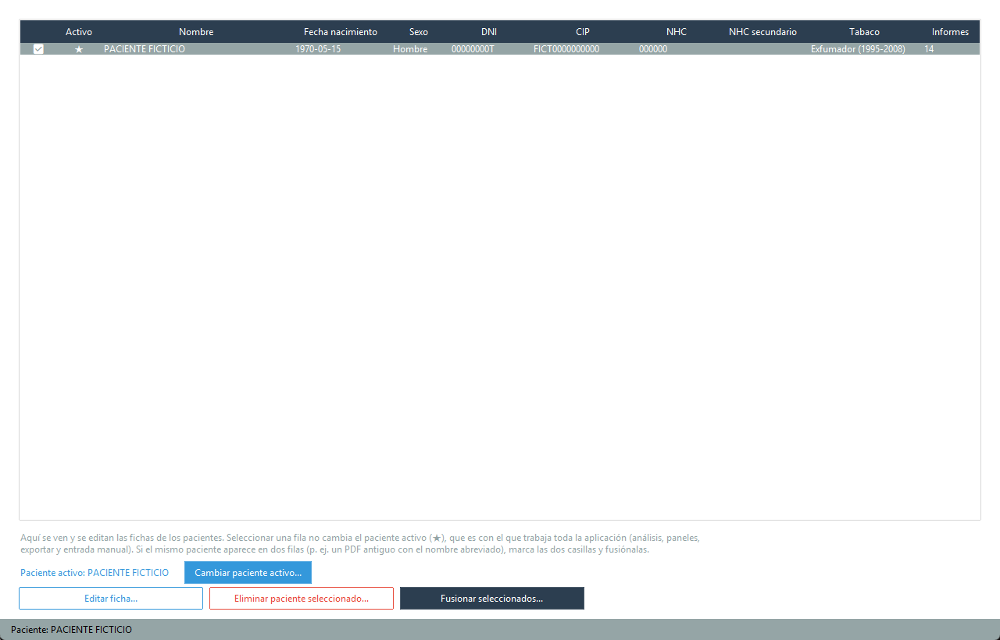
</p>

> Captura con datos **ficticios** ("PACIENTE FICTICIO" y valores inventados, no reales).

Ficha del paciente (**Editar ficha...**), con los datos editables, el
tabaquismo y la lista de informes importados:

<p align="center">
  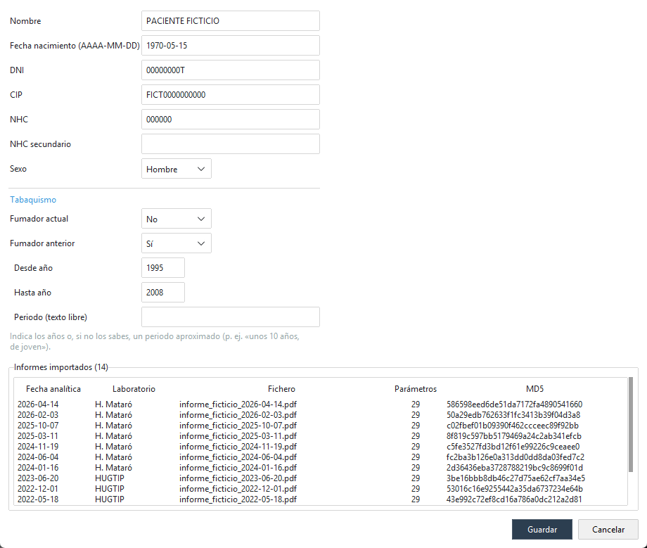
</p>

> Captura con datos **ficticios** ("PACIENTE FICTICIO" y valores inventados, no reales).

**Eliminar paciente seleccionado...**: borra ese paciente y todos sus
informes y resultados de la base de datos (no borra el PDF original, así
que puedes volver a importarlo si lo necesitas). Pide confirmación porque
no se puede deshacer. Útil, por ejemplo, para quitar un paciente "de
repuesto" que se haya creado por error a partir del nombre de un fichero
cuando no se reconoció el nombre real del paciente en un PDF.

**Cambiar paciente activo...**: abre la misma ventana que al iniciar (§1.3),
con solo los nombres, para elegir otro paciente activo. Se marca con una ★
en la columna "Activo". **No se recuerda entre sesiones**: cada vez que
abres Analitix se vuelve a elegir, a propósito, para que nunca analices ni
anotes datos de una persona que quedó elegida de la sesión anterior.

**Fusionar seleccionados...**: para cuando la misma persona aparece en dos
filas — pasa sobre todo con PDF antiguos que traen el nombre abreviado (sin
algún nombre intermedio) y, además, un número de historia clínica de otra
numeración (el NHC cambia entre plantillas del laboratorio a lo largo de
los años, así que por sí solo no basta para reconocer al paciente).
Selecciona las filas a fusionar (Ctrl/Shift para varias, ahora que se
pueden marcar varias a la vez) y pulsa el botón: se te pedirá elegir cuál
de ellas conserva su identidad — el resto se funde en ella, sus informes
pasan a pertenecerle y el DNI/fecha de nacimiento que le falten se rellenan
con los del resto si los tienen. La columna "Informes" te ayuda a detectar
este caso a simple vista: alguien con muy pocos informes junto a otro con
muchos y la misma fecha de nacimiento suele ser la misma persona partida en
dos filas.

Si el NHC no coincide entre las filas fusionadas (lo habitual: el
laboratorio lo renumera de vez en cuando), **no se pierde ninguno**: se
queda el más reciente como "NHC" y el otro pasa a la columna "NHC
secundario", por si alguna vez necesitas consultarlo (por ejemplo, para
localizar un informe en el sistema del laboratorio con el número antiguo).
Esto también ocurre automáticamente, sin fusionar nada a mano, cuando
reimportas informes de la misma persona con NHC de distintas épocas.

Editar, Eliminar y Fusionar actúan sobre las filas **seleccionadas** en la
tabla, no sobre el paciente activo. Al abrir la pestaña, la fila del
paciente activo aparece ya seleccionada.

**Si hay más de un paciente**, esas tres opciones de menú aparecen
deshabilitadas (en gris, no se pueden pulsar) hasta que elijas uno aquí
explícitamente — así no se corre el riesgo de ver o exportar sin darte
cuenta los datos de otra persona. Con un único paciente en la base de datos
no hay ambigüedad posible y se selecciona solo.

### 2.3 ✏ Entrada manual (menú Pacientes → Entrada manual)

Para registrar una analítica cuando el PDF no se ha podido interpretar (o
cuando simplemente no viene en PDF). No sustituye a la importación
automática: es el respaldo para esos casos puntuales.

Los datos que añadas aquí son siempre para el **paciente activo** (§1.3,
Pacientes → Cambiar paciente activo...) — esta pestaña no tiene su
propio desplegable de paciente, precisamente para no correr el riesgo de
teclear una determinación para la persona equivocada. Si no hay ningún
paciente activo, todo el formulario (prueba, valor, notas, "Añadir a la
lista", "Guardar analítica") aparece deshabilitado — no se puede ni
empezar a rellenarlo: elígelo antes con Pacientes → Cambiar paciente
activo...

1. Comprueba el **paciente activo** que se muestra arriba y la **fecha**
   (formato `AAAA-MM-DD`); si es otra persona, cámbialo con Pacientes →
   Cambiar paciente activo... antes de continuar. El campo **Notas (opcional)** sirve para
   apuntar a qué corresponde esta analítica o por qué se ha metido a mano
   (p. ej. "analítica hecha en otro laboratorio", "solo el valor que me
   dieron por teléfono") — se guarda junto con el informe y se puede
   consultar más tarde en el 🔍 Explorador BD (§2.18, tabla `reports`).
2. Por cada determinación: escribe su **nombre** (el desplegable sugiere
   nombres ya usados en otras analíticas, para intentar escribirlo igual y
   que se agrupen como la misma prueba — ver también §2.19 si ya se han
   colado variantes distintas), el **valor**, la **unidad** y, si los
   conoces, el **rango de referencia** (bajo/alto). Pulsa **Añadir a la
   lista**; se repite por cada determinación de la analítica.
3. Revisa la lista y, si hace falta, quita alguna fila con **Quitar fila
   seleccionada**.
4. Pulsa **Guardar analítica**. Se guarda todo de una vez (una analítica, una
   fecha, varias determinaciones) y a partir de ahí se ve igual que una
   importada de un PDF: en Evolución, Comparativa y Exportar.

El valor y el rango admiten coma o punto como separador decimal. El nombre y
el valor son obligatorios; la unidad y el rango son opcionales (sin rango, el
punto se dibuja pero no se marca como fuera de rango en ningún sentido).

### 2.4 📈 Evolución (menú Análisis → Evolución)

Gráfico de una prueba concreta a lo largo del tiempo.

<p align="center">
  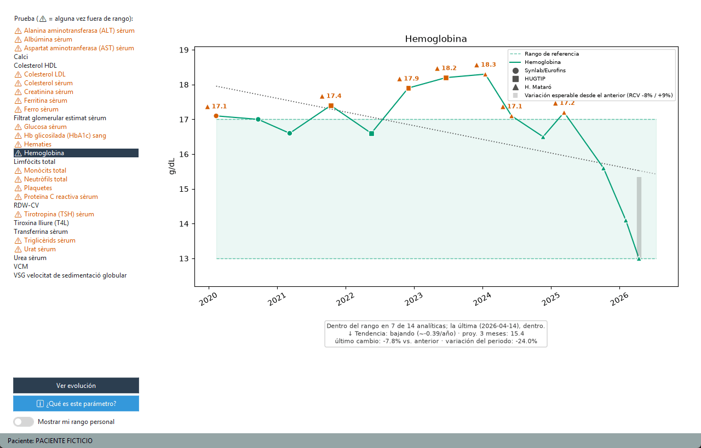
</p>

> Captura con datos **ficticios** ("PACIENTE FICTICIO" y valores inventados, no reales).

- Si la prueba viene de **varios laboratorios**, cada punto tiene la
  **forma** de su laboratorio (● ■ ▲ ◆…, con leyenda), y el color sigue
  indicando si está alto, bajo o normal. Un salto brusco justo donde cambia
  la forma suele deberse al cambio de laboratorio o de método, no a un
  cambio real; al pasar el ratón por el punto también se ve el laboratorio.
- La lista de la izquierda muestra todas las pruebas con resultado numérico
  del paciente seleccionado. Las que **alguna vez** han estado fuera de
  rango llevan el icono ⚠ y aparecen en rojo, para poder localizarlas de un
  vistazo y estudiar su evolución.
- Las pruebas con **pocos valores registrados** (por defecto, menos de 4;
  ajustable en Configuración, §2.20) se agrupan aparte, al final de la lista
  y en gris, tras una línea separadora — con tan pocos puntos, un gráfico de
  evolución (y sobre todo una tendencia) no es muy fiable. Siguen estando
  disponibles, solo quedan señaladas para no confundirlas con el resto.
- El mismo número mínimo se aplica a **todos** los gráficos de evolución
  (Evolución, Comparativa, cada panel clínico y el informe PDF): por debajo,
  el gráfico se dibuja con el aviso "⚠ Solo N analíticas (mínimo
  recomendado: M): evolución poco representativa"; con **una sola**
  analítica no se dibuja ningún gráfico (un punto suelto parecería una
  evolución), solo el valor, su fecha y su rango.
- Selecciona una prueba y pulsa **Ver evolución**. El gráfico muestra:
  - La línea de valores en el tiempo, con un punto por análisis.
  - Las líneas discontinuas de mínimo y máximo del rango de referencia (más
    la banda sombreada entre ambas).
  - Los puntos **fuera de rango** en rojo (alto) o naranja (bajo), con el
    valor exacto escrito junto al punto, con margen suficiente para que no
    quede pegado al borde del gráfico ni a la leyenda.
  - Pasando el cursor sobre cualquier punto (también los normales) aparece
    la fecha, el valor y la unidad.
  - Debajo del gráfico, un **resumen en texto**: en cuántas analíticas ha
    estado dentro del rango y cómo está la última, por ejemplo "Dentro del
    rango en 8 de 10 analíticas; la última (2025-01-01), un 8 % por encima
    del límite superior (110)". Es solo una descripción de tus datos, no una
    interpretación. Aparece también en la Comparativa, en los paneles
    clínicos y en el informe PDF.
  - Con al menos 2 valores, debajo del gráfico se indica la **variación
    porcentual**: cuánto ha cambiado el último valor respecto al anterior y
    respecto al primero de toda la serie — útil para saber si un cambio es
    grande o pequeño en términos relativos, no solo en unidades absolutas.
  - Con al menos 3 valores, además una **línea de tendencia** punteada
    (regresión lineal simple) con si el valor tiende a subir, bajar o
    mantenerse estable, la tasa de cambio aproximada al año y una
    proyección a 3 meses vista. Es una orientación visual sencilla, **no
    un diagnóstico ni una predicción médica** — para eso, tu médico.
- **ℹ️ ¿Qué es este parámetro?**: la descripción en lenguaje llano del
  parámetro (qué mide y por qué se pide) en un diálogo aparte, para quien
  no esté familiarizado con los términos médicos — no se muestra
  automáticamente bajo el gráfico, para no quitarle espacio en pantalla.
  Ver §3.1 si quieres añadir o corregir la ficha de algún parámetro.
- Al cambiar de paciente en la pestaña **Pacientes** (§2.2), el gráfico se
  vacía de inmediato (aquí y en Comparativa/Riesgo cardiovascular) en vez de
  seguir mostrando el del paciente anterior: vuelve a pulsar "Ver
  evolución"/"Comparar" para el paciente nuevo.

### 2.5 📊 Comparativa (menú Análisis → Comparativa)

<p align="center">
  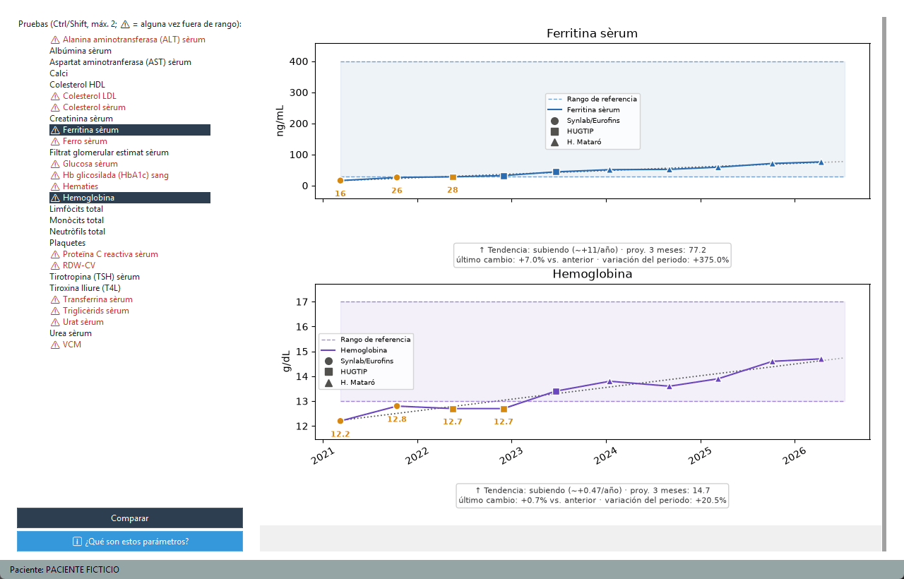
</p>

> Captura con datos **ficticios** ("PACIENTE FICTICIO" y valores inventados, no reales).

Compara hasta **2 pruebas** a la vez, una encima de la otra, alineadas por
fecha (misma escala de tiempo en ambas) pero cada una con su propia escala
de valores — así se puede ver qué pasaba en una prueba cuando la otra tenía
un valor concreto, sin mezclar unidades ni rangos distintos en un mismo eje.

- Marca hasta 2 pruebas en la lista (Ctrl/Shift para seleccionar varias); si
  intentas marcar una tercera, se avisa y se mantiene la selección anterior.
- Pulsa **Comparar**. Cada panel incluye también el margen, la variación
  porcentual y la tendencia descritos en Evolución (§2.4). Si el gráfico
  combinado no cabe entero en la ventana, aparece una barra de scroll para
  ver el segundo panel sin redimensionarla a mano.
- **ℹ️ ¿Qué son estos parámetros?**: igual que en Evolución, pero para
  todos los parámetros marcados a la vez.

### 2.6 🚦 Resumen (menú Análisis → Resumen)

<p align="center">
  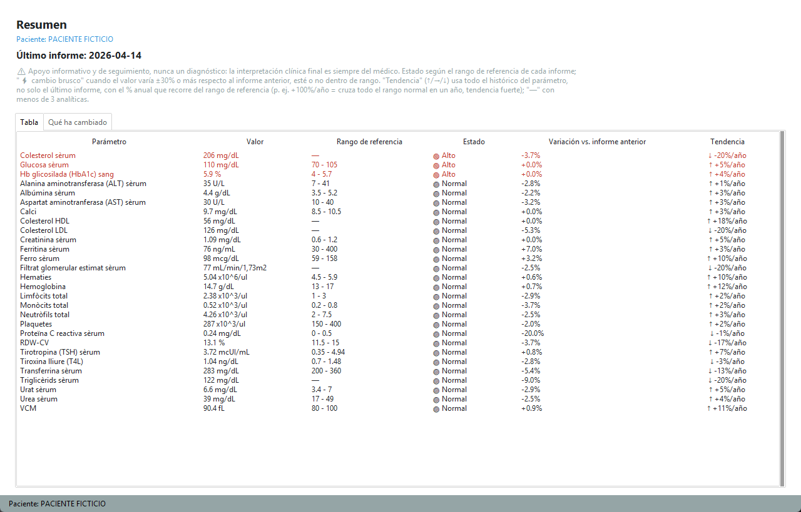
</p>

> Captura con datos **ficticios** ("PACIENTE FICTICIO" y valores inventados, no reales).

Una tabla con **todos** los parámetros numéricos del informe más reciente
del paciente de un vistazo — "semáforo" en vez de tener que recorrer
Evolución parámetro a parámetro. **Apoyo informativo y de seguimiento,
nunca un diagnóstico.**

- **Estado**: cada fila usa el mismo rango de referencia ya calculado por
  el laboratorio para ese informe (🔴 Alto / 🟠 Bajo / 🟢 Normal) — no es
  un umbral nuevo inventado por Analitix.
- **Variación vs. informe anterior**: el cambio porcentual respecto al
  valor anterior del mismo parámetro (o "—" si es la primera vez que se
  mide). Marcada con **⚡** cuando el cambio es de ±30% o más, **esté o no
  dentro de rango** — a veces un cambio grande dentro de rango vale la
  pena comentarlo igual que un valor fuera de rango. Ese 30% es una
  elección de interfaz para llamar la atención sobre saltos grandes, no
  un punto de corte clínico.
- **Tendencia**: a diferencia de "Variación" (que solo mira el último
  informe frente al anterior), esta columna usa **todo el histórico** del
  parámetro — ↑ si la tendencia general es a subir, → si se mantiene
  estable, ↓ si es a bajar. Mismo cálculo (regresión lineal) y mismo
  criterio de "estable" que ya usa el gráfico de Evolución (§2.4) bajo el
  propio gráfico. Con menos de 3 analíticas de ese parámetro se muestra
  "—": con tan pocos puntos una tendencia no es fiable.
  - Si sube o baja, se acompaña de un **% anual** (p. ej. "↑ +38%/año"):
    qué parte del rango de referencia recorrería el parámetro en un año a
    este ritmo — un +100%/año cruza todo el rango normal en un año
    (tendencia fuerte), un +10%/año solo una décima parte (tendencia
    leve). Es una proyección lineal a partir de los puntos disponibles:
    con pocas analíticas y un periodo corto (p. ej. 3 meses), un cambio
    real pequeño puede anualizarse en un porcentaje aparentemente grande
    — sirve para comparar la fuerza de la tendencia entre parámetros, no
    como una predicción literal de dentro de un año.
- Orden: primero los valores fuera de rango, luego los que tienen un
  cambio brusco dentro de rango, y por último el resto — alfabético
  dentro de cada grupo.
- No hay gráfico ni botón "¿Qué es esto?" en esta pestaña: para ver la
  evolución de un parámetro concreto en detalle, usa Evolución (§2.4).

**Subpestaña "Qué ha cambiado".** El mismo último informe, en gráfico: una
barra por parámetro con cuánto ha cambiado respecto al informe anterior,
ordenadas de mayor a menor cambio. El tamaño de la barra se mide en **anchos
del rango de referencia** (1 = moverse todo el ancho del rango normal), no
en %, para poder comparar parámetros de escalas muy distintas: pasar la
creatinina de 0,9 a 1,1 y las plaquetas de 200 a 244 es un +22 % en los dos
casos, pero lo primero es mucho más relevante respecto a su rango. Color:

- **Rojo ▲** = se aleja del rango o sale de él.
- **Verde ✓** = se acerca al rango o vuelve a él.
- **Gris** = estaba dentro del rango y sigue dentro.

Las barras de colores llevan escrito "anterior → actual"; al pasar el ratón
se ve también el % de cambio y el rango. Se omiten (y se indica cuántos) los
parámetros sin informe anterior, sin rango de referencia o sin ningún
cambio. Es orientativo: un cambio grande no significa por sí solo nada
grave.

**¿Cambio real o variación normal? (RCV).** Aunque no cambie nada, dos
analíticas seguidas nunca dan exactamente el mismo valor. Tu propio
organismo oscila un poco y la medida del laboratorio tiene un pequeño
margen de error. Para unas 45 pruebas habituales, Analitix calcula con
datos de estudios publicados (sobre todo el estudio europeo EuBIVAS) cuánto
tiene que cambiar el valor para que el cambio sea **probablemente real**.
Es el "valor de referencia del cambio" (RCV).

- **Barra atenuada (más clara)**: el cambio cabe dentro de esa variación
  esperable. Conserva su color, porque sigue siendo importante si sale del
  rango.
- **Barra de color intenso**: el cambio supera el RCV y es probablemente
  real. Eso **no** quiere decir que sea malo ni que indique una enfermedad.
- **Al pasar el ratón** verás el veredicto, los límites (p. ej. "RCV −14 %
  / +16 %") y el estudio del que salen.
- **Laboratorios distintos**: si los dos valores son de laboratorios
  distintos (o uno es una entrada manual), no se valora, porque cada
  laboratorio y cada método miden un poco distinto.
- **Pruebas sin RCV**: algunas no lo tienen a propósito. La vitamina D, por
  ejemplo, cambia con la estación del año. El motivo de cada una, las
  fuentes y las limitaciones están en **Ayuda → Referencias científicas**
  (documento "referencias_rcv").

<p align="center">
  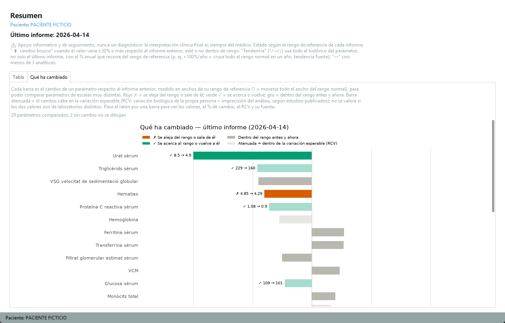
</p>

> Captura con datos **ficticios** ("PACIENTE FICTICIO" y valores inventados, no reales).

### 2.6.1 🟥 Mapa de calor (menú Análisis → Mapa de calor)

<p align="center">
  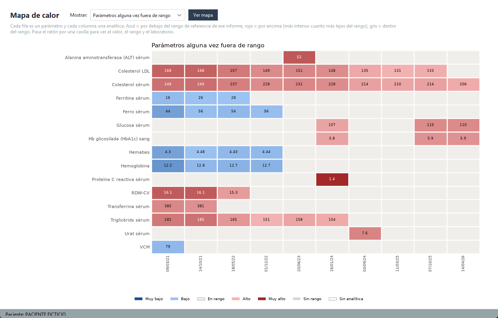
</p>

> Captura con datos **ficticios** ("PACIENTE FICTICIO" y valores inventados, no reales).

Todo el historial del paciente de un vistazo: **una fila por parámetro y
una columna por analítica**, con cada casilla coloreada según dónde cayó el
valor respecto al rango de referencia de ese informe:

- **Gris** = dentro del rango.
- **Azul** = por debajo; **rojo** = por encima. Cuanto más intenso, más
  lejos del rango (el valor aparece escrito dentro de la casilla cuando hay
  pocas columnas).
- **Gris oscuro con un punto** = hay valor, pero el informe no traía rango.
- **En blanco** = ese día no se midió ese parámetro.

Arriba se elige qué mostrar: los parámetros que **alguna vez** han estado
fuera de rango (por defecto), **todos**, o los de **un panel clínico**
concreto (Hemograma, Hierro, Función renal...). En este último caso el mapa
enseña exactamente los datos con los que calcula ese panel, lo que ayuda a
ver si le falta algún dato o si alguno no encaja. Pasa el ratón por una
casilla para ver el valor, la fecha, el rango y el laboratorio.

Como el color depende del rango de cada informe, el mapa compara bien
analíticas de laboratorios distintos aunque usen unidades diferentes.
Es una ayuda visual de seguimiento, no un diagnóstico: un color intenso no
significa por sí solo nada grave; coméntalo con tu médico.

### 2.6.2 🧪 Laboratorios incluidos (menú Análisis → Laboratorios incluidos...)

Por defecto, los gráficos y paneles usan las analíticas de **todos** los
laboratorios. Cada laboratorio puede usar métodos o rangos de referencia
distintos, y mezclarlos en una misma serie puede dar saltos que no son
cambios reales tuyos: al cambiar de laboratorio, una prueba puede subir o
bajar solo por el método. Aquí puedes quitar uno o varios laboratorios, o
quedarte solo con uno, para ver series más coherentes.

- Marca los laboratorios que quieres usar y pulsa **Aceptar**. Debe quedar
  al menos uno; **Marcar todos** vuelve a la situación por defecto. La
  elección se recuerda la próxima vez que abras la app.
- Se aplica a **Evolución, Comparativa, Resumen ("Qué ha cambiado"
  incluido), Mapa de calor, todos los paneles clínicos y el informe PDF**.
  Las pruebas que solo tengan analíticas de laboratorios quitados dejan de
  aparecer en las listas, y el aviso de pocas analíticas cuenta solo las
  que quedan.
- **Siempre a la vista**: mientras haya un filtro, la barra inferior (y la
  cabecera de cada panel) dice "Datos solo de: …", y el informe PDF lo
  indica en la portada y en el pie de cada página.
- **No se filtran** la exportación a Excel/CSV ni el Explorador BD: son tus
  datos en bruto, completos.
- "Laboratorio desconocido" agrupa los informes importados antes de que
  Analitix guardara el laboratorio; una reimportación forzada (§2.1) se lo
  asigna. Las analíticas que introduces a mano aparecen como "Entrada
  manual".

### 2.7 ❤ Riesgo cardiovascular (menú Paneles clínicos → Riesgo cardiovascular)

<p align="center">
  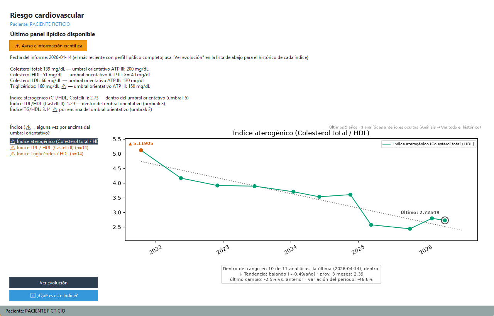
</p>

> Captura con datos **ficticios** ("PACIENTE FICTICIO" y valores inventados, no reales).

Perfil lipídico e índices de riesgo cardiovascular calculados a partir del
colesterol total, HDL, LDL y triglicéridos ya guardados — **apoyo
informativo y de seguimiento, nunca un diagnóstico**; los umbrales usados
están citados con su fuente científica y pueden variar según la población de
estudio (ver el botón "ℹ️ ¿Qué es este índice?" de esta misma pestaña).

**Aviso de población, visible siempre en esta pestaña**: los umbrales de
Castelli I/II y TG/HDL proceden de estudios en Colombia y EEUU, no de
población europea. Las guías cardiológicas europeas actuales (ESC/EAS,
SCORE2) no fijan un umbral equivalente para estos índices — usan en su
lugar un cálculo de riesgo personalizado (edad, sexo, tensión, tabaquismo)
que Analitix no calcula hoy. El detalle completo, con las fuentes
concretas, está en "ℹ️ ¿Qué es este índice?".

- Arriba del todo, el título de la pestaña ("Riesgo cardiovascular") y el
  nombre del **paciente activo** (§1.3) y, debajo, un **resumen en texto** del último informe con perfil lipídico
  disponible (colesterol total, HDL, LDL —medido o, si falta, estimado por
  la fórmula de Friedewald cuando los triglicéridos son < 400 mg/dL— y
  triglicéridos), cada uno con su clasificación orientativa (marcados con ⚠
  si superan el umbral), seguido de los tres índices calculables ese mismo
  día. Este resumen se calcula **solo con el informe más reciente** que
  tenga perfil lipídico; para ver todo el histórico de un índice concreto,
  usa la lista y el gráfico de más abajo:
  - **Índice aterogénico / Castelli I** (colesterol total ÷ HDL).
  - **Índice LDL/HDL / Castelli II**.
  - **Índice triglicéridos/HDL**: marcador indirecto de resistencia a la
    insulina.
- Abajo, igual que en Evolución (§2.4), una lista de los índices con datos
  suficientes (⚠ si alguna vez ha superado su umbral orientativo) para ver
  su **evolución en el tiempo** con el mismo tipo de gráfico (rango de
  referencia, tendencia, variación porcentual).
- **ℹ️ ¿Qué es este índice?**: fórmula completa y cita científica (artículo,
  año, enlace) de cada índice.
- Solo calcula lo que puede a partir de lo ya almacenado: si el laboratorio
  no informa colesterol total o HDL en un informe, ese informe simplemente
  no aporta ningún punto a estos gráficos (no se inventa ni se interpola
  ningún valor).

### 2.8 🧪 Salud hepática (menú Paneles clínicos → Salud hepática)

Índices de cribado de fibrosis hepática calculados a partir de AST, ALT y
plaquetas ya guardados — **apoyo informativo y de seguimiento, nunca un
diagnóstico**; un resultado alterado no sustituye una prueba de imagen, una
biopsia ni la valoración de un hepatólogo. Misma disposición que "❤ Riesgo
cardiovascular" (§2.7).

- Arriba del todo, el título de la pestaña, el nombre del **paciente
  activo** y un botón **"⚠️ Aviso e información científica"** (abre en un popup, no queda siempre visible) que muestra **en qué estudios se basa cada índice**
  (De Ritis 1957 para el ratio AST/ALT; Wai et al. 2003 para APRI; Sterling
  et al. 2006 con los puntos de corte de la guía AASLD 2023 para FIB-4).
  Debajo, un **resumen en texto** del último informe con AST y ALT
  disponibles: los valores en crudo (AST, ALT, plaquetas), la edad del
  paciente en la fecha de ese informe (calculada a partir de la fecha de
  nacimiento) y los tres índices:
  - **Ratio AST/ALT (índice De Ritis)**: orienta sobre el patrón de daño
    hepático. Un valor por debajo de 1 es un hallazgo común (hígado graso,
    hepatitis viral aguda), no una alarma por sí solo; por encima de 2
    sugiere un patrón de daño hepático alcohólico (marcado con ⚠).
  - **APRI**: por debajo de 0.5, riesgo bajo de fibrosis; por encima de 1.5,
    riesgo alto (⚠); entre ambos, riesgo intermedio (normalmente
    requeriría una prueba adicional, p. ej. elastografía).
  - **FIB-4**: misma idea que APRI pero con puntos de corte distintos (bajo
    < 1.3, intermedio 1.3-2.67, alto > 2.67 ⚠) y necesita además la edad del
    paciente — **solo aparece si se conoce su fecha de nacimiento**.
- Abajo, igual que en Evolución (§2.4), una lista de los índices con datos
  suficientes (⚠ si alguna vez ha superado su umbral orientativo) para ver
  su **evolución en el tiempo**.
- **ℹ️ ¿Qué es este índice?**: fórmula completa y cita científica de cada
  índice, incluida la explicación completa de los umbrales usados.
- Solo calcula lo que puede a partir de lo ya almacenado: si falta algún
  valor (o la fecha de nacimiento, para FIB-4), ese índice simplemente no
  aparece para ese informe.

### 2.9 🩺 Función renal (menú Paneles clínicos → Función renal)

Clasificación de riesgo renal y dos índices calculados a partir del
filtrado glomerular estimado, el ratio albúmina/creatinina, la urea y la
creatinina ya guardados — **apoyo informativo y de seguimiento, nunca un
diagnóstico**; la interpretación clínica final es siempre del médico o
nefrólogo. Misma disposición que "❤ Riesgo cardiovascular" (§2.7) y
"🧪 Salud hepática" (§2.8).

- Arriba del todo, el título de la pestaña, el nombre del **paciente
  activo** y un botón **"⚠️ Aviso e información científica"** (abre en un popup, no queda siempre visible) que muestra **en qué estudios se basa cada cálculo**:
  la clasificación y el mapa de riesgo KDIGO 2012 (verificado contra la
  adaptación oficial de la National Kidney Foundation), el ratio
  urea/creatinina (Higgins, 2016) y el aviso de subida brusca de
  creatinina, adaptado del algoritmo de alerta de fallo renal agudo (AKI)
  del NHS de Inglaterra (Sawhney et al., 2015).
- Debajo, un **resumen en texto** del último informe con filtrado
  glomerular disponible:
  - **Filtrado glomerular estimado** con su categoría KDIGO (G1 a G5, de
    normal a fallo renal).
  - **Ratio albúmina/creatinina** con su categoría KDIGO (A1 a A3, de
    normal a severamente aumentada) — solo si el informe trae este dato
    (no todos los informes de orina lo incluyen).
  - **Riesgo KDIGO cruzado** (bajo/moderadamente aumentado/alto/muy
    alto/máximo): combina las dos categorías anteriores según el mapa
    oficial de riesgo — no aparece si falta cualquiera de las dos, ya que
    ni siquiera un filtrado normal descarta enfermedad renal sin saber la
    albuminuria.
  - **Ratio urea/creatinina**: orienta si una alteración de la función
    renal tiene un origen prerrenal o intrínseco.
  - **Comparación con la mediana del último año**: avisa (⚠) si la
    creatinina actual es 1.5 veces o más la mediana de las creatininas de
    ese paciente en el último año — una señal débil de subida brusca, no
    una "detección de fallo renal agudo".
- Abajo, igual que en Evolución (§2.4), una lista con el histórico de los
  dos índices numéricos (ratio urea/creatinina y comparación con la
  mediana del último año) — la clasificación KDIGO no tiene gráfico propio
  porque es una categoría, no un valor continuo.
- **ℹ️ ¿Qué es este índice?**: fórmula completa y cita científica de cada
  índice.
- **No implementado deliberadamente**: un cálculo de FG desde cero
  (CKD-EPI 2021) sin depender de que el laboratorio ya lo traiga —
  necesitaría el sexo del paciente, un dato sensible que Analitix no
  guarda, y la mayoría de informes ya traen el FG calculado.

### 2.10 🩸 Hemograma (menú Paneles clínicos → Hemograma)

<p align="center">
  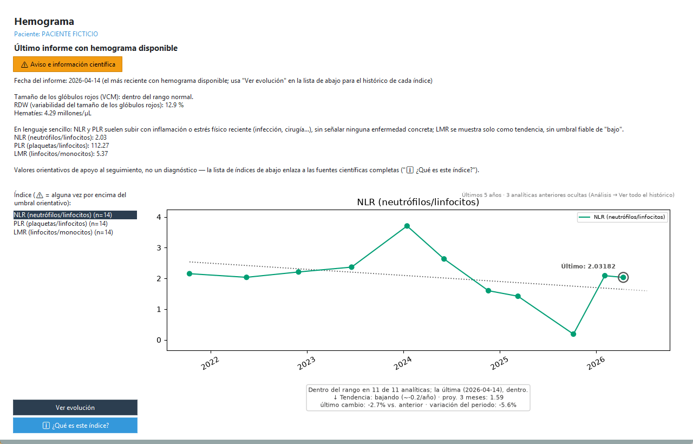
</p>

> Captura con datos **ficticios** ("PACIENTE FICTICIO" y valores inventados, no reales).

Índices calculados a partir del hemograma (neutrófilos, linfocitos,
monocitos, plaquetas, VCM, hematíes y RDW) ya guardado — **apoyo
informativo y de seguimiento, nunca un diagnóstico**; la interpretación
clínica final es siempre del médico o hematólogo. Misma disposición que
"🧪 Salud hepática" (§2.8) y "🩺 Función renal" (§2.9), con una novedad: el
resumen y las fichas de cada índice explican cada cálculo **tanto en
lenguaje sencillo como en detalle técnico con sus citas**.

- Arriba del todo, el título de la pestaña, el nombre del **paciente
  activo** y un botón **"⚠️ Aviso e información científica"** (abre en un popup, no queda siempre visible) que muestra **en qué estudios se basa cada cálculo**
  (Wang J et al. 2021 para NLR/PLR/LMR, una corroboración independiente de
  2025 para NLR, Mentzer 1973 para su índice, StatPearls para la
  orientación de anemia por VCM/RDW), aclarando que **no hay ningún índice
  o score combinado de riesgo de leucemia u otra enfermedad de la sangre**,
  porque no existe ninguno validado científicamente para eso — solo el
  aviso puntual de linfocitosis descrito abajo.
- Debajo, un **resumen en texto** del último informe con hemograma
  disponible:
  - **Tamaño de los glóbulos rojos (VCM)**, con una frase en lenguaje
    llano sobre qué orienta a descartar si hay anemia (falta de hierro o
    rasgo genético si es pequeño; falta de vitamina B12/fólico, alcohol u
    otras causas si es grande).
  - **RDW** (variabilidad del tamaño de los glóbulos rojos) y **hematíes**.
  - **Índice de Mentzer**, solo cuando el VCM es pequeño (microcítico) —
    es el único caso en el que este índice tiene sentido clínico.
  - **NLR, PLR y LMR**, con una frase explicando que suelen subir con
    inflamación o un esfuerzo físico reciente (una infección, una cirugía),
    sin señalar ninguna enfermedad concreta.
  - **Aviso de linfocitosis sostenida** (⚠), solo cuando los linfocitos
    superan 5×10⁹/L en **dos o más informes** del paciente (no un valor
    puntual): fechas afectadas, último valor y una explicación en lenguaje
    llano y técnico (con las citas científicas europeas en las que se
    basa) de por qué vale la pena comentarlo con el médico — nunca una
    sospecha de leucemia ni ningún otro diagnóstico. Se muestra incluso
    si ese informe no tiene VCM.
- Abajo, igual que en Evolución (§2.4), una lista con el histórico de cada
  índice y su gráfico de evolución.
- **ℹ️ ¿Qué es este índice?**: para cada índice, primero una explicación en
  lenguaje sencillo de qué representa y después el detalle técnico con la
  cita científica completa (DOI/PMID).
- **No implementado deliberadamente**: ningún aviso orientativo de
  leucemia u otras neoplasias hematológicas — la bibliografía revisada no
  ofrece un score combinado validado para eso.

### 2.11 🩸 Metabolismo del hierro (menú Paneles clínicos → Metabolismo del hierro)

<p align="center">
  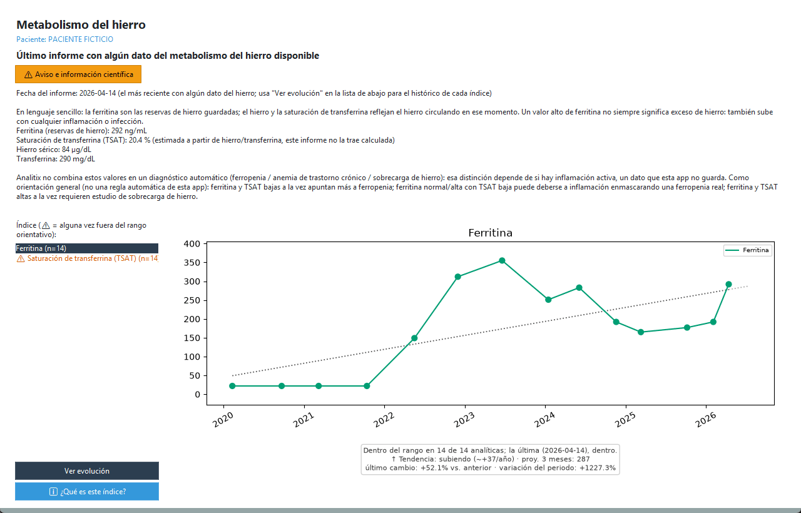
</p>

> Captura con datos **ficticios** ("PACIENTE FICTICIO" y valores inventados, no reales).

Ferritina, saturación de transferrina (TSAT) y sus valores de apoyo
(hierro sérico, transferrina) ya guardados — **apoyo informativo y de
seguimiento, nunca un diagnóstico**; la interpretación clínica final es
siempre del médico. Misma disposición que "🩸 Hemograma" (§2.10) y
"🩺 Función renal" (§2.9), con la misma explicación en lenguaje sencillo y
técnico a la vez.

- Arriba del todo, el título de la pestaña, el nombre del **paciente
  activo** y un botón **"⚠️ Aviso e información científica"** (abre en un popup, no queda siempre visible) que muestra **en qué estudios se basa cada cálculo**
  (guía de la OMS de 2020 para la ferritina, University of Iowa Path
  Handbook y Medscape para la TSAT), aclarando que **no se automatiza
  ningún diagnóstico diferencial** entre ferropenia, anemia de trastorno
  crónico o sobrecarga de hierro, porque distinguir entre ellas depende de
  si hay una inflamación activa, un dato que Analitix no guarda.
- Debajo, un **resumen en texto** del último informe con algún dato del
  hierro disponible:
  - **Ferritina** ("las reservas de hierro guardadas"), con su
    clasificación (⚠ si está baja).
  - **Saturación de transferrina (TSAT)**, con su clasificación (⚠ si está
    baja o alta) — si el informe no la trae ya calculada, se indica
    "(estimada...)" porque se ha calculado a partir del hierro y la
    transferrina de ese mismo día.
  - **Hierro sérico** y **transferrina**, como valores de apoyo sin
    clasificación propia.
  - Un párrafo de orientación general (ferropenia / inflamación
    enmascarando ferropenia / sobrecarga), presentado explícitamente como
    una guía de lectura para comparar tú mismo, **no como una
    clasificación automática de la app**.
- Abajo, igual que en Evolución (§2.4), una lista con el histórico de
  Ferritina y TSAT y su gráfico de evolución.
- **ℹ️ ¿Qué es este índice?**: para cada índice, primero una explicación en
  lenguaje sencillo de qué representa y después el detalle técnico con la
  cita completa.
- **No implementado deliberadamente**: un algoritmo que decida
  automáticamente entre ferropenia, anemia de trastorno crónico o
  sobrecarga de hierro — necesitaría saber si hay una inflamación activa,
  dato que Analitix no guarda.

### 2.12 🔥 Inflamación (menú Paneles clínicos → Inflamación)

PCR (proteína C reactiva) y VSG (velocidad de sedimentación globular) ya
guardadas — **apoyo informativo y de seguimiento, nunca un
diagnóstico**; la interpretación clínica final es siempre del médico.
Distinta del resto de paneles: **no hay ningún índice combinado**, porque
no existe ninguno validado científicamente que junte PCR y VSG en un solo
número (sus "velocidades" de reacción son demasiado distintas).

- Arriba del todo, el título de la pestaña, el nombre del **paciente
  activo** y un botón **"⚠️ Aviso e información científica"** (abre en un popup) explicando, con sus estudios, por qué no hay un
  índice combinado: la PCR reacciona en horas y baja rápido, la VSG tarda
  mucho más en subir y sobre todo en volver a la normalidad.
- Debajo, un **resumen en texto** con el último valor disponible de cada
  una (⚠ si está fuera del rango de referencia de su propio informe) y,
  si aplica, un aviso cuando **no coinciden entre sí** (una alterada y la
  otra no) — presentado siempre como algo esperable por su diferencia de
  cinética, nunca como una alarma o un error de laboratorio.
- Un único botón **"Ver evolución (PCR + VSG)"** dibuja las dos series
  superpuestas en el mismo gráfico de dos paneles que ya usa Comparativa
  — no hay una lista de índices donde elegir, porque siempre se muestran
  las dos series fijas.
- **ℹ ¿Qué es esto?**: explicación en lenguaje sencillo y técnico (con
  citas) de por qué no se combinan y qué significa que no coincidan.

### 2.13 🩹 Ácido úrico (menú Paneles clínicos → Ácido úrico)

Último valor de ácido úrico ya guardado, con su clasificación — **apoyo
informativo y de seguimiento, nunca un diagnóstico**; la interpretación
clínica final es siempre del médico. El panel clínico más simple de
todos: un único parámetro con un único umbral citado.

- Arriba del todo, el título de la pestaña, el nombre del **paciente
  activo** y un botón **"⚠️ Aviso e información científica"** (abre en un popup, no queda siempre visible) que muestra el umbral usado (≥6.8 mg/dL, guía de la
  American College of Rheumatology de 2020), aclarando que un valor alto
  es **hiperuricemia, no un diagnóstico de gota** — eso necesita
  confirmación por cristales de urato o el patrón clínico de los
  criterios ACR/EULAR 2015, que no viven en una analítica de sangre.
- Debajo, un **resumen en texto** con el último valor disponible (⚠ si
  está por encima del umbral) y, si está alto, el objetivo de tratamiento
  habitual en gota ya diagnosticada (< 6.0 mg/dL), presentado solo como
  referencia informativa.
- Abajo, igual que en Evolución (§2.4), una lista con el histórico (aquí,
  una sola fila) y su gráfico de evolución.
- **ℹ️ ¿Qué es este índice?**: explicación en lenguaje sencillo y técnico
  (con cita completa).

### 2.14 🦴 Calcio corregido (menú Paneles clínicos → Calcio corregido)

Calcio corregido por la albúmina — **apoyo informativo y de seguimiento,
nunca un diagnóstico**; la interpretación clínica final es siempre del
médico. Solo aparece en informes donde el laboratorio midió calcio y
albúmina el mismo día.

- Arriba del todo, el título de la pestaña, el nombre del **paciente
  activo** y un botón **"⚠️ Aviso e información científica"** (abre en un popup, no queda siempre visible) que muestra la fórmula (Payne et al. 1973), aclarando
  que se clasifica con el mismo rango de referencia que el laboratorio ya
  usa para el calcio total, sin ningún umbral nuevo inventado.
- Debajo, un **resumen en texto**: calcio medido, albúmina y calcio
  corregido (⚠ si sale fuera del rango de referencia una vez corregido),
  con una frase en lenguaje sencillo.
- Abajo, igual que en Evolución (§2.4), una lista con el histórico (una
  sola fila) y su gráfico de evolución.
- **ℹ️ ¿Qué es este índice?**: explicación en lenguaje sencillo y técnico
  (con cita completa y la limitación de la fórmula en los extremos de
  albúmina).

### 2.15 🍬 Glucosa media estimada — eAG (menú Paneles clínicos → Glucosa media estimada (eAG))

Traduce la HbA1c (%) a una glucosa media estimada en mg/dL, directamente
comparable con las lecturas de glucosa — **apoyo informativo y de
seguimiento, nunca un diagnóstico**; la interpretación clínica final es
siempre del médico.

- Arriba del todo, el título de la pestaña, el nombre del **paciente
  activo** y un botón **"⚠️ Aviso e información científica"** (abre en un popup, no queda siempre visible) que muestra la fórmula ADAG y los puntos de corte
  diagnósticos de HbA1c de la ADA (normal <5.7%, prediabetes 5.7-6.4%,
  diabetes ≥6.5%), aclarando que requieren un HbA1c de laboratorio
  estandarizado para uso diagnóstico formal.
- Debajo, un **resumen en texto**: HbA1c, su categoría ADA y la eAG
  derivada, con una frase en lenguaje sencillo que anima a comentar con
  el médico si el resultado está en rango de prediabetes o diabetes.
- Abajo, igual que en Evolución (§2.4), una lista con el histórico (⚠ si
  alguna vez en rango de diabetes) y su gráfico de evolución.
- **ℹ️ ¿Qué es este índice?**: explicación en lenguaje sencillo y técnico,
  incluidas las limitaciones (anemia, ferropenia, embarazo... alteran
  falsamente el resultado).
- **Ver evolución (Glucosa + eAG)**: un segundo botón que muestra la
  glucosa puntual de cada análisis junto a la eAG, en dos paneles con el
  mismo eje de fechas (igual que hace Inflamación con PCR+VSG) — para
  distinguir un día puntual raro de una tendencia mantenida.

### 2.16 🦋 Tiroides (menú Paneles clínicos → Tiroides)

Muestra la TSH y la T4 libre juntas en un gráfico combinado — **apoyo
puramente visual de seguimiento, nunca un diagnóstico**. A diferencia de
todos los demás paneles clínicos, **no clasifica ni interpreta ningún
patrón** (hipotiroidismo/hipertiroidismo): esa clasificación es
literalmente el criterio médico diagnóstico estándar y depende de si hay
embarazo, algo que Analitix no registra.

- Arriba del todo, el título de la pestaña, el nombre del **paciente
  activo** y un botón **"⚠️ Aviso e información científica"** (abre en un popup) explicando por qué no hay clasificación por
  cuadrante, con la fuente de la relación fisiológica inversa entre TSH y
  T4L (American Thyroid Association).
- Debajo, un **resumen en texto** con los últimos valores de TSH y T4
  libre por separado (⚠ si alguno está fuera del rango de referencia de
  su propio informe), sin ninguna interpretación conjunta.
- **Ver evolución (TSH + T4L)**: muestra las dos series juntas, cada una
  en su propio panel con el mismo eje de fechas.
- **ℹ ¿Qué es esto?**: explicación en lenguaje sencillo y técnico (con
  cita completa) de por qué no hay clasificación automática.

### 2.17 💾 Exportar (menú Archivo → Exportar)

Exporta los resultados del paciente seleccionado a un fichero:

- **Exportar a Excel...**: genera un `.xlsx` con una fila por resultado
  de **todos** los informes (fecha, prueba, valor, unidad, rango de
  referencia, si estaba fuera de rango, informe de origen).
- **Exportar a CSV...**: mismo contenido en formato CSV, compatible con
  Excel, hojas de cálculo y cualquier herramienta de análisis de datos.

Dos informes en PDF pensados para llevar a una consulta médica, no un
volcado de todos los datos — **apoyo informativo y de seguimiento, nunca
un diagnóstico**. Los dos siguen la misma estructura de página:

1. **Portada**: logo de Analitix, nombre del paciente, tipo de informe y
   fecha del último informe/de generación.
2. **Parámetros alterados en la última analítica**: los que están fuera
   de rango ahora mismo.
3. **Resto de parámetros**: los que están dentro de rango.
4. Un **gráfico de evolución** por cada parámetro fuera de rango o con
   un cambio brusco (≥30%) — nunca para los normales, ni para uno del
   que solo hay un valor registrado (no hay evolución que mostrar).

Cada página lleva un pie con el tipo de informe a la izquierda y el
número de página a la derecha. En la tabla, cada fila muestra valor,
rango de referencia, estado (Alto/Bajo/Normal, coloreado) y variación
respecto al informe anterior, marcada con "(*)" si es un cambio brusco.

- **Exportar informe completo (PDF)...**: **todos** los parámetros del
  **último informe** — mismo contenido y orden que la pestaña Resumen
  (§2.6).
- **Exportar informe de alterados (PDF)...**: solo los parámetros que
  **alguna vez** han estado fuera de rango en **todo el histórico** del
  paciente, aunque en el informe más reciente ya estén normales — con su
  valor más reciente (que puede venir de un informe distinto al último,
  si ese parámetro concreto no se repitió en él). Útil para un
  seguimiento centrado solo en lo que alguna vez dio problema.

Limitación conocida en los dos: si hay muchísimos parámetros fuera de
rango (o alterados) a la vez, esa página de tabla concreta podría no
caber entera (no pagina automáticamente dentro de una misma categoría en
esta versión).

### 2.18 🔍 Explorador BD (menú Herramientas → Explorador BD)

Muestra el contenido tal cual de la base de datos, tabla por tabla, para
poder comprobar exactamente qué se ha guardado — es de **solo lectura**, no
se puede cambiar nada desde aquí.

- Elige una tabla en el desplegable (pacientes, informes, resultados,
  ficheros importados o preferencias) y pulsa **Actualizar** para
  refrescarla.
- Útil para diagnosticar dudas sobre la importación (por ejemplo, ver el
  valor exacto guardado para una prueba, o comprobar qué `status` tiene un
  fichero en la tabla de ficheros importados) sin tener que abrir la base de
  datos con otra herramienta.

### 2.19 🔗 Normalizar pruebas (menú Herramientas → Normalizar pruebas)

<p align="center">
  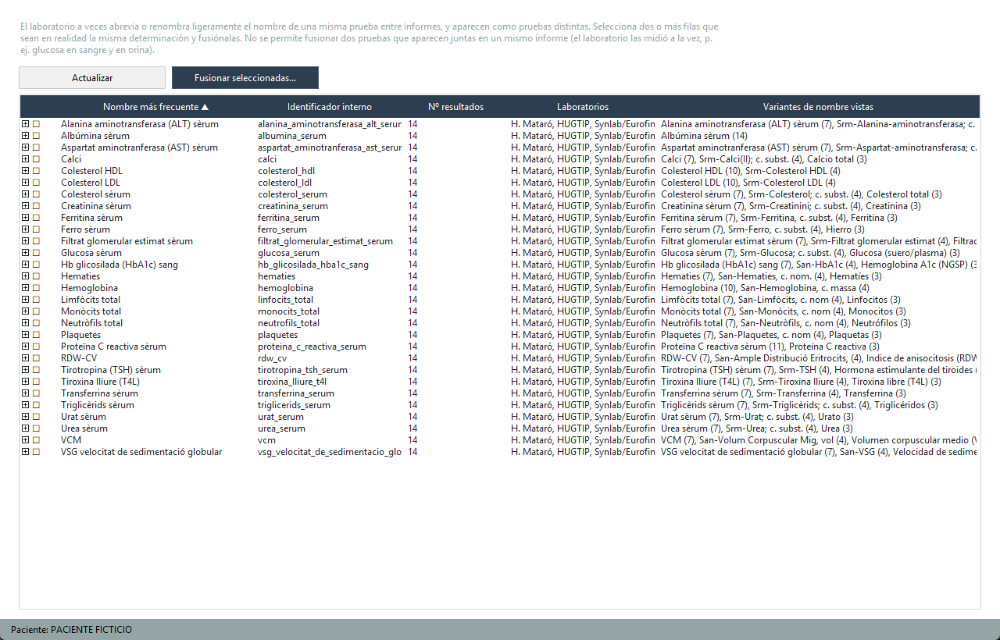
</p>

> Captura con datos **ficticios** ("PACIENTE FICTICIO" y valores inventados, no reales).

El laboratorio a veces abrevia o renombra ligeramente el nombre de una misma
prueba entre informes ("Glucosa sèrum" vs. "Gluc. sèrica", por ejemplo), y
Analitix las trata como pruebas distintas porque no tiene forma de saber que
son la misma. Esta sección deja corregirlo:

1. La lista muestra una fila por cada prueba distinta que conoce Analitix,
   con el nombre más frecuente, cuántos resultados tiene, de qué
   **laboratorios** vienen y todas las variantes de nombre vistas (con su
   recuento cada una). Pulsa la cabecera
   de una columna para **ordenar** por ella (otro clic invierte el orden):
   por nombre o por identificador interno, las variantes de una misma
   prueba quedan juntas y los duplicados saltan a la vista. Pulsa la
   flecha **▸** a la izquierda de una prueba para desplegarla: verás una
   línea por cada nombre y **laboratorio** que lo usa, con sus resultados,
   para comparar cómo llama cada laboratorio a la misma prueba.
2. Selecciona dos o más filas que sean en realidad la misma determinación
   (Ctrl/Shift para varias) y pulsa **Fusionar seleccionadas...**.
3. Elige cuál de ellas es el nombre "bueno" a conservar (por defecto, la que
   más resultados tiene) y confirma.

Antes de fusionar, Analitix comprueba que no estés mezclando pruebas
distintas:

- **No deja fusionar** dos pruebas que aparecen juntas en un mismo informe:
  si el laboratorio las midió a la vez, no pueden ser la misma (p. ej.
  glucosa en sangre y glucosa en orina).
- **Avisa y pide confirmación** si tienen códigos LOINC distintos (el código
  internacional de la prueba, que algunos laboratorios imprimen) o unidades
  de tipo distinto (p. ej. g/dL frente a g/L). Fusionarlas mezclaría escalas
  en las gráficas; ante la duda, mejor no fusionar.

Dos nombres distintos de un **mismo laboratorio** sí pueden ser la misma
prueba: los laboratorios renombran algunas pruebas al cambiar de plantilla
(p. ej. "Ferritina" en informes antiguos y "Ferritina sèrum" en los nuevos).
Mientras no aparezcan juntas en un mismo informe, se pueden fusionar.

A partir de ahí, todos los resultados de las variantes fusionadas cuentan
como una sola prueba en Evolución/Comparativa (más puntos, una sola entrada
en la lista en vez de varias sueltas) — y **la fusión se recuerda**: la
próxima vez que se importe un PDF con cualquiera de esas variantes de
nombre, también se reconocerá automáticamente como la misma prueba, sin
tener que repetir la fusión. Es una acción segura y repetible: no borra
ningún dato, solo agrupa resultados que ya estaban guardados.

### 2.19.1 Alias de pruebas: qué son, riesgos y cómo mantenerlos

**El problema.** Para seguir la evolución de un parámetro, Analitix tiene
que saber que dos resultados son la misma prueba. Pero cada laboratorio la
nombra a su manera, y no siempre en el mismo idioma: el hierro aparece como
"Ferro sèrum" (Hospital de Mataró), "Hierro" (Synlab/Eurofins) o
"Srm-Ferro, c. subst." (HUGTIP); los leucocitos, como "Leucòcits",
"Leucocitos" o "San-Leucòcits, c. nom". Incluso un mismo laboratorio cambia
el nombre entre plantillas a lo largo de los años. Si Analitix no sabe que
son lo mismo, trata cada nombre como una prueba distinta: el gráfico de
Evolución sale partido en varias líneas y los paneles clínicos no
encuentran los datos.

Un **alias** es la regla que dice "este nombre es esta prueba". Se guardan
en el fichero `src\analitix\data\test_aliases.csv` y se aplican **en el
momento de importar** cada PDF.

**Por qué hay que revisar los alias antes de aplicarlos.** Un alias mal
puesto es peor que no tener ninguno: mezcla en una sola serie dos cosas
distintas, y los paneles calculan entonces sus índices con datos que no
corresponden. Las confusiones típicas:

| Confusión | Ejemplo | Consecuencia |
|---|---|---|
| Porcentaje con valor absoluto | "Linfocitos %" con "Linfocitos" (recuento) | Valores de 30 y de 2 en la misma gráfica; índices del hemograma erróneos |
| Muestra distinta | Creatinina en orina con creatinina en sangre | La función renal usaría un valor de orina |
| Unidades de escala distinta | PCR en mg/L con PCR en mg/dL | Saltos ×10 en la gráfica que no son reales |
| Pruebas parecidas pero distintas | "Colesterol HDL" con "Colesterol no HDL"; HbA1c en % con HbA1c en mmol/mol | El panel cardiovascular o el de glucemia muestran otra prueba |

Analitix no puede saber por sí solo si dos nombres son la misma prueba
(misma muestra, mismo método): la herramienta de auditoría propone, pero
**la decisión es tuya**. Ante la duda, no fusiones: una prueba partida en dos
líneas es una molestia; una fusión equivocada da información incorrecta.

**Procedimiento recomendado**

1. *(Opcional pero muy recomendable)* Haz una copia de
   `src\analitix\data\test_aliases.csv` (por ejemplo
   `test_aliases.backup.csv`) antes de empezar.
2. Ejecuta la auditoría (desde cualquier carpeta; usa el entorno `venv` de
   la instalación):

   ```
   C:\ruta\a\Analitix\scripts\alias_audit.bat
   ```

   Analiza todos los PDF de `informes_analiticas\` (o la carpeta que le
   indiques: `scripts\alias_audit.bat informes_analiticas\emf`) y **no
   modifica nada**. Deja en `export\`:
   - `auditoria_alias.md`: el informe para revisar.
   - `auditoria_alias.csv`: las propuestas de confianza alta, en el mismo
     formato que `test_aliases.csv`.

   El informe solo contiene nombres de prueba y unidades, ningún dato de
   paciente ni nombre de fichero.
3. Revisa el informe. Sus secciones:
   1. **Propuestas de fusión**: grupos de nombres que parecen la misma prueba
      y tienen unidades iguales o equivalentes. La ★ marca el nombre que se
      conservaría. Las filas con ⚠ no tienen unidad y no van al CSV:
      decide tú.
   2. **Unidades convertibles** (p. ej. g/L y g/dL): probablemente la misma
      prueba, pero **no** se proponen como alias porque mezclarían escalas.
      No hace falta hacer nada; si un panel necesita esos datos, se
      resuelve en el propio programa.
   3. **Descartadas por unidades incompatibles**: normalmente pruebas
      distintas con nombre parecido. Solo informativo.
   4. **Identificadores que ya mezclan unidades**: si aparece algo aquí, hay
      un alias equivocado que conviene deshacer (ver "Cómo revertir").
   5. **Nombres con el valor pegado** ("LDH sèrum 160 UI/L"): fallos de
      lectura del PDF, no de alias. Coméntalos para que se corrija la
      lectura; no los fusiones.
4. Aplica lo que des por bueno, de una de estas dos formas:
   - **Desde la aplicación** (recomendado para pocos casos): en esta misma
     pestaña, ordena por nombre, selecciona las filas de un grupo y pulsa
     **Fusionar seleccionadas...**. Corrige al momento los datos ya
     importados y guarda el alias para el futuro.
   - **Con el CSV** (para muchos casos): copia a
     `src\analitix\data\test_aliases.csv` las líneas de
     `export\auditoria_alias.csv` que hayas validado (quita las que no), y
     después pulsa **Reimportar todo (forzar)** en **cada** carpeta de
     informes (Importar solo procesa la carpeta seleccionada, no sus
     subcarpetas).
5. Comprueba el resultado: vuelve a ejecutar la auditoría (la sección 1
   debería quedar vacía o casi, y la 4 vacía) y revisa aquí la lista
   ordenada por nombre.

**Cómo revertir o empezar de nuevo**

- **Deshacer una fusión concreta**: abre `test_aliases.csv` con un editor de
  texto (Bloc de notas sirve), busca las líneas del alias equivocado (cada
  línea es `nombre normalizado,identificador`) y bórralas. Guarda y pulsa
  **Reimportar todo (forzar)** en cada carpeta: al reimportar, cada
  resultado vuelve a recibir su identificador según los alias vigentes, así
  que la fusión se deshace también en los datos ya guardados.
- **Volver a la versión anterior de todos los alias**: sustituye
  `test_aliases.csv` por tu copia de seguridad del paso 1 (o, si trabajas con
  Git, `git checkout -- src/analitix/data/test_aliases.csv` recupera la
  última versión publicada) y reimporta forzando cada carpeta.
- **Empezar de cero**: la opción segura es volver a la versión publicada del
  fichero (punto anterior), que ya incluye las equivalencias entre
  laboratorios probadas. Dejar el fichero solo con la primera línea
  (`alias_normalizado,canonical_id`) también funciona, pero entonces se
  pierden **todas** las equivalencias entre laboratorios e idiomas y varios
  paneles clínicos se quedarán sin datos de Synlab, HUGTIP, Quirón o
  Echevarne hasta que se vuelvan a crear.
- **Qué no se revierte solo**: las **entradas manuales** (§2.3) guardan el
  identificador que tenía la prueba el día que se crearon y la
  reimportación no las toca. Si una fusión equivocada afectó a una entrada
  manual, corrígela o vuelve a crearla.
- Reimportar no afecta a tus pacientes fusionados, a las fichas editadas a
  mano ni a las entradas manuales.
- Aviso: `test_aliases.csv` forma parte del programa. Si lo has modificado,
  el script de actualización (`scripts\update_main.bat`) se negará a
  actualizar para no sobrescribir tus cambios; guarda antes una copia y, si
  quieres conservarlos, pide que se incorporen a la versión publicada.

### 2.20 ⚙ Configuración (menú Configuración)

Este panel se organiza a su vez en cuatro subpestañas (**General**,
**Seguridad**, **Datos**, **Estadísticas**), para que quepa todo sin
necesidad de ampliar la ventana ni usar barras de desplazamiento.

**General**

- **Carpeta de informes**: qué carpeta escanea el botón "Importar". Pulsa
  **Cambiar carpeta...** para apuntar a otra ubicación (por ejemplo, si
  guardas tus PDF en otro sitio o quieres tener varias carpetas). El cambio
  se recuerda para la próxima vez que abras la app.
- **Gráficos**: nº mínimo de analíticas para que una evolución se
  considere representativa (por defecto 4, mínimo 2). Se aplica a todos los
  gráficos de evolución, incluidos los paneles clínicos y el PDF: por debajo
  llevan un aviso y con una sola analítica no se dibuja el gráfico (ver
  §2.4). En Evolución/Comparativa, esas pruebas se agrupan además al final
  de la lista. Cambia el número y pulsa **Guardar**; se aplica al volver a
  abrir el gráfico.
- **Actualizaciones**: activa **Comprobar al iniciar** para que Analitix
  mire si hay una versión nueva cada vez que se abre (desactivado por
  defecto), o pulsa **Buscar ahora** para comprobarlo en el momento (ver
  §2.22).

**Seguridad**

- **Cambiar contraseña...**: cambia la contraseña maestra de la base de
  datos sin perder ningún dato. Te pedirá la nueva contraseña dos veces
  (para confirmarla). A partir de ese momento necesitarás la nueva
  contraseña para abrir la app.

**Datos**

- **Vaciar toda la base de datos...**: borra todos los pacientes, informes y
  resultados de golpe (los PDF de la carpeta de informes no se tocan,
  puedes volver a importarlos después). Pensado para empezar de cero, por
  ejemplo mientras se prueban cambios. Pide confirmación y, además, escribir
  la palabra "BORRAR" — no se puede deshacer.
- **Informes huérfanos**: lista los informes que no aportan nada —
  **sin ningún resultado**, o cuyo PDF **ya no está** en la carpeta de
  informes (lo borraste, no lo renombraste: uno renombrado se sigue
  reconociendo solo). Marca los que quieras (Ctrl/Shift para varios) y
  **Eliminar seleccionados...** — pide confirmación, no se puede deshacer,
  y no toca ningún PDF de la carpeta. Útil, por ejemplo, si en algún
  momento borraste de la carpeta un PDF que nunca llegó a reconocerse bien:
  su informe se queda huérfano en la base de datos para siempre si no lo
  limpias aquí (una reimportación normal no lo toca, porque ya no ve ese
  fichero).

**Estadísticas**

- **Avisos**: lista de informes pendientes de revisión (ver §2.1), con el
  motivo. Vacía en el caso normal; si aparece algo aquí, conviene comprobar
  ese PDF (y ese paciente) antes de fiarse de sus datos.
- **Estadísticas de la base de datos**: nº de pacientes, informes
  importados, registros (resultados individuales), cuántos están fuera de
  rango, fecha del informe más antiguo y más reciente, ficheros importados
  con y sin error, y el tamaño del fichero de la base de datos. Pulsa
  **Actualizar** para refrescar tras una importación.
- **Ubicación de la base de datos** y botón **Abrir carpeta de datos**: la
  carpeta donde está guardada. Para hacer una copia de seguridad, cierra
  Analitix y copia el fichero `analitix.db` a otro sitio (va cifrado con tu
  contraseña; sin ella no se puede abrir).
- **Cambiar ubicación de los datos...** (solo en la versión instalada): lleva
  tu carpeta `Analitix` (base de datos, alias y PDF) a otra ubicación. Si en
  la nueva ya hay datos de Analitix, se usan esos; si no, se **copian** los
  actuales, que se quedan también en la carpeta antigua hasta que los borres
  tú cuando compruebes que todo está bien. Analitix se reinicia para usar la
  nueva ubicación.

### 2.21 ℹ Ayuda → Acerca de...

Muestra el logo de Analitix, el nombre de la aplicación, el autor (Gabriel
Marti) y un enlace a su perfil de GitHub (pulsable, abre el navegador).

### 2.22 🔄 Ayuda → Buscar actualizaciones...

Comprueba si hay una versión de Analitix más nueva que la tuya (la ves en
**Acerca de...**). Si la hay, te lo indica y te ofrece abrir en el navegador
la página de descarga, desde donde puedes bajar el instalador nuevo; si no,
te dice que ya tienes la última. Analitix no se actualiza solo: tú decides
si descargas e instalas la versión nueva (instalarla encima conserva tus
datos, ver §1.1).

También puede hacerlo automáticamente cada vez que se abre: actívalo en
**Configuración → General → Actualizaciones → Comprobar al iniciar**. En
ese caso solo verás un aviso cuando haya una versión nueva.

Es la **única conexión a internet** de Analitix: consulta en GitHub el
número de la última versión publicada y **no envía ningún dato** tuyo ni de
tus analíticas. Si no hay conexión, verás "No se pudo comprobar"; el resto
de la aplicación funciona igual sin internet.

### 2.23 📚 Ayuda → Manual, documentación y referencias

**Manual de usuario**, **Documentación técnica**, **Referencias
científicas** y **Registro de cambios** abren en el navegador la versión más
reciente de cada documento, en el repositorio público del proyecto. En
**Referencias científicas** están todos los estudios, guías y fórmulas que
usa Analitix (paneles clínicos, RCV...), con su cita, sus limitaciones y,
cuando las fuentes no coinciden, la discrepancia indicada. Abrir estos
enlaces no envía ningún dato tuyo.

## 3. Colaborar

Analitix es un proyecto abierto a cualquiera que quiera aportar algo —
**no hace falta saber programar**. Si usas la aplicación, tu experiencia
como usuario ya es valiosa: qué se entiende mal, qué echas en falta, o si
tu laboratorio no está soportado. Todos los detalles de cómo participar
(incluido un aviso importante sobre privacidad si vas a compartir un PDF de
ejemplo) están en [`CONTRIBUTING.md`](../CONTRIBUTING.md).

### 3.1 Añadir o corregir la descripción de un parámetro

Las descripciones que ves al pulsar "ℹ️ ¿Qué es este parámetro?"/"¿Qué es
este índice?" (§2.4/§2.5/§2.7/§2.8/§2.9/§2.10/§2.11/§2.12/§2.13/§2.14/§2.15/§2.16) son ficheros de texto sencillos, uno por
parámetro, en `src/analitix/data/descripciones/`. Cuando aparezca un
parámetro nuevo sin descripción todavía (el diálogo te avisará con
"Todavía no hay una ficha para este parámetro"), o si quieres
corregir/ampliar una ya existente:

1. Averigua el identificador interno de la prueba (`canonical_id`): en
   **🔍 Explorador BD** (§2.18), elige la tabla `results`, busca una fila de
   esa prueba y mira su columna `canonical_id` (p. ej. `glucosa_serum`).
2. Crea (o edita, si ya existe) el fichero
   `src/analitix/data/descripciones/<canonical_id>.txt` con un editor de
   texto normal (el Bloc de notas de Windows sirve). El contenido es texto
   plano, sin formato especial: unas pocas frases explicando qué mide la
   prueba y por qué se pide, en lenguaje sencillo.
3. Guarda el fichero en formato UTF-8 (si usas el Bloc de notas moderno de
   Windows, es el que viene por defecto) y reinicia Analitix — el cambio se
   recoge solo, no hace falta ninguna otra acción.

Si dos pruebas distintas (`canonical_id` distinto) son en realidad la misma
determinación con el nombre escrito de forma diferente entre plantillas del
laboratorio, mejor fusionarlas primero con **🔗 Normalizar pruebas** (§2.19)
y hacer una única ficha para el `canonical_id` que quede — así no hay dos
descripciones separadas (y potencialmente contradictorias) para la misma
prueba real.
